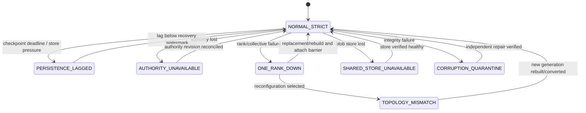

# Degraded-mode behavior

## Mode table

| Mode | Inference behavior | Persistent checkpoint behavior | Recovery behavior | Single-node continuation? |
|---|---|---|---|---:|
| `NORMAL_STRICT` | two ranks execute normally | commit only at required durability | exact/delta recovery enabled | not applicable |
| `PERSISTENCE_LAGGED` | policy: continue with exposed replay window or pause | no false durability claim; new commits may be refused | use last committed state plus token replay | **No** solely because persistence lags |
| `AUTHORITY_UNAVAILABLE` | conservative policy pauses before ownership ambiguity; bounded lease policy may finish already-owned work | no new commit or epoch; status may be unknown | wait for authority or operator recovery | **No** |
| `ONE_RANK_DOWN` | stop generation immediately | in-flight checkpoint aborts unless certificate already committed | replace/rebuild/reconfigure/reset | **No**, except full-model/full-state preconditions |
| `SHARED_STORE_UNAVAILABLE` | two-rank inference may continue | process-durable commit only if policy permits; host-failure durability unavailable | local exact reuse only; no claimed off-host recovery | **No** |
| `LOCAL_STORE_PRESSURE` | continue or shed by policy | throttle/deny new snapshots; never evict referenced committed objects unsafely | GC unreferenced objects, reduce checkpoint rate | **No** |
| `TOPOLOGY_MISMATCH` | do not attach mismatched cache | reject exact reuse and commit under old generation | rebuild, verified conversion, or reset | **Conditional** only after supported one-node reconfiguration |
| `CORRUPTION_QUARANTINE` | stop affected session before using bytes | reject corrupt checkpoint/object | repair from independent copy, older checkpoint + replay, or rebuild | **No** unless complete one-node recovery succeeds |
| `CONTROL_PLANE_PARTITION` | only side with valid authority lease may act; execution nodes do not elect by themselves | fenced side cannot commit | reconcile by authority revision | **No** |
| `ASYNC_OFFLOAD_LAG` | normal inference | certificate records weaker durability/watermark | host loss may require older checkpoint/replay | **No** |

## Required mode transitions

## Policy requirements

- The current degraded mode is explicit in metrics, traces, admin state, and any API that claims durability.
- Mode transition is idempotent and tied to generation/epoch where relevant.
- A mode cannot relax integrity, topology, or epoch checks.
- Latency-first continuation must expose the maximum uncheckpointed token/replay window and cannot market that state as durable.
- Automatic recovery has a bounded attempt budget; repeated failures transition to operator-required state rather than retry storms.

## Single-node decision test

A recovery controller may answer “yes” only when all are true:

1. complete model weights and required adapters are accessible on the node;
2. memory and kernels support a declared one-node topology;
3. a new generation and epoch fence all old ranks;
4. the complete logical KV state is available in the new topology or can be deterministically rebuilt from authorized compact state;
5. sampler/beam/output continuity is preserved;
6. validation and attach complete before any new token is emitted.

Failure of any condition means single-node continuation is **not possible**. The service remains stopped, restores two ranks, or resets according to client policy.
