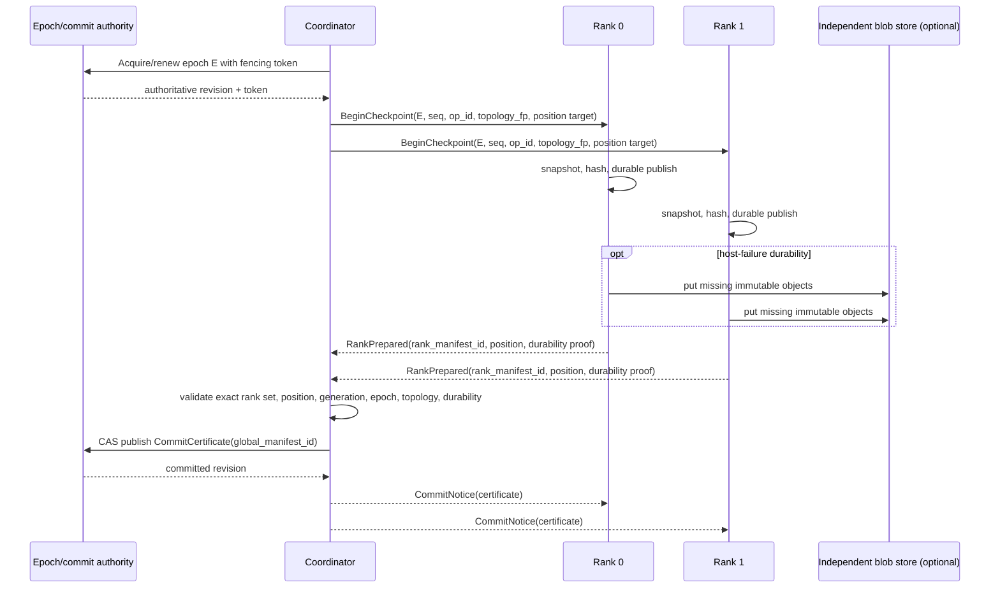

# Protocol overview

## Plane separation

HaloKV uses two logical planes:

- **Control plane:** small authenticated messages for handshake, epochs, begin/prepare/commit/abort, cancellation, status, heartbeat, inventory summaries, and credit grants.
- **Data plane:** bounded streaming of immutable manifests and pages. Data transfer is content-addressed and resumable; control messages never carry multi-gigabyte cache bodies.

Transport flow control remains enabled, but application-level byte/page credits are normative because transport buffering alone does not express disk, decompression, GPU staging, or per-tenant capacity.

## Normal checkpoint flow



The authority CAS is the linearization point. Commit notices are cacheable hints. If a notice is lost, a rank or coordinator queries authority and reaches the same terminal result.

## Request envelope

Every mutating request binds:

```text
protocol_version
message_kind
request_digest
op_id
 tenant_namespace / session_id / session_generation
 epoch / checkpoint_seq
 sender instance / logical rank
 topology_fingerprint
 deadline and bounded resource declaration
```

Authentication identifies the workload and process; the receiver derives authorized tenant/session/rank scope from credentials and does not trust self-asserted fields.

## Terminal outcomes

A checkpoint operation has one durable terminal record:

- `COMMITTED`: certificate exists and names the immutable global manifest.
- `ABORTED`: abort record exists; late prepare messages cannot transition it.

Before a terminal record, the operation may be `OPEN` or `PREPARED_PARTIAL`. A timeout is an observation failure, not a state transition. The caller issues `QueryCheckpoint` using the same identity before deciding whether to retry, clean up, or resume.

## Read/materialization gate

A checkpoint can be materialized only after this ordered gate:

1. Authenticate and authorize the caller.
2. Read the authoritative terminal record at an acceptable consistency level.
3. Validate generation, epoch policy, checkpoint sequence, protocol version, and exact topology fingerprint.
4. Validate global manifest digest and signature/MAC.
5. Require exactly ranks `0` and `1`, equal logical position, and declared durability.
6. Validate each rank manifest and all page lengths, coordinates, shapes, and digests.
7. Stage within bounded memory credits.
8. Publish to the execution engine only at a coherent barrier.

Any failure becomes a cache miss, quarantine event, or session reset—not partial reuse.

## Reconnect outline

A reconnecting rank sends its identity, highest persisted epoch, last certificate, topology fingerprint, software/cache-format versions, and a compact inventory summary. The coordinator authoritatively returns one of `RESUME_EXACT`, `FETCH_DELTA`, `REBUILD_RANK`, `RESET_SESSION`, `RECONFIGURE`, or `REJECT_STALE`.
