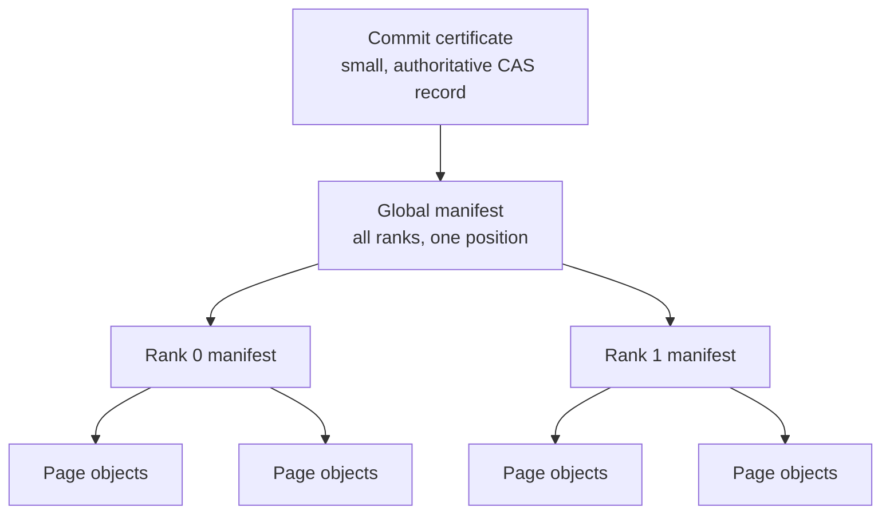

# System model

## Actors

| Actor | Responsibility | Must not be trusted for |
|---|---|---|
| Coordinator | Orchestrates checkpoint operations, validates rank agreement, plans reconnect/recovery | Self-issuing an epoch after losing authority |
| Epoch/commit authority | Monotonic fencing, operation status, conditional publication of commit certificates | Bulk cache storage or model execution |
| Rank 0 / Rank 1 | Own rank-local tensors, create durable page and rank manifests, execute collectives | Claiming another rank’s identity or declaring global commit |
| Local durable store | Process-restart persistence and fast reuse | Host/disk-failure durability unless independently replicated |
| Independent blob store | Optional off-host rank/page durability | Compute availability or epoch ownership |
| Client/router | Supplies inference intent and observes tokens | Asserting internal rank, epoch, storage locator, or commit status |

## Durable object graph



All manifests and pages are immutable. Mutable indexes map a session/checkpoint name to an immutable ID and are protected by authority revision, generation, and epoch. Garbage collection follows references from retained commit certificates; it never interprets an unreferenced `Prepared` object as committed.

## Protocol state tuple

```text
SessionState = (
  tenant_namespace,
  session_id,
  session_generation,
  authoritative_epoch,
  current_topology_fingerprint,
  last_committed_checkpoint_seq,
  last_committed_logical_position,
  terminal_operation_records,
  emitted_token_log_or_digest
)
```

A checkpoint operation is identified by `(session_id, generation, epoch, checkpoint_seq, op_id)`. The `op_id` makes retries idempotent; the monotonic fields make rollback and stale-worker activity detectable.

## Durability classes

| Class | Commit precondition | Survives | Does not promise |
|---|---|---|---|
| `PROCESS_DURABLE` | Both rank manifests/pages are fsync-published on their own hosts | Process or container restart on both intact hosts | Host, disk, or zone loss |
| `HOST_FAILURE_DURABLE` | Every required rank object is durable outside its originating host before commit | Loss of either execution host, subject to store availability | Single-node model execution |
| `ASYNC_OFFLOAD` | Local commit is complete; off-host replication may lag | Best effort, with explicit replication watermark | Host failure before offload completes |

The certificate records the durability class and replication watermark. A reader may require a minimum class and reject weaker checkpoints.

## Failure model

The baseline model includes process crash/restart, host loss, disk-full and I/O errors, delayed/lost/duplicated/reordered messages, partition and reconnect, stale processes, coordinator restart, authority unavailability, object loss, random or malicious byte corruption, incompatible software/topology, cancellation races, slow consumers, and hostile authenticated RPC senders.

The design assumes crash-stop behavior for the small authority unless its own documented consensus guarantees say otherwise. Execution peers are treated as potentially buggy or hostile at the RPC boundary.

## Safety over availability

When the protocol cannot prove epoch ownership, global checkpoint completeness, topology compatibility, or object integrity, it rejects reuse and stops or rebuilds. This is deliberate: stale or mixed KV state can silently alter model outputs and is not equivalent to a cache miss.
