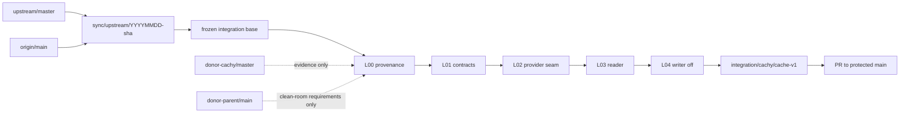

# Git Topology

> [!NOTE]
> Evidence is pinned to **2026-07-17**. Repository heads and source links are locked in [[Source-Register]] and `evidence/commit-lock.json`.


## Remotes

```bash
git remote add upstream     https://github.com/ggml-org/llama.cpp.git
git remote add donor-cachy  https://github.com/fewtarius/CachyLLama.git
git remote add donor-parent https://github.com/fewtarius/llama-ai.git

git config remote.upstream.tagOpt --no-tags
git config remote.donor-cachy.tagOpt --no-tags
git config remote.donor-parent.tagOpt --no-tags

git remote set-branches upstream master
git remote set-branches donor-cachy master
git remote set-branches donor-parent main
```

`origin` remains `charlie12345/ROCmFPX`. The donor-parent remote is metadata-only; no code from it may enter an MIT lane without a separately approved license plan.

This topology mirrors ROCmFPX's existing practice of pinning an upstream baseline, preserving protected reference trees, and validating in a dedicated integration workspace. [S05]

## Branch classes

| Pattern | Base | Purpose | Merge authority |
|---|---|---|---|
| `main` | protected | Canonical release line. | PR only. |
| `sync/upstream/YYYYMMDD-<sha12>` | `origin/main` | One frozen llama.cpp synchronization attempt. | Merge to `main` after full gates. |
| `intake/cachy/<capability>/<sha12>` | detached donor commit or canonical base | Quarantine/provenance analysis. Never deployed. | Never merged directly. |
| `lane/00-provenance` … `lane/15-compat` | frozen integration base | Buildable capability lane. | Merge into milestone integration branch in dependency order. |
| `integration/cachy/<milestone>` | frozen canonical+upstream base | Combined green lanes. | PR to `main`. |
| `rollback/<milestone>-premerge` | pre-milestone canonical commit | Immutable operational reference. | Never force-updated. |
| `release/YYYY.MM.DD[-rcN]` | approved `main` | Deployment/release branch. | Release managers. |

## Topology



A more explicit remote diagram is in `diagrams/git-topology.mmd`.

## Donor intake rules

1. Fetch exact donor commit IDs; never reference only `donor-cachy/master` in a provenance record.
2. Determine whether each candidate is already upstream by ancestry, stable patch ID, or equivalent current code.
3. Record parent commits and merge context; a feature hidden inside a broad upstream merge is not an isolated cherry-pick candidate.
4. Copy no source into a lane until the provenance record is P3.
5. Delete or archive intake branches after the decision; they do not become integration ancestors.

## Commit trailers

Every imported or derived commit must include the applicable trailers:

```text
Upstream-Base: <ggml-org/llama.cpp sha>
Donor-Repo: fewtarius/CachyLLama
Donor-Commit: <exact sha>
Donor-Path: <path[, path...]>
Donor-Blob: <blob sha[, blob sha...]>
License-Verified: MIT
Provenance-Record: docs/provenance/<id>.md
Derived-from: <permalink>          # manual port
Cherry-picked-from: <sha>          # exact cherry-pick, with git -x retained
Clean-Room-Spec: <spec path>       # clean-room work
Reviewed-by: <maintainer>
```

Preserve original author identity on cherry-picks and manual ports where code is derived. Do not use a single generic “donor sync” author.

## Tags and rollback refs

Annotated, signed tags should mark:

- `integration-base/<date>-<sha12>`
- `cache-contract-v0`
- `cache-provider-seam-v0`
- `cache-format-v1-reader`
- `cache-format-v1-writer-off`
- `persistent-cache-v1-canary`
- `persistent-cache-v1-stable`

Tags identify format/behavior boundaries; branches identify active work. Neither is force-updated.

## History policy

- Merge upstream with an explicit merge commit; do not rewrite canonical public history.
- Rebase private lane branches onto a newly frozen integration base, then review with `git range-diff`.
- Do not squash a provenance-bearing cherry-pick or manual-port sequence into an unattributed mega-commit.
- Use `git rerere` only as a local aid; do not accept recorded conflict resolutions without re-review.
- Append each meaningful integration session to ROCmFPX `AI_CHANGES.md`, consistent with the repository's stated process. [S04]


---

**Wiki navigation:** [[Home]] · [[Executive-Decision]] · [[Capability-Decision-Matrix]] · [[Patch-Lanes-and-Dependency-Graph]] · [[Acceptance-Criteria]]
