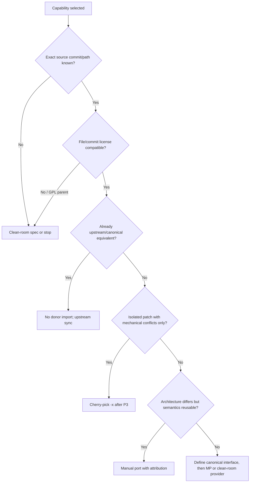

# Licensing and Provenance Gates

> [!NOTE]
> Evidence is pinned to **2026-07-17**. Repository heads and source links are locked in [[Source-Register]] and `evidence/commit-lock.json`.

## Repository-level finding

ROCmFPX and CachyLLama engine heads carry MIT license text. The `fewtarius/llama-ai` parent carries GPL-3.0. [S02] [S13] [S23]

This permits MIT-to-MIT reuse in principle but does not prove that every selected change is donor-original, isolated, or free of parent-project code. Provenance is evaluated per capability and per commit.

## Treatment decision tree

## Cherry-pick gate

Required evidence:

- exact non-ambiguous commit and parent(s);
- complete diff and touched files;
- MIT license/notice for every copied substantial portion;
- no source copied from the GPL parent;
- original author and sign-off policy resolved;
- patch is not a broad upstream merge;
- stable patch ID not already upstream/canonical;
- conflicts are mechanical, not semantic;
- intake build/tests green.

Use `git cherry-pick -x`; retain the generated source commit reference and add the provenance record trailer.

## Manual-port gate

Manual port is appropriate when exact MIT source is known but current ROCmFPX architecture differs. Requirements:

- identify source lines/paths and commit range;
- state which algorithms/behavior are derived;
- preserve author attribution and MIT notices as required;
- document intentional semantic deviations;
- port tests or create independent equivalence tests;
- prohibit copying unrelated donor scaffolding to make the patch apply.

## Interface-adaptation gate

Use when a capability crosses canonical subsystem boundaries or must coexist with current behavior. The interface commit must be independently useful, feature-off, and implement the current ROCmFPX behavior first. A donor provider cannot define the canonical interface by accident.

## Clean-room procedure

Required for GPL-parent behavior and recommended when donor lineage is unresolved:

1. **Spec reviewer** records externally observable inputs, outputs, constraints, error behavior, and performance goals. They may cite public docs and black-box observations but do not copy implementation expressions.
2. **Maintainer approval** freezes the clean-room spec and test vectors.
3. **Implementer attestation** states that implementation was produced from the approved spec and canonical code, not from GPL source.
4. **Independent review** checks similarity, test behavior, and canonical style.
5. Commit carries `Clean-Room-Spec:` and the attestations.

Where team separation is impractical, use a documented cooling-off period and a reviewer who did not inspect the GPL implementation; legal review may impose stricter controls.

## Parent-project boundary

Allowed from `fewtarius/llama-ai`:

- public requirements and CLI behavior descriptions;
- hardware/environment assumptions;
- black-box input/output observations;
- identification of the MIT engine submodule revision.

Not allowed into an MIT code lane without a new license decision:

- copied shell/Python/CMake source;
- line-by-line translated implementation;
- comments, variable naming, or structure that substantially reproduces GPL expression;
- a patch generated by diffing GPL source into canonical source.

## Required artifacts

Complete `templates/PROVENANCE-RECORD.md` for every capability and attach it to the lane PR. The source register is updated before merge, not after release.

---

**Wiki navigation:** [[Home]] · [[Executive-Decision]] · [[Capability-Decision-Matrix]] · [[Patch-Lanes-and-Dependency-Graph]] · [[Acceptance-Criteria]]
