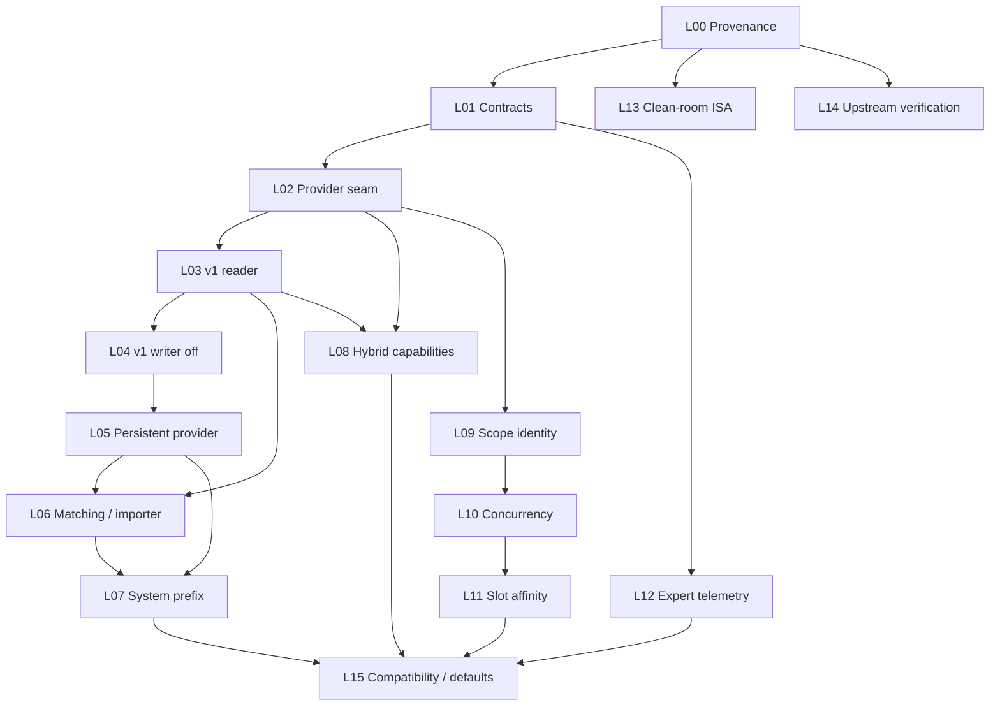

# Patch Lanes and Dependency Graph

> [!NOTE]
> Evidence is pinned to **2026-07-17**. Repository heads and source links are locked in [[Source-Register]] and `evidence/commit-lock.json`.

## Invariants

Every commit admitted to an integration branch must:

1. build with all new compile-time features **off**;
2. pass the feature-off baseline test suite;
3. have a single primary behavior and a single owning lane;
4. avoid changing runtime defaults unless the commit is an explicitly approved release-policy change;
5. contain its tests or make pre-existing contract tests pass—no knowingly red intermediate commits;
6. identify its nearest rollback tag;
7. update provenance and `AI_CHANGES.md` where applicable. [S04]

## Lane catalog

| Lane | Name | Deliverable | Depends on | Rollback marker |
|---|---|---|---|---|
| **L00** | Provenance and evidence lock | Source records, license classification, upstream-overlap report, no code. | None | `integration-base/*` |
| **L01** | Behavior contracts | Existing-cache tests, metrics schema, failure taxonomy, fixture inventory. | L00 | `cache-contract-v0` |
| **L02** | Provider seam | Neutral store/codec/match interfaces, no-op and current-cache adapters. | L01 | `cache-provider-seam-v0` |
| **L03** | Canonical v1 reader | Bounded parser, compatibility checks, corruption quarantine; no writes. | L02 | `cache-format-v1-reader` |
| **L04** | Canonical v1 writer, disabled | Atomic staging/commit, checksums, permissions, recovery; compile/runtime off. | L03 | `cache-format-v1-writer-off` |
| **L05** | Persistent provider + retention | Cross-restart store, hot/warm/cold policy, quotas, prefetch. | L04 | `persistent-cache-v1-canary` |
| **L06** | Matching and optional donor importer | Independent safety policy; optional offline donor-format importer. | L03, L05 | `persistent-cache-v1-match` |
| **L07** | System-prefix provider | Explicit/template boundary, global namespace, expiry. | L05, L06 | `system-prefix-cache-v1` |
| **L08** | Hybrid state capabilities | Attention/recurrent/draft/spec contracts and restore tests. | L02, L03 | `hybrid-restore-v1` |
| **L09** | Scope identity plumbing | Request field → opaque scope key → provider key; no scheduling policy. | L02 | `cache-scope-v1` |
| **L10** | Per-user concurrency | Counters, authoritative scheduler check, 429 mapping. | L09 | `user-concurrency-v1` |
| **L11** | Slot affinity | Optional user-aware scoring hint. | L09, L10 | `slot-affinity-v1` |
| **L12** | Expert telemetry | Internal provider, disabled counters, HTTP/C exposure only after stabilization. | L01 | `expert-telemetry-v0` |
| **L13** | Clean-room build presets | ROCmFPX-owned CPU ISA detection requirements and tests. | L00 | `isa-preset-v1` |
| **L14** | Upstream/no-op verification | Assert Vulkan tuning and MLA/DeepSeek behavior remain upstream-owned. | Current sync | `upstream-verification/*` |
| **L15** | Compatibility aliases and release policy | Optional donor CLI aliases, deprecation messages, default-state decision. | Stable dependent lanes | `persistent-cache-v1-stable` |

## Dependency graph

The standalone Mermaid source is `diagrams/patch-dependencies.mmd`.

## Commit pattern within a lane

Use this sequence unless the lane template documents a narrower alternative:

| Commit | Content | Required state |
|---|---|---|
| `A` | Contract/test fixture that passes against current behavior or remains explicitly skipped by capability detection. | Green. |
| `B` | Types/interface plus no-op/current adapter. | Green; feature off. |
| `C` | Provider implementation under compile/runtime gate. | Green; default off. |
| `D` | Fault handling, metrics, and negative tests. | Green. |
| `E` | Documentation, provenance, release notes, and lane acceptance record. | Green. |

Never introduce a failing “future test” on an integration branch. Use a draft-only branch if red/green TDD history must be preserved, then combine the red test with the minimum implementation needed for a green integration commit.

## Bisect script contract

Each lane must publish a deterministic `git bisect run` command covering at least:

- configure/build with feature off;
- unit tests for touched subsystem;
- feature-on unit tests when the compile option exists;
- one tiny-model server smoke where state serialization is involved.

Hardware-only performance tests are release gates, not bisect predicates, unless a stable dedicated runner exists.

## Parallelism

L12, L13, and L14 can proceed in parallel after their dependencies. L09 can begin after L02 while L03–L05 continue, but L09 must not add persistent file layout. L08 can develop its internal state contract before L05, but cross-restart hybrid persistence cannot be enabled until L03/L04 acceptance is complete.

---

**Wiki navigation:** [[Home]] · [[Executive-Decision]] · [[Capability-Decision-Matrix]] · [[Patch-Lanes-and-Dependency-Graph]] · [[Acceptance-Criteria]]
