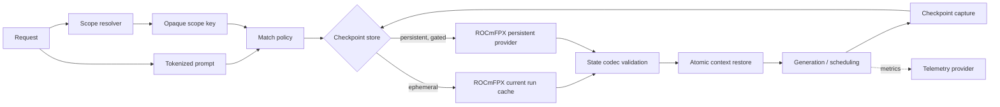

# Target Architecture

> [!NOTE]
> Evidence is pinned to **2026-07-17**. Repository heads and source links are locked in [[Source-Register]] and `evidence/commit-lock.json`.


## Architectural principle

Storage lifecycle, matching policy, state serialization, request identity, and scheduling must be separate concerns. The donor implementation combines several of these in common/server cache classes; the canonical design introduces explicit seams so each concern can be built, tested, and reverted independently. [S14] [S18]

## Components

| Component | Responsibility | Must not own |
|---|---|---|
| **Checkpoint state codec** | Capture/restore target, draft, speculative, and optional recurrent components; expose compatibility metadata. | Retention, tenant routing, or disk paths. |
| **Checkpoint store provider** | Atomic put/get/list/quarantine/delete of opaque, validated entry components. | Token-prefix matching semantics or slot scheduling. |
| **Match policy** | Select an entry from immutable metadata under exact compatibility and scope rules. | File I/O or context mutation. |
| **Scope resolver** | Map explicit user/tenant/conversation inputs to opaque stable scope keys. | Raw identity persistence or model state. |
| **Retention policy** | Hot/warm/cold state, quotas, LRU, expiry, and pressure response. | Serialization compatibility decisions. |
| **Scheduler policy** | Concurrency caps and slot-affinity scoring. | Cache file names or state parsing. |
| **Telemetry provider** | Counters, events, and optional expert statistics. | Control-path behavior. |

## Non-implementation interface contract

The following is behavioral pseudocode, not a source patch:

```text
capture(sequence, state_capabilities) -> checkpoint_bundle | error
validate(bundle, runtime_fingerprint, required_components) -> decision
store.put(scope_key, entry_metadata, components, write_policy) -> committed_id
store.find(scope_key, query_metadata, match_policy) -> candidate_metadata[]
store.get(committed_id, read_policy) -> validated_components | quarantine_reason
restore(sequence, validated_components, state_capabilities) -> restored_boundary
```

Required properties:

- `get` never mutates model context before all mandatory components pass size, digest, version, and compatibility checks.
- target/draft/speculative components commit and restore as one logical transaction.
- a failed persistent operation falls back to a cold prompt, not a partially restored context.
- match policy cannot cross an explicit tenant scope.
- the current ROCmFPX per-run cache remains a provider/adapter and a rollback target.

## Data flow



## Provider modes

| Mode | Purpose | Persistence | Initial status |
|---|---|---:|---|
| `off` | No automatic disk checkpoint provider. | None | Existing/default when no disk flags are set. |
| `ephemeral` | Current ROCmFPX owner-scoped run cache. | Process lifetime | Production rollback provider. |
| `persistent-read-only` | Validate and read canonical v1 entries, never write. | Cross restart | First canary state. |
| `persistent-read-write` | Read/write canonical v1 entries. | Cross restart | Later canary after format gate. |

## State capability negotiation

Every model/context exposes a capability vector before a persistent entry is considered:

- attention state present/required;
- recurrent state present/required;
- draft context present/required;
- speculative implementation blob present/required;
- state shifting supported;
- attention-only removal supported;
- multimodal state supported.

Unknown required capability bits reject the entry. No “best effort” partial restore is permitted.

## Security boundary

Persistent cache files are untrusted input on process restart. The provider must parse metadata with explicit bounds before allocating component buffers, reject symlinks/path traversal, and quarantine malformed entries. Tenant identifiers are converted to keyed opaque digests before touching disk; raw IDs do not become path components.


---

**Wiki navigation:** [[Home]] · [[Executive-Decision]] · [[Capability-Decision-Matrix]] · [[Patch-Lanes-and-Dependency-Graph]] · [[Acceptance-Criteria]]
