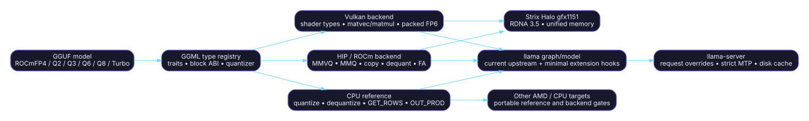

# Executive inventory

> **Audit snapshot:** fork `a5605a72768c6562241b248e268e33dc92787394`; upstream `86d86ed4396b4130922f7b9af26e3d9fc11a591b`; inventory date `2026-07-17`.  
> **Decision vocabulary:** **RETAIN** = capability/ABI must survive; **REFRESH** = preserve capability but re-port onto current upstream; **RETIRE** = remove the fork patch and use upstream or archive it. [S-FORK-HEAD](https://github.com/charlie12345/ROCmFPX/tree/a5605a72768c6562241b248e268e33dc92787394) [S-UP-HEAD](https://github.com/ggml-org/llama.cpp/tree/86d86ed4396b4130922f7b9af26e3d9fc11a591b)

## Decision distribution

The capability-level assessment is balanced: **9 RETAIN**, **8 REFRESH**, and **9 RETIRE**. The path-level ledger is broader because imported backend snapshots account for many individual files. The decision data is available in [`data/capability-matrix.csv`](data/capability-matrix.csv) and [`data/file-map.csv`](data/file-map.csv).

| Capability | Area | Decision | Required action | Primary sources |
| --- | --- | --- | --- | --- |
| GGUF/GGML type IDs 100–107 for ROCmFP4, ROCmFPX, TurboQuant, and Q2 | Quantization formats | **RETAIN** | Preserve stable on-disk IDs and block ABI; re-register them in current upstream without renumbering. | [S-QT-ENUM-FORK](https://github.com/charlie12345/ROCmFPX/blob/a5605a72768c6562241b248e268e33dc92787394/ggml/include/ggml.h) [S-QT-ENUM-UP](https://github.com/ggml-org/llama.cpp/blob/86d86ed4396b4130922f7b9af26e3d9fc11a591b/ggml/include/ggml.h) [S-GGUF-CONSTANTS](https://github.com/charlie12345/ROCmFPX/blob/a5605a72768c6562241b248e268e33dc92787394/gguf-py/gguf/constants.py) |
| ROCmFP4 standard and FAST 32-weight blocks | Quantization formats | **RETAIN** | Treat block size, scale coding, and bit order as immutable file-format contracts. | [S-ROCMFP4-H](https://github.com/charlie12345/ROCmFPX/blob/a5605a72768c6562241b248e268e33dc92787394/ggml/rocmfp4/rocmfp4.h) [S-ROCMFP4-C](https://github.com/charlie12345/ROCmFPX/blob/a5605a72768c6562241b248e268e33dc92787394/ggml/rocmfp4/rocmfp4.c) |
| ROCmFPX Q3/Q6/Q8 blocks | Quantization formats | **RETAIN** | Preserve CPU reference and exhaustive cross-backend conformance tests. | [S-ROCMFPX-H](https://github.com/charlie12345/ROCmFPX/blob/a5605a72768c6562241b248e268e33dc92787394/ggml/rocmfpx/rocmfpx.h) [S-ROCMFPX-C](https://github.com/charlie12345/ROCmFPX/blob/a5605a72768c6562241b248e268e33dc92787394/ggml/rocmfpx/rocmfpx.c) [S-ROCMFPX-README](https://github.com/charlie12345/ROCmFPX/blob/a5605a72768c6562241b248e268e33dc92787394/ggml/rocmfpx/README.md) |
| ROCmFPX Q2 and Phase-1 ROCmFP2 reference | Quantization formats | **RETAIN** | Keep the frozen byte format and reference oracle; do not equate it with upstream Q2_0. | [S-ROCMFP2-H](https://github.com/charlie12345/ROCmFPX/blob/a5605a72768c6562241b248e268e33dc92787394/ggml/rocmfpx/rocmfp2_reference.h) [S-ROCMFP2-C](https://github.com/charlie12345/ROCmFPX/blob/a5605a72768c6562241b248e268e33dc92787394/ggml/rocmfpx/rocmfp2_reference.c) [S-ROCMFP2-TEST](https://github.com/charlie12345/ROCmFPX/blob/a5605a72768c6562241b248e268e33dc92787394/ggml/rocmfpx/test_rocmfp2_reference.c) [S-QT-ENUM-UP](https://github.com/ggml-org/llama.cpp/blob/86d86ed4396b4130922f7b9af26e3d9fc11a591b/ggml/include/ggml.h) |
| CPU quantize/dequantize, GET_ROWS, OUT_PROD, and type traits | CPU / ggml | **REFRESH** | Start from current upstream CPU/ggml files, then re-port type traits and operation cases with oracle tests. | [S-ROCMFP4-C](https://github.com/charlie12345/ROCmFPX/blob/a5605a72768c6562241b248e268e33dc92787394/ggml/rocmfp4/rocmfp4.c) [S-ROCMFPX-C](https://github.com/charlie12345/ROCmFPX/blob/a5605a72768c6562241b248e268e33dc92787394/ggml/rocmfpx/rocmfpx.c) [S-CPU-REG](https://github.com/charlie12345/ROCmFPX/blob/a5605a72768c6562241b248e268e33dc92787394/ggml/src/ggml-cpu/ggml-cpu.c) [S-CPU-OPS](https://github.com/charlie12345/ROCmFPX/blob/a5605a72768c6562241b248e268e33dc92787394/ggml/src/ggml-cpu/ops.cpp) [S-C-D45](https://github.com/charlie12345/ROCmFPX/commit/d45ceff8d2b67fdebf73ebcb999807b0d322c73b) [S-C-A8B](https://github.com/charlie12345/ROCmFPX/commit/a8b5fa906ccd13c6a8ca06d55aa287854c376868) |
| HIP/ROCm MMVQ and MMQ kernels | ROCm/HIP kernels | **REFRESH** | Rebase shared backend wholesale; re-port only format-specialized templates, dispatch, and validated fixes. | [S-MMVQ](https://github.com/charlie12345/ROCmFPX/blob/a5605a72768c6562241b248e268e33dc92787394/ggml/src/ggml-cuda/mmvq.cu) [S-MMQ](https://github.com/charlie12345/ROCmFPX/blob/a5605a72768c6562241b248e268e33dc92787394/ggml/src/ggml-cuda/mmq.cu) [S-MMQ-H](https://github.com/charlie12345/ROCmFPX/blob/a5605a72768c6562241b248e268e33dc92787394/ggml/src/ggml-cuda/mmq.cuh) [S-VECDOT](https://github.com/charlie12345/ROCmFPX/blob/a5605a72768c6562241b248e268e33dc92787394/ggml/src/ggml-cuda/vecdotq.cuh) [S-DEQUANT](https://github.com/charlie12345/ROCmFPX/blob/a5605a72768c6562241b248e268e33dc92787394/ggml/src/ggml-cuda/dequantize.cuh) [S-CUDA-DISPATCH](https://github.com/charlie12345/ROCmFPX/blob/a5605a72768c6562241b248e268e33dc92787394/ggml/src/ggml-cuda/ggml-cuda.cu) |
| ROCm 7.2 exact negative-infinity behavior | ROCm/HIP kernels | **REFRESH** | Use the current upstream implementation if equivalent; otherwise retain a narrowly scoped regression test and minimal patch. | [S-C-DF3](https://github.com/charlie12345/ROCmFPX/commit/df3b8a0efa4dbdfcc2e29dac367c69eed310ed24) [S-UP-HEAD](https://github.com/ggml-org/llama.cpp/tree/86d86ed4396b4130922f7b9af26e3d9fc11a591b) |
| Vulkan packed FP6 host/device coherency | Vulkan kernels | **RETAIN** | Preserve transformation semantics and unaligned copy tests while rebasing the surrounding Vulkan backend. | [S-C-62F](https://github.com/charlie12345/ROCmFPX/commit/62f7508b12c6b8510fd7a77dfc5d9519fa026d82) [S-VULKAN](https://github.com/charlie12345/ROCmFPX/blob/a5605a72768c6562241b248e268e33dc92787394/ggml/src/ggml-vulkan/ggml-vulkan.cpp) [S-VULKAN-FP6](https://github.com/charlie12345/ROCmFPX/blob/a5605a72768c6562241b248e268e33dc92787394/ggml/src/ggml-vulkan/vulkan-shaders/dequant_rocmfpx_fp6.comp) |
| Vulkan ROCmFPX dequant, matvec/matmul, copy, and FlashAttention hooks | Vulkan kernels | **REFRESH** | Port only ROCmFPX shader primitives and dispatch into current upstream shader generation. | [S-VULKAN](https://github.com/charlie12345/ROCmFPX/blob/a5605a72768c6562241b248e268e33dc92787394/ggml/src/ggml-vulkan/ggml-vulkan.cpp) [S-VULKAN-TYPES](https://github.com/charlie12345/ROCmFPX/blob/a5605a72768c6562241b248e268e33dc92787394/ggml/src/ggml-vulkan/vulkan-shaders/types.glsl) [S-PR27-FILES](https://github.com/charlie12345/ROCmFPX/pull/27/files) [S-PR32-FILES](https://github.com/charlie12345/ROCmFPX/pull/32/files) |
| Strix Halo gfx1151 build target and wave32 decode knobs | Strix Halo | **RETAIN** | Keep the profile and scripts, but convert hard-coded defaults into benchmarked presets with per-release gates. | [S-BUILD-STRIX](https://github.com/charlie12345/ROCmFPX/blob/a5605a72768c6562241b248e268e33dc92787394/scripts/build-strix-rocmfp4-mtp.sh) [S-CMAKE-PRESETS](https://github.com/charlie12345/ROCmFPX/blob/a5605a72768c6562241b248e268e33dc92787394/CMakePresets.json) [S-TUNE-FLAGS](https://github.com/charlie12345/ROCmFPX/blob/a5605a72768c6562241b248e268e33dc92787394/scripts/rocmfp4-decode-tune-flags.sh) [S-MMVQ](https://github.com/charlie12345/ROCmFPX/blob/a5605a72768c6562241b248e268e33dc92787394/ggml/src/ggml-cuda/mmvq.cu) [S-AMD-STRIX](https://rocm.docs.amd.com/en/docs-7.2.0/how-to/system-optimization/strixhalo.html) |
| rocWMMA path for Strix Halo | Strix Halo | **RETIRE** | Do not make rocWMMA the default for gfx1151; retain only as an opt-in experiment behind explicit detection and benchmarks. | [S-BUILD-STRIX](https://github.com/charlie12345/ROCmFPX/blob/a5605a72768c6562241b248e268e33dc92787394/scripts/build-strix-rocmfp4-mtp.sh) [S-AMD-ROCWMMA](https://rocm.docs.amd.com/projects/rocWMMA/en/develop/api-reference/api-reference-guide.html#supported-gpu-architectures) |
| TurboQuant KV-cache formats | KV cache / quantization | **REFRESH** | Preserve format ABI and quality tests; re-integrate against current KV-cache/FA APIs. | [S-QT-ENUM-FORK](https://github.com/charlie12345/ROCmFPX/blob/a5605a72768c6562241b248e268e33dc92787394/ggml/include/ggml.h) [S-PR27-FILES](https://github.com/charlie12345/ROCmFPX/pull/27/files) [S-CPU-REG](https://github.com/charlie12345/ROCmFPX/blob/a5605a72768c6562241b248e268e33dc92787394/ggml/src/ggml-cpu/ggml-cpu.c) [S-CUDA-DISPATCH](https://github.com/charlie12345/ROCmFPX/blob/a5605a72768c6562241b248e268e33dc92787394/ggml/src/ggml-cuda/ggml-cuda.cu) [S-VULKAN](https://github.com/charlie12345/ROCmFPX/blob/a5605a72768c6562241b248e268e33dc92787394/ggml/src/ggml-vulkan/ggml-vulkan.cpp) |
| Base HY3 model architecture | Graph / model | **RETIRE** | Delete the fork model port and adopt upstream src/models/hy-v3.cpp and current converter metadata. | [S-HYV3-FORK](https://github.com/charlie12345/ROCmFPX/blob/a5605a72768c6562241b248e268e33dc92787394/src/models/hyv3.cpp) [S-UP-PR25395](https://github.com/ggml-org/llama.cpp/pull/25395) [S-UP-HY3-MERGE](https://github.com/ggml-org/llama.cpp/commit/2969d6d15d67a08e7b83f26164b15350c79c5248) [S-HYV3-UP](https://github.com/ggml-org/llama.cpp/blob/86d86ed4396b4130922f7b9af26e3d9fc11a591b/src/models/hy-v3.cpp) |
| Generic HY3 MTP/NextN graph and split export | Graph / model | **RETIRE** | Use upstream graph, private API, context split, and converter; carry only independently tested fork deltas. | [S-C-630](https://github.com/charlie12345/ROCmFPX/commit/630fa5a0f8fc04689b86d1b0a3d75b2b7d546d07) [S-C-F961](https://github.com/charlie12345/ROCmFPX/commit/f961404519a2ed286b750ba1419d40318a6b9a92) [S-UP-PR25395](https://github.com/ggml-org/llama.cpp/pull/25395) [S-UP-SPLIT-MTP](https://github.com/ggml-org/llama.cpp/commit/cb489bc0fb789c2cb7a9cc9dc44fa71893fe0988) [S-HYV3-UP](https://github.com/ggml-org/llama.cpp/blob/86d86ed4396b4130922f7b9af26e3d9fc11a591b/src/models/hy-v3.cpp) |
| Fork private MTP graph API | Graph / model | **RETIRE** | Replace the private fork API with current upstream llama-ext.h contracts. | [S-EXT-FORK](https://github.com/charlie12345/ROCmFPX/blob/a5605a72768c6562241b248e268e33dc92787394/src/llama-ext.h) [S-EXT-UP](https://github.com/ggml-org/llama.cpp/blob/86d86ed4396b4130922f7b9af26e3d9fc11a591b/src/llama-ext.h) |
| Generic speculative draft-MTP engine | MTP / speculative decoding | **REFRESH** | Use upstream speculative.cpp as the base and port only proven state/verification deltas. | [S-SPEC-FORK](https://github.com/charlie12345/ROCmFPX/blob/a5605a72768c6562241b248e268e33dc92787394/common/speculative.cpp) [S-SPEC-UP](https://github.com/ggml-org/llama.cpp/blob/86d86ed4396b4130922f7b9af26e3d9fc11a591b/common/speculative.cpp) [S-C-EFF](https://github.com/charlie12345/ROCmFPX/commit/eff9987923b58d1a6b7e54610c667803ac2d0ea7) |
| Strict greedy HY3 target verification | MTP / speculative decoding | **RETAIN** | Re-port as a small upstream-based feature with deterministic token-equivalence tests. | [S-C-7D7](https://github.com/charlie12345/ROCmFPX/commit/7d7b06bc5e6fd4a128af8efa954caa7409376a79) [S-SERVER-CTX](https://github.com/charlie12345/ROCmFPX/blob/a5605a72768c6562241b248e268e33dc92787394/tools/server/server-context.cpp) [S-SPEC-UP](https://github.com/ggml-org/llama.cpp/blob/86d86ed4396b4130922f7b9af26e3d9fc11a591b/common/speculative.cpp) |
| Per-request speculative n_min/n_max/p_min | Server | **RETAIN** | Port the request contract into current server schema/task plumbing and keep API tests. | [S-C-B56](https://github.com/charlie12345/ROCmFPX/commit/b56ad79d77bc1eb9fe6407640eec8b8edfc04900) [S-SERVER-TASK](https://github.com/charlie12345/ROCmFPX/blob/a5605a72768c6562241b248e268e33dc92787394/tools/server/server-task.cpp) [S-SERVER-SCHEMA-UP](https://github.com/ggml-org/llama.cpp/blob/86d86ed4396b4130922f7b9af26e3d9fc11a591b/tools/server/server-schema.cpp) |
| SSD-backed prompt cache with speculative state | Server / cache | **REFRESH** | Preserve capability but redesign on current upstream state APIs; add versioned cache format, integrity, permissions, and compatibility checks. | [S-C-C81](https://github.com/charlie12345/ROCmFPX/commit/c81c7c92233b6370b4eb7087398779a8dcb234a4) [S-C-BB7](https://github.com/charlie12345/ROCmFPX/commit/bb7d9cb5965e3be1ce2073134ba14787bf378113) [S-C-756](https://github.com/charlie12345/ROCmFPX/commit/756121a5e8e7da464aebd2ab344a2aefef6cecac) [S-C-0D7](https://github.com/charlie12345/ROCmFPX/commit/0d7ac512e5eb511843797c07a16bc7d97d3bc4f8) [S-SERVER-CTX](https://github.com/charlie12345/ROCmFPX/blob/a5605a72768c6562241b248e268e33dc92787394/tools/server/server-context.cpp) [S-SERVER-TEST](https://github.com/charlie12345/ROCmFPX/blob/a5605a72768c6562241b248e268e33dc92787394/tools/server/tests/unit/test_prompt_cache_disk.py) |
| Automatic one-slot policy for strict HY3 | Server | **REFRESH** | Prefer an explicit warning/config constraint over a hidden default; retain only if multi-slot correctness tests require it. | [S-C-276](https://github.com/charlie12345/ROCmFPX/commit/2766f419526ea14ba1be8f31eca21263cfc52813) [S-SERVER-CTX](https://github.com/charlie12345/ROCmFPX/blob/a5605a72768c6562241b248e268e33dc92787394/tools/server/server-context.cpp) |
| RPC protocol implementation | RPC | **RETIRE** | Replace RPC wholesale with current upstream. Maintain only same-build custom-type round-trip/handshake tests; do not fork the wire protocol. | [S-RPC-FORK](https://github.com/charlie12345/ROCmFPX/blob/a5605a72768c6562241b248e268e33dc92787394/ggml/src/ggml-rpc/ggml-rpc.cpp) [S-RPC-UP](https://github.com/ggml-org/llama.cpp/blob/86d86ed4396b4130922f7b9af26e3d9fc11a591b/ggml/src/ggml-rpc/ggml-rpc.cpp) [S-PR27-FILES](https://github.com/charlie12345/ROCmFPX/pull/27/files) [S-PR32-FILES](https://github.com/charlie12345/ROCmFPX/pull/32/files) [S-RPC-MTP-FIX](https://github.com/ggml-org/llama.cpp/commit/c3e9ade6dd3ff2a1ceafd2d59062634715b472c4) [S-RPC-IGPU-FIX](https://github.com/ggml-org/llama.cpp/commit/1738129bee5c81b06fa1850daf3f958813c76f5f) [S-RPC-LIGHTNING](https://github.com/ggml-org/llama.cpp/commit/00f5442cc4e805293280c8f85d21d8f9d4aad206) |
| WebUI async/image repairs and provisioning patches | Server / WebUI | **RETIRE** | Use current upstream WebUI and provisioning unmodified unless a current reproducer remains. | [S-C-FF8](https://github.com/charlie12345/ROCmFPX/commit/ff8e7b8cf9dab714951df49d71f5835a7322404a) [S-C-063](https://github.com/charlie12345/ROCmFPX/commit/0631515b0bca7859387e3467a6f6ac6379622a02) [S-C-A8C](https://github.com/charlie12345/ROCmFPX/commit/a8c41d31423e3e0b6f2dc7138af1d4fba8edb295) [S-UP-HEAD](https://github.com/ggml-org/llama.cpp/tree/86d86ed4396b4130922f7b9af26e3d9fc11a591b) |
| Hexagon/OpenCL/WebGPU source snapshots | Other backends | **RETIRE** | Replace wholesale from upstream; add ROCmFPX hooks only where real backend support and tests exist. | [S-C-807](https://github.com/charlie12345/ROCmFPX/commit/80732f992f7c75e9154cfe184041f1384c59a0fb) [S-PR27-FILES](https://github.com/charlie12345/ROCmFPX/pull/27/files) [S-UP-HEAD](https://github.com/ggml-org/llama.cpp/tree/86d86ed4396b4130922f7b9af26e3d9fc11a591b) |
| ROCmFPX correctness, register-quality, and real-backend gates | Build / CI | **RETAIN** | Keep these as the acceptance contract; refresh workflow plumbing and separate correctness from benchmark evidence. | [S-ROCMFPX-CI](https://github.com/charlie12345/ROCmFPX/blob/a5605a72768c6562241b248e268e33dc92787394/.github/workflows/check-rocmfpx.yml) [S-HIP-QUALITY](https://github.com/charlie12345/ROCmFPX/blob/a5605a72768c6562241b248e268e33dc92787394/.github/workflows/hip-quality-check.yml) [S-SWEEP-BACKEND](https://github.com/charlie12345/ROCmFPX/blob/a5605a72768c6562241b248e268e33dc92787394/scripts/sweep-rocmfpx-backend-ops.sh) [S-BACKEND-TEST](https://github.com/charlie12345/ROCmFPX/blob/a5605a72768c6562241b248e268e33dc92787394/tests/test-backend-ops.cpp) [S-C-848](https://github.com/charlie12345/ROCmFPX/commit/8488bfc69f716b5aa34bf75d1a72466ac75cc5da) |
| Generic parser/Jinja/server formatting/Apple packaging backports | Portability | **RETIRE** | Remove from the fork patch stack and inherit from current upstream. | [S-C-8FC](https://github.com/charlie12345/ROCmFPX/commit/8fcff76bca27ea2818761adad681cb792eb2fa26) [S-C-D52](https://github.com/charlie12345/ROCmFPX/commit/d52c96a8339325417624351bebad194c3864cb26) [S-C-FE2](https://github.com/charlie12345/ROCmFPX/commit/fe2b7dc5e19a5e24c276593368a1bb41d0e27b1d) [S-C-01D](https://github.com/charlie12345/ROCmFPX/commit/01d463bb23c3f290688c4529c13b3b467fa2f7dc) [S-UP-HEAD](https://github.com/ggml-org/llama.cpp/tree/86d86ed4396b4130922f7b9af26e3d9fc11a591b) |
| Open draft PRs #29 and #30 | Patch hygiene | **RETIRE** | Close or label superseded; do not carry them as parallel patch stacks. | [S-PR29](https://github.com/charlie12345/ROCmFPX/pull/29) [S-PR30](https://github.com/charlie12345/ROCmFPX/pull/30) [S-PR32](https://github.com/charlie12345/ROCmFPX/pull/32) |

## Architectural interpretation

The fork should stop behaving as a whole-tree downstream distribution and instead behave as a **versioned extension** with four owned layers:

1. format ABI and CPU oracle;
2. HIP/Vulkan optimized implementations;
3. gfx1151 build/tuning/validation;
4. optional server policy/state extensions.

That interpretation follows directly from where upstream lacks equivalents and where the current fork carries generic upstream copies. [S-QT-ENUM-FORK](https://github.com/charlie12345/ROCmFPX/blob/a5605a72768c6562241b248e268e33dc92787394/ggml/include/ggml.h) [S-ROCMFP4-H](https://github.com/charlie12345/ROCmFPX/blob/a5605a72768c6562241b248e268e33dc92787394/ggml/rocmfp4/rocmfp4.h) [S-ROCMFPX-H](https://github.com/charlie12345/ROCmFPX/blob/a5605a72768c6562241b248e268e33dc92787394/ggml/rocmfpx/rocmfpx.h) [S-MMVQ](https://github.com/charlie12345/ROCmFPX/blob/a5605a72768c6562241b248e268e33dc92787394/ggml/src/ggml-cuda/mmvq.cu) [S-VULKAN](https://github.com/charlie12345/ROCmFPX/blob/a5605a72768c6562241b248e268e33dc92787394/ggml/src/ggml-vulkan/ggml-vulkan.cpp) [S-UP-PR25395](https://github.com/ggml-org/llama.cpp/pull/25395) [S-C-807](https://github.com/charlie12345/ROCmFPX/commit/80732f992f7c75e9154cfe184041f1384c59a0fb) [S-RPC-UP](https://github.com/ggml-org/llama.cpp/blob/86d86ed4396b4130922f7b9af26e3d9fc11a591b/ggml/src/ggml-rpc/ggml-rpc.cpp)

