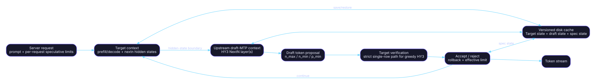

# Graph and model architecture

> **Audit snapshot:** fork `a5605a72768c6562241b248e268e33dc92787394`; upstream `86d86ed4396b4130922f7b9af26e3d9fc11a591b`; inventory date `2026-07-17`.  
> **Decision vocabulary:** **RETAIN** = capability/ABI must survive; **REFRESH** = preserve capability but re-port onto current upstream; **RETIRE** = remove the fork patch and use upstream or archive it. [S-FORK-HEAD](https://github.com/charlie12345/ROCmFPX/tree/a5605a72768c6562241b248e268e33dc92787394) [S-UP-HEAD](https://github.com/ggml-org/llama.cpp/tree/86d86ed4396b4130922f7b9af26e3d9fc11a591b)

## Fork graph changes

The audited fork adds HY3 support in `src/models/hyv3.cpp`, including an MTP/NextN graph path, extra decoder-layer loading, shared embedding/head fallback, target-versus-draft layer filtering, and exposure of the hidden-state tensor consumed by the MTP layer. Commit `630fa5a…` is the capability-owning anchor. [S-HYV3-FORK](https://github.com/charlie12345/ROCmFPX/blob/a5605a72768c6562241b248e268e33dc92787394/src/models/hyv3.cpp) [S-C-630](https://github.com/charlie12345/ROCmFPX/commit/630fa5a0f8fc04689b86d1b0a3d75b2b7d546d07)

The fork also modifies shared model/context/private-API files to create separate target and MTP contexts and to move hidden-state data between them. Those changes are spread across `src/llama-context*`, `src/llama-ext.h`, model loader/model files, and speculative code. [S-C-630](https://github.com/charlie12345/ROCmFPX/commit/630fa5a0f8fc04689b86d1b0a3d75b2b7d546d07) [S-CONTEXT-FORK](https://github.com/charlie12345/ROCmFPX/blob/a5605a72768c6562241b248e268e33dc92787394/src/llama-context.cpp) [S-EXT-FORK](https://github.com/charlie12345/ROCmFPX/blob/a5605a72768c6562241b248e268e33dc92787394/src/llama-ext.h) [S-PR32-FILES](https://github.com/charlie12345/ROCmFPX/pull/32/files)

## Upstream replacement

Upstream PR #25395 merged HY3 with MTP speculative decoding on July 13, 2026. The PR description identifies the base implementation as ported from ROCmFPX and adapts it to current upstream APIs; the pinned upstream tree now contains `src/models/hy-v3.cpp`. [S-UP-PR25395](https://github.com/ggml-org/llama.cpp/pull/25395) [S-UP-HY3-MERGE](https://github.com/ggml-org/llama.cpp/commit/2969d6d15d67a08e7b83f26164b15350c79c5248) [S-HYV3-UP](https://github.com/ggml-org/llama.cpp/blob/86d86ed4396b4130922f7b9af26e3d9fc11a591b/src/models/hy-v3.cpp)

Upstream also carries a separate split-MTP export commit, so the fork’s generic HY3 converter/export patch no longer needs to be maintained. [S-C-F961](https://github.com/charlie12345/ROCmFPX/commit/f961404519a2ed286b750ba1419d40318a6b9a92) [S-UP-SPLIT-MTP](https://github.com/ggml-org/llama.cpp/commit/cb489bc0fb789c2cb7a9cc9dc44fa71893fe0988) [S-CONVERTER-UP](https://github.com/ggml-org/llama.cpp/blob/86d86ed4396b4130922f7b9af26e3d9fc11a591b/convert_hf_to_gguf.py)

## Private API divergence

| Concern | Fork API/behavior | Pinned upstream API/behavior | Decision | Primary sources |
|---|---|---|---|---|
| NextN embedding output | Fork-private pre-norm/nextn source handling. | Current upstream exposes `embeddings_nextn`-oriented plumbing. | **RETIRE fork API** | [S-EXT-FORK](https://github.com/charlie12345/ROCmFPX/blob/a5605a72768c6562241b248e268e33dc92787394/src/llama-ext.h) [S-EXT-UP](https://github.com/ggml-org/llama.cpp/blob/86d86ed4396b4130922f7b9af26e3d9fc11a591b/src/llama-ext.h) |
| MTP layer selection | Fork setters and graph-specific offsets. | Current upstream exposes nextn layer offset APIs. | **RETIRE fork API** | [S-EXT-FORK](https://github.com/charlie12345/ROCmFPX/blob/a5605a72768c6562241b248e268e33dc92787394/src/llama-ext.h) [S-EXT-UP](https://github.com/ggml-org/llama.cpp/blob/86d86ed4396b4130922f7b9af26e3d9fc11a591b/src/llama-ext.h) |
| Other context access | Fork-specific target/draft wiring. | Current upstream private API includes other-context access for current graph architecture. | **REFRESH callers** | [S-EXT-UP](https://github.com/ggml-org/llama.cpp/blob/86d86ed4396b4130922f7b9af26e3d9fc11a591b/src/llama-ext.h) [S-SPEC-UP](https://github.com/ggml-org/llama.cpp/blob/86d86ed4396b4130922f7b9af26e3d9fc11a591b/common/speculative.cpp) |
| HY3 file/model class | `src/models/hyv3.cpp`. | `src/models/hy-v3.cpp`. | **RETIRE fork model** | [S-HYV3-FORK](https://github.com/charlie12345/ROCmFPX/blob/a5605a72768c6562241b248e268e33dc92787394/src/models/hyv3.cpp) [S-HYV3-UP](https://github.com/ggml-org/llama.cpp/blob/86d86ed4396b4130922f7b9af26e3d9fc11a591b/src/models/hy-v3.cpp) |
| Converter split export | Fork commit `f961404…`. | Upstream commit `cb489bc…`. | **RETIRE fork patch** | [S-C-F961](https://github.com/charlie12345/ROCmFPX/commit/f961404519a2ed286b750ba1419d40318a6b9a92) [S-UP-SPLIT-MTP](https://github.com/ggml-org/llama.cpp/commit/cb489bc0fb789c2cb7a9cc9dc44fa71893fe0988) |

## What remains fork-specific

The generic model and graph implementation can be replaced, but the following behavior still requires explicit preservation or revalidation:

- strict greedy target verification for HY3;
- serialization/restoration of speculative state for disk caching;
- per-request speculative policy;
- ROCmFPX quantization of HY3 tensors and backend operation coverage;
- Strix-specific performance/acceptance validation.

These capabilities are implemented outside, or as deltas on top of, the generic HY3 graph. [S-C-7D7](https://github.com/charlie12345/ROCmFPX/commit/7d7b06bc5e6fd4a128af8efa954caa7409376a79) [S-C-C81](https://github.com/charlie12345/ROCmFPX/commit/c81c7c92233b6370b4eb7087398779a8dcb234a4) [S-C-B56](https://github.com/charlie12345/ROCmFPX/commit/b56ad79d77bc1eb9fe6407640eec8b8edfc04900) [S-QUANTIZER](https://github.com/charlie12345/ROCmFPX/blob/a5605a72768c6562241b248e268e33dc92787394/src/llama-quant.cpp) [S-BACKEND-TEST](https://github.com/charlie12345/ROCmFPX/blob/a5605a72768c6562241b248e268e33dc92787394/tests/test-backend-ops.cpp) [S-BUILD-STRIX](https://github.com/charlie12345/ROCmFPX/blob/a5605a72768c6562241b248e268e33dc92787394/scripts/build-strix-rocmfp4-mtp.sh)

## Recommended graph integration

1. Adopt upstream HY3 and the current draft-MTP graph unchanged.
2. Add a narrow strict-verification policy to the current speculative engine.
3. Add explicit, versioned speculative-state serialization hooks only where upstream state APIs are insufficient.
4. Keep ROCmFPX formats below the graph layer through normal GGML type traits and backend dispatch.
5. Test target-token equivalence, cache restore equivalence, and multi-context/RPC behavior independently.

This sequence minimizes graph divergence while preserving the actual fork-only capabilities. [S-HYV3-UP](https://github.com/ggml-org/llama.cpp/blob/86d86ed4396b4130922f7b9af26e3d9fc11a591b/src/models/hy-v3.cpp) [S-SPEC-UP](https://github.com/ggml-org/llama.cpp/blob/86d86ed4396b4130922f7b9af26e3d9fc11a591b/common/speculative.cpp) [S-RPC-MTP-FIX](https://github.com/ggml-org/llama.cpp/commit/c3e9ade6dd3ff2a1ceafd2d59062634715b472c4) [S-C-7D7](https://github.com/charlie12345/ROCmFPX/commit/7d7b06bc5e6fd4a128af8efa954caa7409376a79) [S-C-C81](https://github.com/charlie12345/ROCmFPX/commit/c81c7c92233b6370b4eb7087398779a8dcb234a4) [S-QT-ENUM-FORK](https://github.com/charlie12345/ROCmFPX/blob/a5605a72768c6562241b248e268e33dc92787394/ggml/include/ggml.h)
