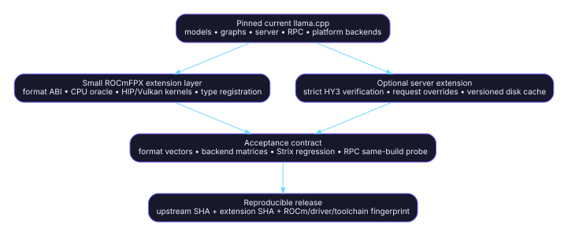

# ROCmFPX technical inventory

> **Audit snapshot:** fork `a5605a72768c6562241b248e268e33dc92787394`; upstream `86d86ed4396b4130922f7b9af26e3d9fc11a591b`; inventory date `2026-07-17`.  
> **Decision vocabulary:** **RETAIN** = capability/ABI must survive; **REFRESH** = preserve capability but re-port onto current upstream; **RETIRE** = remove the fork patch and use upstream or archive it. [S-FORK-HEAD](https://github.com/charlie12345/ROCmFPX/tree/a5605a72768c6562241b248e268e33dc92787394) [S-UP-HEAD](https://github.com/ggml-org/llama.cpp/tree/86d86ed4396b4130922f7b9af26e3d9fc11a591b)

<strong>100</strong>post-baseline commit-graph nodes

<strong>276</strong>unique paths across PRs #27/#28/#31/#32

<strong>47</strong>path-level RETAIN

<strong>105</strong>path-level REFRESH

<strong>124</strong>path-level RETIRE

Counts derive from the exact compare and PR changed-file lists; path decisions are this inventory's assessment. [S-COMPARE](https://github.com/charlie12345/ROCmFPX/compare/5b3956605309dd3e6beed49c8f3a41423ba71d25...a5605a72768c6562241b248e268e33dc92787394) [S-PR27-FILES](https://github.com/charlie12345/ROCmFPX/pull/27/files) [S-PR28](https://github.com/charlie12345/ROCmFPX/pull/28) [S-PR31-FILES](https://github.com/charlie12345/ROCmFPX/pull/31/files) [S-PR32-FILES](https://github.com/charlie12345/ROCmFPX/pull/32/files)

## Executive conclusion

ROCmFPX’s durable value is the **format and backend extension layer**: stable GGUF/GGML type IDs, on-disk block layouts, CPU reference implementations, HIP/ROCm and Vulkan kernels, Strix Halo tuning/validation, and a small set of server behaviors that upstream does not yet expose. Those capabilities should survive a rebase. [S-QT-ENUM-FORK](https://github.com/charlie12345/ROCmFPX/blob/a5605a72768c6562241b248e268e33dc92787394/ggml/include/ggml.h) [S-ROCMFP4-H](https://github.com/charlie12345/ROCmFPX/blob/a5605a72768c6562241b248e268e33dc92787394/ggml/rocmfp4/rocmfp4.h) [S-ROCMFPX-H](https://github.com/charlie12345/ROCmFPX/blob/a5605a72768c6562241b248e268e33dc92787394/ggml/rocmfpx/rocmfpx.h) [S-MMVQ](https://github.com/charlie12345/ROCmFPX/blob/a5605a72768c6562241b248e268e33dc92787394/ggml/src/ggml-cuda/mmvq.cu) [S-VULKAN](https://github.com/charlie12345/ROCmFPX/blob/a5605a72768c6562241b248e268e33dc92787394/ggml/src/ggml-vulkan/ggml-vulkan.cpp) [S-BUILD-STRIX](https://github.com/charlie12345/ROCmFPX/blob/a5605a72768c6562241b248e268e33dc92787394/scripts/build-strix-rocmfp4-mtp.sh)

The largest maintenance liability is the copied **general llama.cpp surface**: HY3 model/graph code, private MTP APIs, generic parser/Jinja fixes, WebUI repairs, Apple packaging, and large Hexagon/OpenCL/WebGPU snapshots. Current upstream now contains HY3 with MTP and newer implementations of these shared subsystems, so the fork should replace those copies rather than continue merging them. [S-UP-PR25395](https://github.com/ggml-org/llama.cpp/pull/25395) [S-HYV3-UP](https://github.com/ggml-org/llama.cpp/blob/86d86ed4396b4130922f7b9af26e3d9fc11a591b/src/models/hy-v3.cpp) [S-EXT-UP](https://github.com/ggml-org/llama.cpp/blob/86d86ed4396b4130922f7b9af26e3d9fc11a591b/src/llama-ext.h) [S-C-807](https://github.com/charlie12345/ROCmFPX/commit/80732f992f7c75e9154cfe184041f1384c59a0fb) [S-C-FF8](https://github.com/charlie12345/ROCmFPX/commit/ff8e7b8cf9dab714951df49d71f5835a7322404a) [S-C-01D](https://github.com/charlie12345/ROCmFPX/commit/01d463bb23c3f290688c4529c13b3b467fa2f7dc) [S-UP-HEAD](https://github.com/ggml-org/llama.cpp/tree/86d86ed4396b4130922f7b9af26e3d9fc11a591b)

RPC is not a meaningful ROCmFPX-owned patch layer in the audited PR series: none of PRs #27, #31, or #32 changes `ggml/src/ggml-rpc/*`. The correct target is current upstream RPC plus compatibility tests for ROCmFPX tensor IDs and same-build client/server behavior. This is an inference from the exact PR file lists and the generic `uint32_t` tensor-type field in the RPC implementation. [S-PR27-FILES](https://github.com/charlie12345/ROCmFPX/pull/27/files) [S-PR31-FILES](https://github.com/charlie12345/ROCmFPX/pull/31/files) [S-PR32-FILES](https://github.com/charlie12345/ROCmFPX/pull/32/files) [S-RPC-FORK](https://github.com/charlie12345/ROCmFPX/blob/a5605a72768c6562241b248e268e33dc92787394/ggml/src/ggml-rpc/ggml-rpc.cpp) [S-RPC-UP](https://github.com/ggml-org/llama.cpp/blob/86d86ed4396b4130922f7b9af26e3d9fc11a591b/ggml/src/ggml-rpc/ggml-rpc.cpp) [S-RPC-MTP-FIX](https://github.com/ggml-org/llama.cpp/commit/c3e9ade6dd3ff2a1ceafd2d59062634715b472c4) [S-RPC-IGPU-FIX](https://github.com/ggml-org/llama.cpp/commit/1738129bee5c81b06fa1850daf3f958813c76f5f)

## Recommended target architecture

The migration target is a pinned current upstream tree with a **small, separately testable ROCmFPX extension series**, not another whole-tree source snapshot. [S-UP-HEAD](https://github.com/ggml-org/llama.cpp/tree/86d86ed4396b4130922f7b9af26e3d9fc11a591b) [S-COMPARE](https://github.com/charlie12345/ROCmFPX/compare/5b3956605309dd3e6beed49c8f3a41423ba71d25...a5605a72768c6562241b248e268e33dc92787394) [S-ROCMFPX-CI](https://github.com/charlie12345/ROCmFPX/blob/a5605a72768c6562241b248e268e33dc92787394/.github/workflows/check-rocmfpx.yml) [S-BACKEND-TEST](https://github.com/charlie12345/ROCmFPX/blob/a5605a72768c6562241b248e268e33dc92787394/tests/test-backend-ops.cpp)

## Preserve first

| Capability contract | Decision | Why | Primary sources |
|---|---|---|---|
| ROCmFP4/Q2/Q3/Q6/Q8/Turbo numeric type IDs and byte layouts | **RETAIN** | Existing GGUF files depend on these IDs and block ABIs. | [S-QT-ENUM-FORK](https://github.com/charlie12345/ROCmFPX/blob/a5605a72768c6562241b248e268e33dc92787394/ggml/include/ggml.h) [S-ROCMFP4-H](https://github.com/charlie12345/ROCmFPX/blob/a5605a72768c6562241b248e268e33dc92787394/ggml/rocmfp4/rocmfp4.h) [S-ROCMFPX-H](https://github.com/charlie12345/ROCmFPX/blob/a5605a72768c6562241b248e268e33dc92787394/ggml/rocmfpx/rocmfpx.h) [S-ROCMFP2-H](https://github.com/charlie12345/ROCmFPX/blob/a5605a72768c6562241b248e268e33dc92787394/ggml/rocmfpx/rocmfp2_reference.h) |
| CPU reference quantize/dequantize behavior | **RETAIN** | It is the correctness oracle for optimized backends. | [S-ROCMFP4-C](https://github.com/charlie12345/ROCmFPX/blob/a5605a72768c6562241b248e268e33dc92787394/ggml/rocmfp4/rocmfp4.c) [S-ROCMFPX-C](https://github.com/charlie12345/ROCmFPX/blob/a5605a72768c6562241b248e268e33dc92787394/ggml/rocmfpx/rocmfpx.c) [S-ROCMFP2-C](https://github.com/charlie12345/ROCmFPX/blob/a5605a72768c6562241b248e268e33dc92787394/ggml/rocmfpx/rocmfp2_reference.c) |
| HIP/ROCm and Vulkan format kernels | **REFRESH** | The kernels are unique; their surrounding upstream backend code is newer. | [S-MMVQ](https://github.com/charlie12345/ROCmFPX/blob/a5605a72768c6562241b248e268e33dc92787394/ggml/src/ggml-cuda/mmvq.cu) [S-MMQ](https://github.com/charlie12345/ROCmFPX/blob/a5605a72768c6562241b248e268e33dc92787394/ggml/src/ggml-cuda/mmq.cu) [S-VULKAN](https://github.com/charlie12345/ROCmFPX/blob/a5605a72768c6562241b248e268e33dc92787394/ggml/src/ggml-vulkan/ggml-vulkan.cpp) [S-UP-HEAD](https://github.com/ggml-org/llama.cpp/tree/86d86ed4396b4130922f7b9af26e3d9fc11a591b) |
| gfx1151 Strix Halo build/tuning and real-device gates | **RETAIN** | AMD identifies Strix Halo as gfx1151/RDNA 3.5; fork-specific tuning is not upstream-owned. | [S-BUILD-STRIX](https://github.com/charlie12345/ROCmFPX/blob/a5605a72768c6562241b248e268e33dc92787394/scripts/build-strix-rocmfp4-mtp.sh) [S-TUNE-FLAGS](https://github.com/charlie12345/ROCmFPX/blob/a5605a72768c6562241b248e268e33dc92787394/scripts/rocmfp4-decode-tune-flags.sh) [S-AMD-STRIX](https://rocm.docs.amd.com/en/docs-7.2.0/how-to/system-optimization/strixhalo.html) |
| Strict greedy HY3 verification and per-request speculative controls | **RETAIN** | No equivalent enabled behavior was identified in the pinned upstream server. | [S-C-7D7](https://github.com/charlie12345/ROCmFPX/commit/7d7b06bc5e6fd4a128af8efa954caa7409376a79) [S-C-B56](https://github.com/charlie12345/ROCmFPX/commit/b56ad79d77bc1eb9fe6407640eec8b8edfc04900) [S-SERVER-SCHEMA-UP](https://github.com/ggml-org/llama.cpp/blob/86d86ed4396b4130922f7b9af26e3d9fc11a591b/tools/server/server-schema.cpp) |
| SSD prompt cache including draft/speculative state | **REFRESH** | Capability is fork-specific, but it must be rebuilt on current state APIs and versioned. | [S-C-C81](https://github.com/charlie12345/ROCmFPX/commit/c81c7c92233b6370b4eb7087398779a8dcb234a4) [S-SERVER-CTX](https://github.com/charlie12345/ROCmFPX/blob/a5605a72768c6562241b248e268e33dc92787394/tools/server/server-context.cpp) [S-SPEC-UP](https://github.com/ggml-org/llama.cpp/blob/86d86ed4396b4130922f7b9af26e3d9fc11a591b/common/speculative.cpp) |

## Replace first

| Fork patch family | Decision | Replacement | Primary sources |
|---|---|---|---|
| HY3 base model and generic MTP graph | **RETIRE** | Upstream PR #25395 and current `src/models/hy-v3.cpp`. | [S-HYV3-FORK](https://github.com/charlie12345/ROCmFPX/blob/a5605a72768c6562241b248e268e33dc92787394/src/models/hyv3.cpp) [S-UP-PR25395](https://github.com/ggml-org/llama.cpp/pull/25395) [S-HYV3-UP](https://github.com/ggml-org/llama.cpp/blob/86d86ed4396b4130922f7b9af26e3d9fc11a591b/src/models/hy-v3.cpp) |
| Fork private MTP API | **RETIRE** | Current upstream `llama-ext.h` nextn APIs. | [S-EXT-FORK](https://github.com/charlie12345/ROCmFPX/blob/a5605a72768c6562241b248e268e33dc92787394/src/llama-ext.h) [S-EXT-UP](https://github.com/ggml-org/llama.cpp/blob/86d86ed4396b4130922f7b9af26e3d9fc11a591b/src/llama-ext.h) |
| HY3 split-export converter patch | **RETIRE** | Upstream split-export commit. | [S-C-F961](https://github.com/charlie12345/ROCmFPX/commit/f961404519a2ed286b750ba1419d40318a6b9a92) [S-UP-SPLIT-MTP](https://github.com/ggml-org/llama.cpp/commit/cb489bc0fb789c2cb7a9cc9dc44fa71893fe0988) |
| RPC implementation | **RETIRE** | Current upstream RPC, including MTP-context and Strix iGPU fixes. | [S-RPC-UP](https://github.com/ggml-org/llama.cpp/blob/86d86ed4396b4130922f7b9af26e3d9fc11a591b/ggml/src/ggml-rpc/ggml-rpc.cpp) [S-RPC-MTP-FIX](https://github.com/ggml-org/llama.cpp/commit/c3e9ade6dd3ff2a1ceafd2d59062634715b472c4) [S-RPC-IGPU-FIX](https://github.com/ggml-org/llama.cpp/commit/1738129bee5c81b06fa1850daf3f958813c76f5f) [S-RPC-LIGHTNING](https://github.com/ggml-org/llama.cpp/commit/00f5442cc4e805293280c8f85d21d8f9d4aad206) |
| Hexagon/OpenCL/WebGPU snapshots | **RETIRE** | Current upstream backend trees. | [S-C-807](https://github.com/charlie12345/ROCmFPX/commit/80732f992f7c75e9154cfe184041f1384c59a0fb) [S-PR27-FILES](https://github.com/charlie12345/ROCmFPX/pull/27/files) [S-UP-HEAD](https://github.com/ggml-org/llama.cpp/tree/86d86ed4396b4130922f7b9af26e3d9fc11a591b) |
| Generic WebUI, Jinja, formatting, and Apple packaging backports | **RETIRE** | Current upstream implementations. | [S-C-FF8](https://github.com/charlie12345/ROCmFPX/commit/ff8e7b8cf9dab714951df49d71f5835a7322404a) [S-C-A8C](https://github.com/charlie12345/ROCmFPX/commit/a8c41d31423e3e0b6f2dc7138af1d4fba8edb295) [S-C-FE2](https://github.com/charlie12345/ROCmFPX/commit/fe2b7dc5e19a5e24c276593368a1bb41d0e27b1d) [S-C-D52](https://github.com/charlie12345/ROCmFPX/commit/d52c96a8339325417624351bebad194c3864cb26) [S-C-01D](https://github.com/charlie12345/ROCmFPX/commit/01d463bb23c3f290688c4529c13b3b467fa2f7dc) |

## Navigation

Start with [Scope and baselines](01-Scope-and-Baselines.md) and the [Audit report](AUDIT-REPORT.md), then use the [commit map](03-Commit-Map.md), [file map](04-File-Map.md), and [retain/refresh/retire matrix](13-Retain-Refresh-Retire.md). Machine-readable ledgers are under [`data/`](data/).
