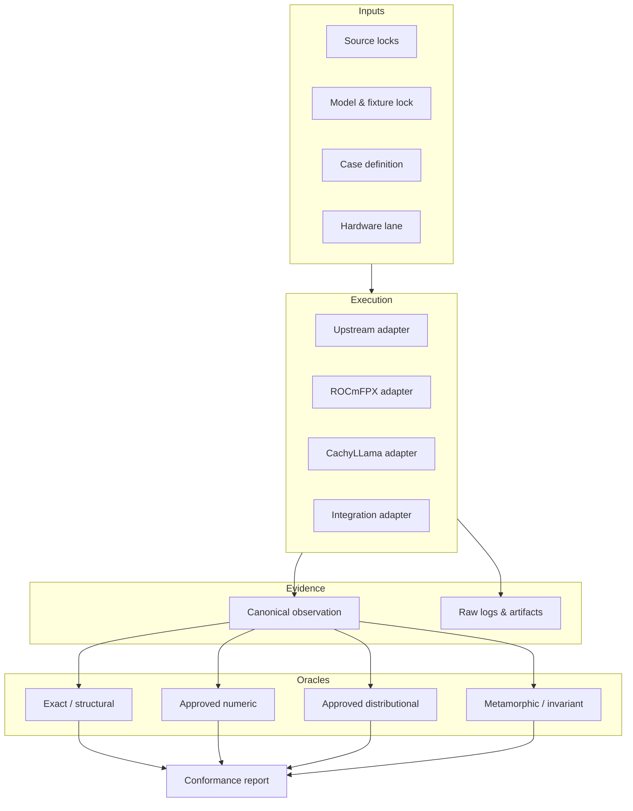

# Conformance architecture



## Adapter boundary

A fork adapter is thin. It maps a case to native CTest, a CLI invocation, a server request, RPC, or a small instrumentation binary. It must not hide unsupported features, silently rewrite sampling controls, or normalize semantic output.

Recommended adapter methods:

```text
probe_capabilities()
resolve_binary(component)
materialize_fixture(fixture_id)
run_native_test(path_or_label)
run_cli(case, controls)
run_server(case, controls)
run_rpc(case, controls)
cancel(handle, phase)
collect_observation()
```

## Canonical observation

`matrix/schemas/observation.schema.json` defines the envelope. It includes:

- case and fork identity;
- repository, commit, and dirty state;
- compiler, flags, build ID, and binary digest;
- operating system, architecture, backend, device, driver/runtime;
- fixture IDs and digests;
- exact command and seed schedule;
- status, exit code, duration, outputs, counters, and error class;
- SHA-256 values for retained artifacts.

A raw server response should be preserved as an artifact. Normalized fields are added to the observation; they do not replace raw evidence.

## Normalization boundary

Allowed normalization is narrow and case-specific:

- CRLF to LF for rendered text where the upstream test already does so;
- removal/canonicalization of timestamps, request IDs, host paths, ports, and wall-clock timings;
- assembly of ordered stream deltas;
- adapter-specific error fields into a normalized error class while retaining the original envelope.

Never normalize token IDs, generated text, tool arguments, stop reasons, HTTP status, counters under test, logits, or cache identity unless the case explicitly defines a transformation.

## Oracle dispatch

| Oracle | Comparator |
|---|---|
| exact bytes/text/tokens | equality |
| normalized JSON/schema | canonicalize declared volatile fields, then equality/schema validation |
| error contract | status/method/normalized class plus endpoint-required fields |
| numeric | approved scoped profile only |
| distributional | preregistered seeds/statistic plus approved profile only |
| language membership | grammar/JSON/schema validator |
| metamorphic | declared relation between two or more executions |
| native test | native process pass/fail and retained logs |
| telemetry | record only unless a separately approved policy exists |

## Result storage

Use content-addressed paths:

```text
reports/raw/<run-id>/<fork>/<case-id>/observation.json
reports/raw/<run-id>/<fork>/<case-id>/stdout.log
reports/raw/<run-id>/<fork>/<case-id>/stderr.log
reports/summary/<run-id>.json
```

Never modify files beneath an approved reference ID. Retire and replace them through a new review record.
