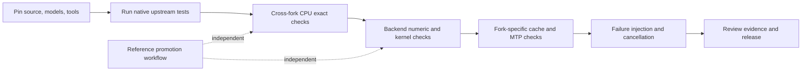

# Cross-Fork Correctness and Regression Testing

> **LLM Wiki / Engineering Conformance**  
> Semantic compatibility first; performance only after correctness.

## Mission

Establish evidence that the integration fork preserves upstream behavior, incorporates ROCmFPX and CachyLLama features safely, and fails predictably across CPU and accelerator backends.

The suite compares four source identities using immutable commits, model and fixture SHA-256 values, build fingerprints, named hardware lanes, and canonical observations. A branch name alone is never a reference.

## Current scope

| Area | Cases |
|---|---|
| Cache rejection | 12 |
| Cache save/restore | 12 |
| Cancellation | 10 |
| Chat templates | 9 |
| Deterministic runs | 10 |
| Expected error behavior | 16 |
| GGUF parsing | 14 |
| Logits | 8 |
| Long context | 10 |
| MTP/speculative decoding | 12 |
| Quantized kernels | 12 |
| RPC | 12 |
| Sampling | 8 |
| Server APIs | 20 |
| Tokenizer | 10 |

**Total:** 175 cases. The machine-readable matrix is authoritative.

## Release-gate order

1. **Pin.** Resolve every fork, model, tokenizer, quantizer, and binary to a digest.
2. **Reuse.** Run upstream CTest and server pytest suites before adding differential checks.
3. **Compare.** Use exact oracles for bytes, tokens, templates, deterministic outputs, schemas, and normalized errors.
4. **Calibrate.** Create numeric or statistical gates only through an independent promotion workflow.
5. **Inject.** Corrupt inputs, disconnect transports, cancel work, and exhaust bounded resources.
6. **Retain.** Preserve raw observations and artifacts; never overwrite an oracle from the candidate run.

## Decision rule

A result is one of:

| Result | Meaning |
|---|---|
| **PASS** | The declared oracle was evaluated and satisfied. |
| **FAIL** | The oracle was evaluated and not satisfied. |
| **ERROR** | The harness or test environment failed before a valid comparison. |
| **SKIP** | A capability was absent and the matrix permits an evidence-backed skip. |
| **NOT APPLICABLE** | The fork intentionally does not implement the feature. |
| **UNCALIBRATED** | Evidence may be collected, but no numeric/distributional pass/fail gate exists. |

A missing accelerator, model, or fork pin is not a pass.

## Key pages

- [Forks and pinning](Forks-and-Pinning.md)
- [Conformance architecture](Conformance-Architecture.md)
- [Test matrix](Test-Matrix.md)
- [Upstream test reuse](Upstream-Test-Reuse.md)
- [Fixtures](Fixtures.md)
- [Oracles and tolerances](Oracles-and-Tolerances.md)
- [Deterministic and nondeterministic comparisons](Deterministic-and-Nondeterministic-Comparisons.md)
- [Failure injection](Failure-Injection.md)
- [CI recommendations](CI-Recommendations.md)
- [Runbook](Runbook.md)
