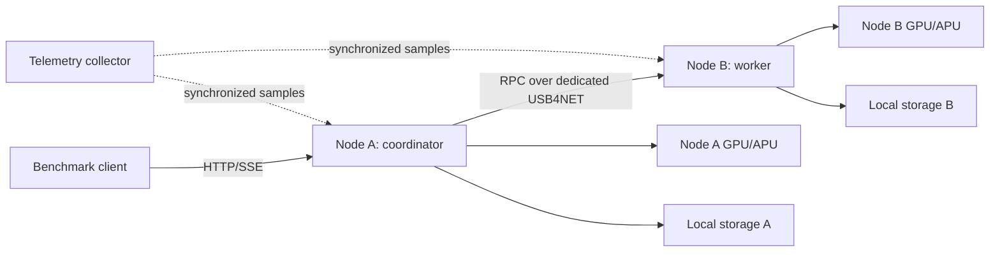

# System Under Test

> **Wiki status:** Proposed · **Evidence state:** D0 — design only · **Last reviewed:** 2026-07-17  
> **Machine-validation status:** Not run. Missing measurements are `INSUFFICIENT_EVIDENCE`, never an implicit pass.

> **Default architecture assumption:** Node A coordinates API traffic and may contribute its local accelerator; Node B exposes a remote accelerator across a dedicated USB4NET point-to-point interface. The core program remains valid if the engine differs, provided the adapter maps equivalent timestamps, cache counters, and errors.

## Logical topology

## SUT freeze set

The following fields define comparability. A change creates a new baseline family unless the experiment explicitly studies that field:

- Node make/model, APU stepping, memory capacity/speed, BIOS/AGESA, firmware, cooling mode, power supply, and USB4 cable identity.
- OS image, kernel build, amdgpu/KFD, firmware package, ROCm/HIP or Mesa/Vulkan, compiler, engine commit, build flags, and container digest.
- Model repository/revision, every shard hash, GGUF metadata, quantization, tokenizer and chat template hash, KV-cache type, context and batch settings.
- CPU governor/affinity, GPU power/performance profile, memory allocation mode, swap/zram state, filesystem/mount options, storage device/firmware.
- USB4 negotiated lane count and per-lane speed, interface/MTU, offload settings, IP addresses, firewall, routing, and time synchronization.

## Current upstream constraints to verify, not assume

Official AMD documentation presently identifies Strix Halo/Ryzen AI Max as `gfx1151`, lists kernel requirements for reliable KFD queue and memory behavior, and exposes more than one ROCm/Ryzen support channel. Capture the exact support page and version used for each run rather than treating “latest ROCm” as a stable identifier. [[SRC-002]](../references/Sources.md#src-002) [[SRC-003]](../references/Sources.md#src-003) [[SRC-004]](../references/Sources.md#src-004)

Upstream `llama.cpp` describes its RPC backend as proof-of-concept, fragile, and insecure. Stable status in this program therefore means stable **inside the declared trusted point-to-point boundary**; it does not establish secure multi-tenant or internet-facing RPC operation. [[SRC-007]](../references/Sources.md#src-007)

## Required SUT declaration

Copy `config/sut.example.yaml` to `config/sut.yaml`. Stable evaluation is blocked while any required identity or absolute SLO remains `null`.
