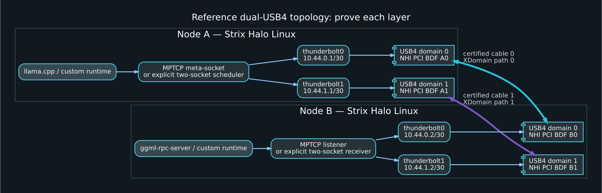

# Dual-USB4 Strix Halo Transport Wiki

**Research snapshot:** 2026-07-17  
**Validation:** passed with documented environment-only skips; see [VALIDATION.md](VALIDATION.md)  
**Target:** two Linux nodes based on AMD Strix Halo / Ryzen AI Max, joined by two host-to-host USB4 cables  
**Primary recommendation:** expose each cable as its own `thunderbolt-net` interface, place the links in different point-to-point subnets, prove controller and failure independence, and use Linux MPTCP for a single logical llama.cpp RPC connection. Use explicit two-socket striping for a custom runtime. Treat USB4STREAM as a Linux 7.2-era experimental raw transport, not shared memory.



## What is in this folder

This repository is both a human-readable wiki and an LLM-ingestible evidence pack. It includes:

- GitHub Wiki files: `Home.md`, `_Sidebar.md`, `_Footer.md`.
- MkDocs files: `mkdocs.yml`, `docs/`, and `requirements-docs.txt`.
- LLM discovery files: `llms.txt`, `llms-full.txt`, `AGENTS.md`, `data/claims.jsonl`, and `manifest.json`.
- Reproducible Linux procedures, topology capture, MPTCP, bonding, performance, and proof scripts.
- Mermaid, Graphviz, SVG, and PNG topology diagrams.
- Machine-readable kernel, transport, source, and proof matrices.
- An optional llama.cpp patch that makes MPTCP selection explicit through `GGML_RPC_MPTCP=1`.
- An auditable [citation map](CITATIONS.md), [source snapshot](SOURCE-SNAPSHOT.md), and offline [validation procedure](VALIDATION.md).

## Start here

1. Read [Executive conclusions](docs/00-executive-conclusions.md).
2. Run `sudo scripts/capture-topology.sh before` on both nodes.
3. Configure two separate subnets with `scripts/configure-links.sh` and `scripts/configure-policy-routing.sh`.
4. Establish per-link baselines and the simultaneous-throughput test in [Measurement and proof](docs/14-measurement-and-proof.md).
5. Configure MPTCP with `scripts/configure-mptcp.sh` and verify two byte-carrying subflows.
6. Run both sides of llama.cpp RPC through `mptcpize`, or apply the supplied native-MPTCP patch.

## Bottom-line decisions

| Requirement | Preferred mechanism | Reason |
|---|---|---|
| One llama.cpp RPC connection using both cables | MPTCP over two USB4NET subnets | Preserves one ordered stream while scheduling independent TCP subflows |
| Custom runtime, maximum control | Two bound TCP sockets or two USB4STREAM devices with application striping | Explicit path ownership, queueing, integrity, and reassembly |
| Link failover only | Bond `active-backup` or MPTCP backup subflow | Low reordering risk |
| Many independent TCP flows | Policy routing, ECMP, or bond `balance-xor`/802.3ad | Flow hashing can spread sockets, but not one socket |
| Shared memory across nodes | Not available through generic USB4 host-to-host links | USB4NET and USB4STREAM are DMA-backed transports, not coherent memory fabrics |
| Raw upstream USB4 data plane | USB4STREAM on Linux 7.2+ | Character devices, 4 KiB tunneled frames, configurable rings; still copy-based at userspace ABI |

## Scope warning

AMD specifies two native USB4 40 Gbit/s ports for Ryzen AI Max+ 395, but that does **not** prove that a particular board exposes two independent Linux USB4 host controllers or two non-contending internal paths. Linux's firmware/ICM connection-manager path can also replace an existing same-peer XDomain when a second route appears within one USB4 domain. This wiki defines and tests several levels of independence rather than assuming it from the port count.

## Build the web wiki

```bash
python3 -m venv .venv
. .venv/bin/activate
pip install -r requirements-docs.txt
mkdocs serve
```

The Markdown files remain usable without MkDocs. Pre-rendered SVG and PNG diagrams are included. Run `scripts/validate-wiki.sh` for offline syntax, link, data, diagram, C-build, and dual-path loopback checks.

## License

Documentation and scripts are provided under the MIT License. Hardware behavior, firmware behavior, and performance remain platform-specific; validate all claims on the target nodes.
