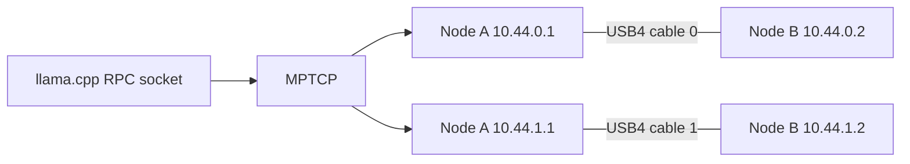

# Executive conclusions

## Recommended deployment

1. Connect one cable at a time, then both. Require two simultaneously present XDomains and `thunderboltN` interfaces; prefer different `domainX` objects and NHI PCI BDFs on both hosts.
2. Load `thunderbolt-net` if needed, then rename interfaces persistently or record their sysfs path. Interface numbers are discovery order, not physical identity.
3. Assign separate point-to-point subnets. Avoid one shared subnet across both cables.
4. Add source-specific policy tables and set reverse-path filtering to loose mode on the USB4 interfaces.
5. Establish single-link baselines, then run two simultaneous source-bound flows.
6. Configure MPTCP endpoints so the initial subflow is cable 0 and the announced/additional subflow is cable 1.
7. Run both llama.cpp RPC endpoints through `mptcpize`, or use the optional source patch.
8. Confirm two established subflows and byte movement on both netdevs. Unplug one cable and confirm continuity.

## What “independent” must mean

There are multiple useful but non-equivalent claims:

| Claim | Minimum evidence |
|---|---|
| Interface independence | Two netdevs and two XDomain service paths |
| Physical-link independence | Unplugging either cable leaves the other carrier and traffic intact |
| Host-controller independence | Different `domainX` objects and different NHI PCI BDFs on both nodes |
| Interrupt/queue independence | Distinct driver instances and observable IRQ/NAPI activity per link |
| Performance independence | Simultaneous aggregate throughput is materially above the best isolated link and both links remain productive |
| Application multipath | One MPTCP connection has at least two established, byte-carrying subflows with the intended address pairs |

Two netdevs alone prove none of the stronger claims.

## Transport verdicts

### TCP over one USB4NET link

The stable baseline. It is directly usable by llama.cpp RPC. It cannot aggregate one socket across both links.

### Two ordinary TCP connections

The best custom-runtime baseline. Bind one socket to each source address or device, frame data explicitly, stripe at chunk granularity, and reassemble by global offset. This is deterministic and observable.

### MPTCP

The preferred llama.cpp path. It retains one stream abstraction, permits bandwidth aggregation and failover, and can be introduced with `mptcpize` or a two-line socket-protocol change. The path manager, routing, and endpoint configuration must be explicit in a two-cable lab.

### Linux bonding

- `active-backup`: robust failover; no aggregation.
- `balance-xor` or 802.3ad: useful for several concurrent flows; one flow remains on one member.
- `balance-rr`: can stripe one flow, but reordering often reduces TCP performance.
- Linux 7.0+ is the practical `thunderbolt-net` floor for current bonding support because the driver gained MAC and link-setting support there.

### USB4STREAM

An upstream raw character-device transport in Linux 7.2 development. It supports multiple streams and coexistence with USB4NET. The current implementation uses 4 KiB tunneled data frames, page-backed DMA rings, blocking/nonblocking I/O, and `poll`, but no `mmap` or zero-copy userspace interface. A custom runtime needs its own message framing, scheduling, reconnection, integrity, and security.

### Shared-memory-like and RDMA approaches

Generic host-to-host USB4 does not expose coherent memory. `memfd`, POSIX shared memory, `dma-buf`, and ROCm allocations are local to one kernel unless a separate transport copies or RDMA-writes data. Soft-RoCE can create a verbs device over USB4NET, but it is software processing over the same network path and should not be confused with hardware-offloaded or coherent shared memory.

## Primary constraints

- The firmware/ICM connection-manager path can replace an existing same-UUID XDomain when that peer appears at another route within one USB4 domain. Two connectors therefore do not guarantee two concurrent same-peer interfaces; separate domains/controllers are the robust topology.
- The current `thunderbolt-net` driver has one NAPI instance and one TX/RX ring pair per interface; it is not an RSS-style multiqueue NIC.
- Its advertised MTU range reaches 65522 bytes, while USB4NET internally fragments packets into roughly 4 KiB transport frames.
- llama.cpp's RPC server is explicitly proof-of-concept/insecure, IPv4-only in the current transport implementation, and listens on loopback by default.
- USB4 link CRC and TCP/MPTCP checksums are error detectors, not peer authentication or encryption.
- Strix Halo systems may report one NUMA node. Measure PCI/IRQ/cache locality rather than inventing NUMA boundaries.
