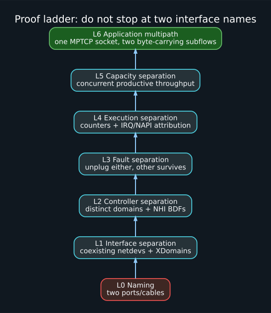

# Scope and terminology

## Scope

The reference setup is two Linux hosts with two direct, certified USB4/Thunderbolt-compatible cables between them. Each host is assumed to expose two USB4-capable receptacles. No switch, dock, or USB4 hub is required. The procedures remain valid when a hub is present, but a shared hub or upstream link weakens path independence.

The workload is bulk and latency-sensitive tensor/RPC traffic rather than general Internet routing. Both hosts are under one administrator's control.

## Linux object vocabulary

**NHI** — Native Host Interface, the PCI-function-facing controller interface driven by the Linux `thunderbolt` subsystem.

**Domain** — a Linux Thunderbolt/USB4 domain object, typically one per host controller. The domain includes a connection manager and router topology.

**Router** — a USB4 router. A host router is the local controller; an XDomain represents a connected remote host.

**XDomain** — a cross-domain host-to-host connection. Services such as USB4NET and USB4STREAM are advertised beneath it.

**USB4NET / ThunderboltIP** — the host-to-host networking protocol exposed by Linux through `thunderbolt-net` as an Ethernet netdev.

**USB4STREAM** — the Linux raw streaming protocol exposed by `thunderbolt-stream` through `/dev/tbstreamX`.

**Path** — an end-to-end route defined by local interface, cable/USB4 fabric, remote interface, IP addressing, and transport subflow. A path is not the same thing as an IP route entry.

**Subflow** — one regular TCP connection used as a component of an MPTCP connection.

## Independence ladder

### Level 0 — naming only

Two ports or two cables exist. No software evidence.

### Level 1 — interface separation

Two `thunderboltN` netdevs remain present **simultaneously** and resolve to different service/XDomain sysfs paths. Attaching cable 2 must not remove or replace cable 1's XDomain.

### Level 2 — controller separation

The two paths resolve to different USB4 domains and different NHI PCI functions on each host. This is strong evidence that they do not share the same host-controller DMA engine or driver instance.

### Level 3 — fault separation

Unplugging, deauthorizing, or administratively lowering one path does not remove the other XDomain, carrier, route, or data transfer.

### Level 4 — execution separation

Traffic bound to link 0 changes only link-0 counters and its associated IRQ/NAPI activity; link 1 behaves similarly.

### Level 5 — capacity separation

Both links transfer concurrently and the aggregate is materially greater than the best isolated-link result. A shared memory controller, SoC interconnect, firmware policy, thermal limit, or CPU bottleneck can prevent ideal scaling even when controllers are distinct.

### Level 6 — application multipath

One logical MPTCP connection has at least two established subflows on the intended address pairs and both subflows carry payload bytes.

## Evidence labels used in this wiki

- **Upstream fact** — documented by a primary project.
- **Source-code fact** — observed in a specific upstream implementation.
- **Inference** — follows from documented behavior but should be tested.
- **Heuristic** — an operational criterion chosen for this project.
- **Platform observation** — machine-specific output; never generalized without corroboration.
