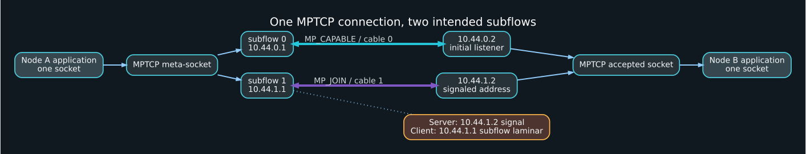

# Multipath TCP

## Why MPTCP fits llama.cpp RPC

MPTCP exposes one ordered stream socket to the application while creating regular TCP subflows over multiple interfaces. It can aggregate bandwidth, reinject data after path loss, and fall back to ordinary TCP when the peer does not negotiate MPTCP. This aligns with llama.cpp RPC's existing stream-oriented send/receive interface.



## Prerequisites

```bash
sysctl net.mptcp.enabled 2>/dev/null || true
ip mptcp limits
ip mptcp endpoint show
ss -M -h
```

Use the in-kernel path manager for a fixed two-cable topology:

```bash
sudo sysctl -w net.mptcp.path_manager=kernel 2>/dev/null || true
```

Do not allow NetworkManager and `mptcpd` to manage the same endpoints simultaneously.

## Reference endpoint design

Initial subflow:

```text
Node A 10.44.0.1  <---- cable 0 ---->  10.44.0.2 Node B
```

Additional subflow:

```text
Node A 10.44.1.1  <---- cable 1 ---->  10.44.1.2 Node B
```

Node B announces `10.44.1.2` with `signal`. Node A marks `10.44.1.1` as a `subflow laminar` endpoint. `laminar`, introduced in Linux 6.18 and exposed by correspondingly recent iproute2 builds, helps pair one local endpoint with one additional remote address instead of generating a full local×remote mesh.

## Configure with the supplied script

Node B, the RPC server:

```bash
sudo ROLE=server IF0=thunderbolt0 IF1=thunderbolt1 \
  scripts/configure-mptcp.sh
```

Node A, the RPC client:

```bash
sudo ROLE=client IF0=thunderbolt0 IF1=thunderbolt1 \
  scripts/configure-mptcp.sh
```

Inspect before clearing existing endpoint policy. The script requires `RESET_ENDPOINTS=1` to delete pre-existing MPTCP endpoints and refuses `LAMINAR=1` when the installed `ip` tool does not advertise that flag. `LAMINAR=0` is a compatibility fallback, but may require stricter routing to avoid an unintended pair.

## Manual configuration

Both nodes:

```bash
sudo ip mptcp limits set subflows 2 add_addr_accepted 2
sudo sysctl -w net.ipv4.conf.thunderbolt0.rp_filter=2
sudo sysctl -w net.ipv4.conf.thunderbolt1.rp_filter=2
```

Node B:

```bash
sudo ip mptcp endpoint add 10.44.1.2 dev thunderbolt1 id 2 signal
```

Node A:

```bash
sudo ip mptcp endpoint add 10.44.1.1 dev thunderbolt1 id 2 subflow laminar
```

Connect the client to `10.44.0.2`, ensuring cable 0 carries the initial subflow.

## Make an application use MPTCP

### `mptcpize`

Run both listener and client through the preload wrapper:

```bash
# Node B
mptcpize run iperf3 -s -p 5203

# Node A
mptcpize run iperf3 -c 10.44.0.2 -p 5203 -t 30
```

`mptcpize` uses `LD_PRELOAD`. It does not affect static binaries, direct syscalls that bypass the wrapper, or runtimes that do not use libc's socket function. llama.cpp's normal dynamically linked Linux build is a suitable candidate, but verify rather than assume:

```bash
ldd ./bin/ggml-rpc-server
strace -f -e socket,connect,accept4 ./your-command
```

### Native socket selection

On Linux, create the socket with protocol `IPPROTO_MPTCP` (262) instead of protocol 0/TCP. The supplied llama.cpp patch makes this opt-in through `GGML_RPC_MPTCP=1`.

### cgroup/eBPF conversion

Kernels 6.6+ can use a cgroup socket-create hook to replace TCP with MPTCP. This is operationally useful but less explicit than native support and outside the baseline scripts.

## Verify that MPTCP did not silently fall back

During a transfer:

```bash
ss -Mani
sudo ss -tani | grep -A4 -B2 -E '50052|5203'
ip -ts mptcp monitor
nstat -asz | grep -i MPTcpExt
sudo tcpdump -ni thunderbolt0 'tcp port 50052'
sudo tcpdump -ni thunderbolt1 'tcp port 50052'
```

Evidence required:

- The meta-socket is reported as MPTCP.
- Two established subflows exist.
- Local/remote address pairs are `10.44.0.1↔10.44.0.2` and `10.44.1.1↔10.44.1.2`.
- Both interface byte counters increase while one application connection is active.
- Packet captures on both links show payload-bearing packets, not only address announcements or keepalives.

## Failover test

Start a long transfer, then unplug one cable. Record:

```bash
watch -n 0.5 'ss -Mani; ip -s link show thunderbolt0; ip -s link show thunderbolt1'
```

The application connection should survive if one usable subflow remains. Data may pause while loss is detected and outstanding bytes are reinjected.

Current in-kernel path-manager documentation notes that subflows closed during an existing connection are not automatically re-established. Reconnecting a cable may therefore not restore two-path operation until the application opens a new MPTCP connection.

## Scheduler and checksum

```bash
sysctl net.mptcp.available_schedulers 2>/dev/null || true
sysctl net.mptcp.scheduler 2>/dev/null || true
sysctl net.mptcp.checksum_enabled 2>/dev/null || true
```

The default scheduler is the baseline. Measure before switching schedulers. DSS checksum is disabled by default; enabling it provides an additional error-detection field, not encryption or peer authentication.

## Full-mesh alternative

`fullmesh` can create a subflow from each local endpoint to each known peer address. In a two-direct-cable design, this may attempt cross-pairs that route over the wrong cable. Use full mesh only with explicit routes/firewall rules and a reason to want more than two subflows. `laminar` is the cleaner reference design.

## Performance interpretation

MPTCP aggregation is not guaranteed to equal the sum of two iperf3 baselines. The scheduler must account for RTT and congestion windows; receive reassembly and reinjection add work; one application thread may be the bottleneck; and both USB4 controllers may still share memory or SoC resources. Compare:

1. single TCP on cable 0;
2. single TCP on cable 1;
3. two simultaneous independent TCP flows;
4. one MPTCP flow;
5. llama.cpp RPC throughput and end-to-end token/prompt metrics.
