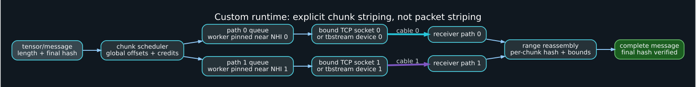

# Custom runtime design for two paths

## Recommended architecture



Use one control session and two data paths:

```text
control: MPTCP or single TCP socket
path 0 data: TCP bound 10.44.0.1 -> 10.44.0.2
path 1 data: TCP bound 10.44.1.1 -> 10.44.1.2
```

The control session negotiates capabilities, creates a session, assigns path IDs, and exchanges credits. Data sockets carry framed chunks with global offsets. This avoids packet-level striping and makes scheduling observable.

USB4STREAM can replace the two data sockets when Linux 7.2+ is available, while the control plane remains TCP/MPTCP for discovery and recovery.

## Framing

A practical fixed header:

```c
struct frame_header {
    uint32_t magic;          // constant, network byte order
    uint16_t version;
    uint16_t type;           // DATA, CREDIT, ACK, ERROR, CLOSE
    uint32_t flags;
    uint64_t session_id;
    uint64_t message_id;
    uint32_t path_id;
    uint32_t chunk_seq;
    uint64_t global_offset;
    uint64_t total_length;
    uint32_t payload_length;
    uint32_t header_crc32c;
    uint8_t  payload_hash[32];
};
```

Validate every field before allocation. Set a protocol maximum for messages, chunks, and outstanding bytes.

## Striping unit

Start with chunks between 256 KiB and 4 MiB. A 4 KiB unit mirrors the raw USB4 frame size but creates too much userspace scheduling overhead. A very large unit makes load balancing and failover coarse.

Adaptive scheduler inputs:

```text
bytes in flight per path
smoothed throughput
smoothed RTT / completion latency
queue depth / available credits
recent errors or stalls
NUMA/CPU ownership
```

Do not send alternating TCP segments manually. Send independent complete chunks on independent ordered streams.

## Ordering and reassembly

Each path preserves local order, but completion across paths is unordered. Reassemble by `message_id + global_offset`, not arrival order. Release a message only after all ranges are present and the final hash matches.

Use a bounded interval/range map. Reject overlapping chunks unless they are exact validated retransmissions.

## Flow control

A fast sender can exhaust receiver memory even when the underlying transport provides byte-stream flow control. Add application credits:

```text
receiver advertises N bytes and M frame slots
sender may not exceed either limit
credits return after data is consumed, not merely received
```

Separate credits per path prevent a stalled link from blocking the other.

## Failure model

Define states:

```text
UP -> DEGRADED -> DRAINING -> DOWN -> RECONNECTING
```

On path loss:

1. stop assigning new chunks;
2. identify unacknowledged global ranges;
3. requeue them to the remaining path;
4. preserve idempotence with message/chunk IDs;
5. reconnect and reauthenticate before rejoining the scheduler.

MPTCP provides much of this below the application for one stream. Explicit striping provides more control but more code.

## Integrity and confidentiality

CRC32C is useful for detecting header corruption quickly. Use BLAKE3/SHA-256 or an AEAD tag for payload integrity. When confidentiality or peer authenticity matters, use an authenticated encrypted session; do not rely on physical cable possession alone.

## Copy model

### TCP/USB4NET

Likely copy path:

```text
runtime buffer -> socket/skb -> thunderbolt-net DMA pages -> cable
peer DMA pages -> skb/GRO -> socket -> runtime buffer
```

### USB4STREAM

Current source path:

```text
runtime buffer -> copy_page_from_iter -> DMA-mapped TX page -> cable
peer DMA-mapped RX page -> copy_page_to_iter -> runtime buffer
```

Both have copies. Registered application buffers, `mmap`, or direct tensor placement would require new kernel/user APIs.

## Queue ownership

Use one I/O worker per physical path, pinned near that controller's IRQ/NAPI CPU set. Keep compute workers separate from network softirq hot spots. For USB4STREAM, one process/thread per device avoids contention between unrelated writers on the same stream mutex.

## llama.cpp integration seam

The RPC transport already abstracts exact-length send and receive. Refactor toward:

```cpp
class byte_transport {
public:
    virtual bool send_exact(const void *, size_t) = 0;
    virtual bool recv_exact(void *, size_t) = 0;
    virtual void get_caps(uint8_t *) = 0;
    virtual void update_caps(const uint8_t *) = 0;
    virtual ~byte_transport() = default;
};
```

Then implement:

- `tcp_transport`;
- `mptcp_transport` as a socket-protocol option;
- `tbstream_transport`;
- `striped_transport` over two child transports.

Keep protocol framing above the child transport and add explicit capability/version negotiation.

## Acceptance tests

- random chunk sizes and boundaries;
- partial read/write handling;
- path delay asymmetry;
- path bandwidth asymmetry;
- cable removal during every message phase;
- duplicate/replayed chunks;
- corrupted header/payload;
- receiver backpressure;
- process crash and reconnect;
- session ID collision/reuse;
- 24-hour soak with hashes and memory leak detection.
