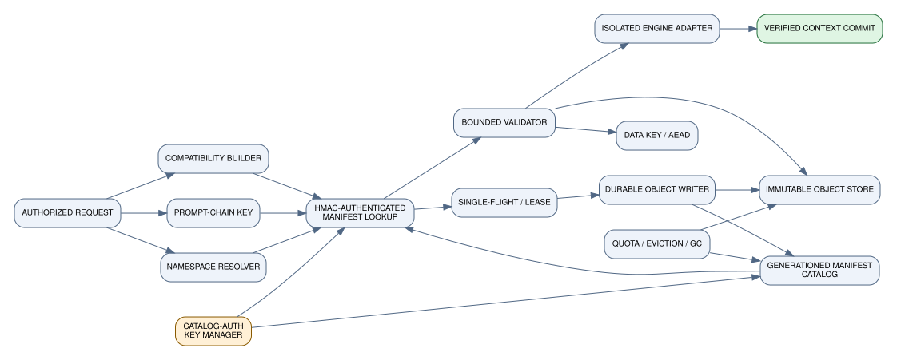

# HaloFPX persistent-prefix-cache redesign

<span class="badge recommended">HALOFPX RECOMMENDATION</span>

## Design objective

HaloFPX treats persisted KV state as an **untrusted optimization artifact**. Trusted inputs are the authorized request, canonical tokens/media/adapters, exact model/runtime configuration, and engine code. Cache bytes may improve latency only after proving they are a valid derivation of those inputs.

The integrated public read API returns one of two semantic outcomes:

```text
HIT_VERIFIED(state_handle, verified_prefix_tokens)
MISS_RECOMPUTE(reason_code)
```

The offline validator emits `CATALOG_ENTRY_VALID` only after the manifest and object are internally authenticated and consistent, and emits `IMPORT_CANDIDATE_VALID` only after every caller-supplied current-request binding also matches. Neither status is a public hit. Warnings, partial structures, or "best effort" bytes are not third public outcomes. Optional acceleration components such as a draft model may miss independently only when the target state remains complete and the engine contract explicitly permits draft catch-up.

## Component architecture

{.diagram}

| Component | Responsibility | Trust rule |
|---|---|---|
| Namespace resolver | Convert authenticated principal and sharing policy to a concealed namespace ID | Authorization occurs before existence lookup or timing-revealing response |
| Compatibility builder | Canonicalize model/runtime/adapter/tokenizer state and hash it | A missing field makes the object ineligible, not "probably compatible" |
| Prefix key builder | Produce a parent-chained prompt/media root at complete reuse boundaries | Exact tokens and semantic extras are committed |
| Single-flight coordinator | Deduplicate concurrent fills and issue bounded leases | A crashed writer cannot publish; readers never wait indefinitely |
| Immutable object store | Store one content-addressed envelope and segment payload | Objects are never modified in place |
| Manifest catalog | Map semantic cache key to object digest/generation and authenticate the pointer | Canonical manifest is HMACed/signed under an authorized catalog key; updates use CAS or generationed atomic replace |
| Integrity validator | Bounded parse, digest/AEAD verification, compatibility and prompt checks | No engine call occurs before outer validation completes |
| Engine adapter | Import a verified state into an isolated destination | Destination remains unchanged if import fails |
| Eviction and GC | Enforce tenant/global byte quotas; reclaim unreachable immutable objects | Logical deletion precedes physical unlink; active readers remain safe |
| Telemetry/audit | Record reason-coded misses, corruption, writes, bytes and wear estimates | No raw prompt, user ID, key material, or sensitive token prefix in logs |

## Namespace design

Recommended path hierarchy:

```text
root/
  objects/sha256/ab/{object_sha256}.hkv
  manifests/{namespace_id}/{engine_family}/{compat_fp_prefix}/{cache_key}.json
  leases/{namespace_id}/{cache_key}.lease
  quarantine/{reason}/{object_sha256}.{timestamp}.hkv
  tmp/{writer_uuid}.partial
```

`namespace_id` is not an unkeyed hash of a username. It is:

```text
namespace_id = hex(HMAC-SHA-256(namespace_secret,
                               canonical_principal_id || 0x00 || sharing_policy_id))
```

Sharing is explicit:

- `private`: one authenticated principal;
- `tenant`: an organization/trust group;
- `public-system`: an administrator-approved immutable system prefix;
- `none`: cache disabled for the request.

A request must never probe a namespace it is not authorized to read. Negative lookups should be latency-normalized where cache-presence inference is material.

## Canonical compatibility fingerprint

Construct deterministic canonical JSON or canonical CBOR, domain-separated as `halofpx.compatibility/v1`, then compute SHA-256. At minimum include:

| Domain | Required fields |
|---|---|
| Model artifacts | Digest and byte length of every model shard, GGUF/safetensors index, projector, sidecar and override file; architecture and exact tensor metadata digest |
| Tokenization | Tokenizer files/digests, vocabulary, normalization/pretokenization, special-token mapping, BOS/EOS policy, chat/system template digest |
| Runtime semantics | Engine family/version, state serialization ABI, architecture implementation ID, context length, batch/sequence state mode, RoPE base/scaling/type, sliding-window/SWA/recurrent settings |
| KV representation | K/V dtype, quantization, layout, layer count, KV heads, head dimension, page/block size, packing/alignment, endian/canonical format |
| Parallelism | TP/PP/CP/DP sizes and rank slice identity where bytes differ; device/backend only when serialization semantics differ |
| Adaptation | LoRA/control-vector artifact digests and scales, prompt-tuning/embedding digest, adapter composition/order |
| Multimodal | Processor/projector digests, media normalization/version, exact media-content digest and position mapping |
| Speculation | Target and draft model fingerprints, speculative algorithm/version, stored optional-state schema |
| Policy | Required segment set, encryption profile, compression codec/version, partial-reuse rules |

Unknown optional fields must be encoded explicitly or rejected by schema; silent omission is not compatibility.

## Prefix and cache key

For fixed complete chunks/pages:

```text
root = SHA-256("halofpx.prompt-root/v1" || compatibility_fp || namespace_policy_digest)
chunk_i = SHA-256("halofpx.prompt-chunk/v1" ||
                 chunk_{i-1} ||
                 canonical_u32le(token_ids_i) ||
                 canonical_semantic_extras_i)
cache_key = SHA-256("halofpx.cache-key/v1" || compatibility_fp || chunk_i || boundary_descriptor)
```

`semantic_extras_i` includes exact media digest/position, prompt-embedding digest, adapter digest, and any non-token input affecting hidden/KV state. A keyed salt may additionally prevent cross-trust cache probing; it does not replace namespace authorization.

Only complete engine-defined boundaries are reusable. A prompt may use the longest consecutive verified prefix; the first missing/invalid chunk invalidates the suffix.

## Object format

The proposed v1 object is immutable and content-addressed. It begins with a 104-byte canonical little-endian header:

```text
8s  magic             = "HFPXKVC1"
u16 major             = 1
u16 minor             = 0
u32 header_len        = 104
u64 metadata_len
u64 payload_len
u32 segment_count
u32 flags
32B metadata_sha256
32B payload_sha256
```

This is followed by canonical UTF-8 JSON metadata and concatenated stored segments. Metadata lists every segment's name, required/optional status, offset, stored length, plaintext/logical length, digest, codec, encryption mode and engine import role. The object file name is SHA-256 of the complete envelope. These unkeyed digests detect accidental corruption; keyed authenticity is supplied by the catalog HMAC over the manifest that commits to the whole-object digest, or by an equivalent authenticated transactional catalog. Encrypted segments additionally require AEAD.

The binary envelope is deliberately simple enough to reject malformed lengths before allocating. See [Storage schemas](storage-schemas.md) and [`schemas/halofpx-object-v1.ksy`](../schemas/halofpx-object-v1.ksy).

## Durable atomic write protocol

{.diagram}

Normative sequence:

1. Resolve/authorize namespace and acquire a bounded per-key single-flight lease.
2. Serialize engine state into memory or an unlinked/private temporary file with hard byte limits.
3. Build canonical metadata and segment digests; encrypt/authenticate if policy requires it.
4. Create a unique temporary object in the target filesystem with `O_CREAT|O_EXCL`, mode `0600`, and no symlink following.
5. Write header, metadata and segments with exact-write loops.
6. `fdatasync`/`fsync` the temporary object and check the result.
7. Reopen through the directory, run the same bounded validator, and compute the whole-object SHA-256.
8. Publish to `objects/sha256/ab/{digest}.hkv` with no-replace semantics. If the object already exists, validate it and discard the duplicate temp.
9. `fsync` the object directory.
10. Build a new canonical manifest containing the object digest, exact key/fingerprint, generation, timestamps and policy. Resolve the authorized catalog key and compute `HMAC-SHA-256("halofpx.manifest-auth/v1\0" || canonical_unsigned_manifest)`.
11. Write and sync the authenticated manifest temporary file, atomically replace/CAS the manifest generation, then `fsync` the manifest directory.
12. Release the lease. A committed authenticated manifest makes an object reachable as an authenticated catalog entry. The authorized reader must still match the current namespace, compatibility digest, semantic key, prompt root and engine family before it becomes `IMPORT_CANDIDATE_VALID`, then complete isolated engine import before `HIT_VERIFIED`.

The order makes orphan objects possible but prevents a manifest from referencing an uncommitted object. Orphans are safe and later collected.

### Error policy

Any failed write, sync, validation, publication or manifest CAS means the cache fill failed. Inference output remains valid because cache storage is an optimization; the request continues from computed state. The failed temporary file is removed or left with a `.partial` name for startup cleanup. No old committed manifest is destroyed until the new generation is durable.

## Read and restore protocol

{.diagram}

1. Authenticate principal and derive authorized namespace.
2. Canonicalize current compatibility and prompt boundary; derive cache key.
3. Resolve the authorized catalog-authentication key, then open and bounded-parse the manifest through a directory file descriptor; reject symlinks and path traversal.
4. Verify canonical encoding and catalog HMAC before trusting the object pointer; then verify schema/version, namespace, key, generation/rollback policy, compatibility fingerprint and prompt root. Missing key or MAC failure is a miss.
5. Open the immutable object by digest. Verify whole-object size/name digest, fixed header, length arithmetic and metadata canonicalization.
6. Verify metadata digest, payload digest, segment table coverage and each required segment digest. If encrypted, obtain the correct key and verify AEAD before decompression.
7. Enforce decompression ratio and output-size limits; never allocate from unchecked persisted lengths.
8. Reconfirm required segment set for the current engine adapter.
9. Import into an isolated/new sequence or transactional engine buffer. Do not mutate the live destination incrementally.
10. Commit/swap the imported state only after the engine reports complete success.
11. On any exception or rejection, discard the isolated state, reason-code the miss, optionally quarantine, and recompute.

## Partial reuse policy

Partial reuse is allowed only at independently verified, semantically composable boundaries:

- Dense transformer pages may reuse a consecutive prefix of complete verified pages.
- A failed page invalidates that page and every later page in the chain.
- Recurrent, Mamba, RWKV, hybrid/SWA, or other global state must be treated as an all-or-nothing checkpoint unless the engine formally exposes a composable page-state contract.
- Target state is mandatory. Draft/speculative state may be optional only when the target engine can safely reconstruct it and metadata declares that policy.
- Never splice segments produced by different compatibility fingerprints, generations, or prompt roots.

## Concurrency and multi-process operation

- Immutable objects eliminate reader/writer byte races.
- Manifest generations are changed by compare-and-swap, transactional database update, or lock+atomic-replace on one filesystem.
- Leases include owner UUID, monotonic expiry and heartbeat; stale leases do not make bytes valid.
- Readers hold an open file descriptor to the object, so later unlink does not invalidate the current read on POSIX systems.
- Eviction first marks/tombstones a manifest, waits for a grace period or reference epoch, then unlinks unreachable objects.
- Process-local LRU is advisory. Durable accounting uses manifest/object sizes and is repairable by scan.
- Lock order is fixed: namespace quota -> cache-key lease -> manifest -> object publish. No callback is invoked while holding filesystem/catalog locks.

## Crash recovery

Startup recovery is deterministic:

1. remove/inspect stale `.partial` files older than the configured grace period;
2. parse manifests with strict bounds; invalid manifests are quarantined and treated as misses;
3. verify referenced object existence, digest and compatibility schema before admitting catalog entries;
4. rebuild accounting from reachable object sizes rather than trusting a mutable counter file;
5. identify unreferenced immutable objects and remove them only after an orphan grace period;
6. recover generation monotonicity from manifests or a transactional catalog;
7. never infer a hit solely from an object filename.

There is no sequential `next_id` correctness dependency.

## Version migration

- Unknown major version: miss; retain/quarantine according to policy.
- Known major with newer minor: parse only when forward-compatible fields are length-delimited and ignorable by schema.
- Supported old format: validate fully, decode in an isolated migrator, write a new immutable v1/vNext object, publish a new manifest generation, then retire the old reference.
- Migration is copy-on-read or offline copy; never mutate an object in place.
- A migration failure leaves the old committed object untouched but ineligible if the current engine cannot safely consume it.

## Eviction and write admission

Use byte-based quotas at global, tenant, compatibility-domain and optional project levels. Candidate score should consider:

```text
expected_saved_prefill_cost * reuse_probability
-----------------------------------------------
stored_bytes * write_cost * privacy_risk_factor
```

Minimum policy:

- hard maximum bytes and minimum free-space watermark;
- per-tenant quota and fair-share pressure;
- LRU/LFU/cost hybrid over manifests, not sequential checkpoint count;
- pinning for in-flight readers and approved public system prefixes;
- write admission threshold to avoid persisting one-use full snapshots;
- content deduplication and chunk reuse;
- periodic accounting repair and SSD wear telemetry.

## Observability

Required counters and events:

- lookup hit/miss by reason code;
- bytes read/written/verified/decrypted/decompressed;
- object and manifest commit latency;
- object/segment digest, catalog-HMAC and AEAD failures;
- compatibility and prompt-root mismatches;
- engine-import rejection;
- orphan/temp/quarantine counts;
- eviction bytes and saved-prefill estimate;
- estimated host writes, NAND writes, drive TBW budget and remaining margin;
- lease contention and stale recovery.

Labels must not contain raw prompts, token prefixes, user IDs, secrets, object encryption keys, or full tenant identifiers.
