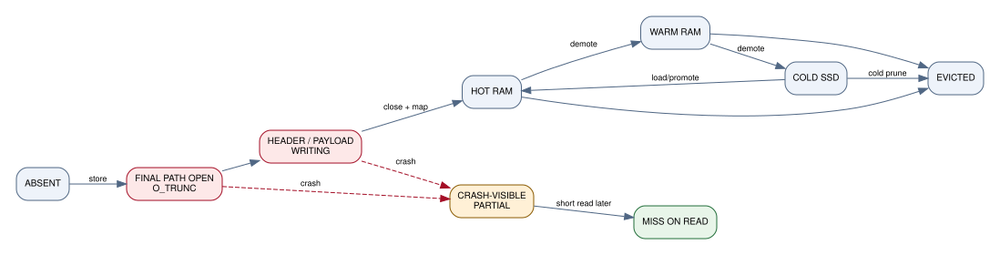
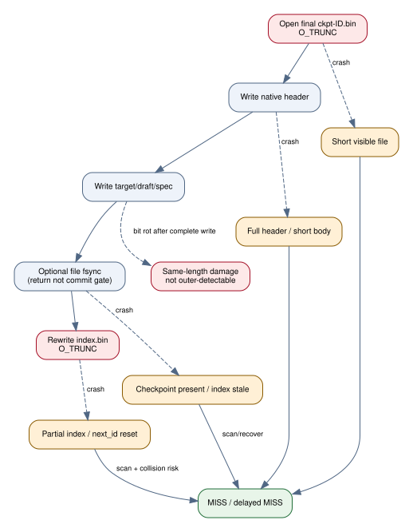
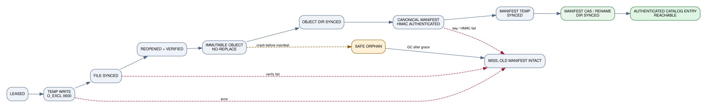
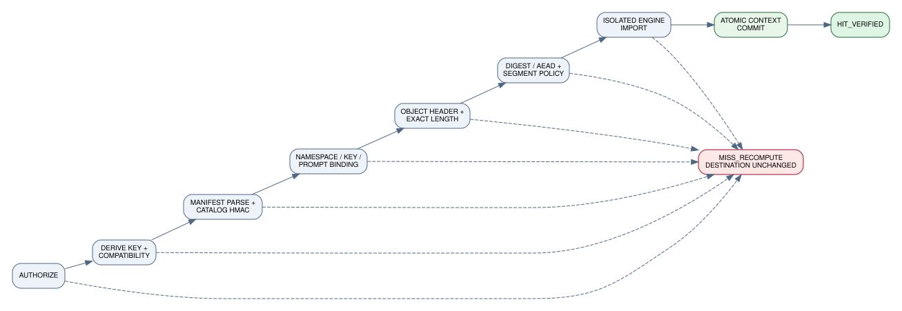
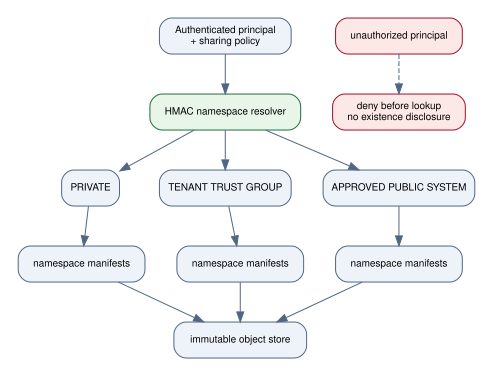

# Cache state machines

## Observed CachyLLama checkpoint lifecycle

{.diagram}

Logical states:

```text
ABSENT
  -> STORE_FINAL_PATH_OPEN
  -> HEADER/PAYLOAD_WRITING
  -> FILE_VISIBLE
  -> HOT_RAM
  -> WARM_RAM
  -> COLD_SSD
  -> EVICTED
```

The critical issue is that `FILE_VISIBLE` begins when the final path is created/truncated, before the header and payload are complete. A process or machine crash in the writing states can leave a path that startup later examines.

Mermaid source: [`observed-cachyllama-lifecycle.mmd`](../diagrams/observed-cachyllama-lifecycle.mmd).

## Observed crash states

{.diagram}

| Crash point | Persisted result | Next-start behavior |
|---|---|---|
| Before final-path open | No new file | Miss |
| After truncation, before full header | Short file | Header scan skips/fails |
| After full header, during body | Complete-looking metadata, short body | Can be indexed; later exact read fails |
| After body write, before successful file sync | Full file may or may not survive power loss | Not durably known |
| After file sync, before index rewrite | Checkpoint can be rediscovered by scan | Index/`next_id` may lag |
| During index truncation/rewrite | Partial or empty index | Index rejected; scan plus ID-reset risk |
| During in-place system-cache rewrite | Existing good entry can be replaced by partial file | Entry rejected/failed later; no old generation |

Mermaid source: [`observed-crash-states.mmd`](../diagrams/observed-crash-states.mmd).

## HaloFPX writer state machine

{.diagram}

```text
MISS
  -> LEASED
  -> TEMP_WRITING
  -> TEMP_SYNCED
  -> TEMP_VERIFIED
  -> OBJECT_PUBLISHED
  -> OBJECT_DIR_SYNCED
  -> MANIFEST_HMAC_COMPUTED
  -> MANIFEST_TEMP_SYNCED
  -> MANIFEST_COMMITTED
  -> AUTHENTICATED_CATALOG_ENTRY_REACHABLE
```

Only an authenticated `MANIFEST_COMMITTED` makes the immutable object reachable as an **authenticated catalog entry**. It becomes an import candidate only after the reader supplies and matches every authorized current-request binding. A public hit exists only after isolated engine import and atomic context commit. Crashes before object publication leave a removable temp. Crashes after object publication but before manifest commit leave an unreachable immutable orphan. Crashes after manifest replacement but before directory sync are treated conservatively at restart: the manifest is revalidated and the absence of a referenced object is a miss.

Mermaid source: [`halofpx-commit-protocol.mmd`](../diagrams/halofpx-commit-protocol.mmd).

## HaloFPX reader state machine

{.diagram}

```text
LOOKUP
 -> AUTHORIZE
 -> MANIFEST_PARSE_AND_HMAC_VALIDATE
 -> KEY/FINGERPRINT/PROMPT_BINDING_VALIDATE
 -> OBJECT_HEADER_VALIDATE
 -> DIGEST/AEAD_VALIDATE
 -> SEGMENT_POLICY_VALIDATE
 -> ISOLATED_ENGINE_IMPORT
 -> ATOMIC_CONTEXT_COMMIT
 -> HIT
```

Every transition has an error edge to:

```text
MISS_RECOMPUTE(reason)
 -> discard staged bytes/state
 -> optional quarantine/repair
 -> trusted prefill
```

No error edge enters `HIT`, and no intermediate state mutates the live sequence.

Mermaid source: [`halofpx-read-validation.mmd`](../diagrams/halofpx-read-validation.mmd).

## Namespace tree

{.diagram}

A namespace is part of authorization, not merely a filename prefix. Object blobs may be globally deduplicated only when confidentiality policy permits; manifests and keys remain namespace-scoped. Encrypted tenants normally use distinct data-encryption keys, preventing cross-tenant ciphertext deduplication unless an explicit convergent-encryption design and its leakage tradeoff are approved.
