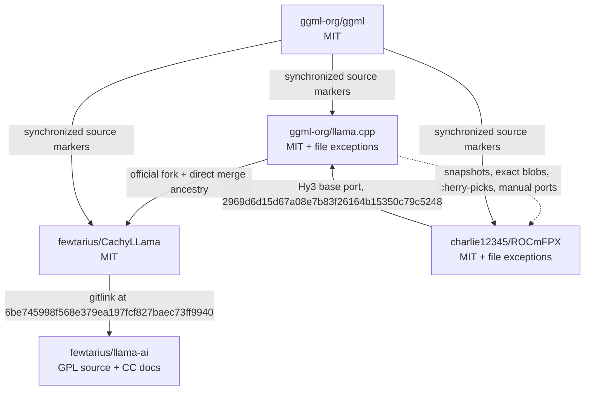

# Provenance Map

## Relationship graph

[VERIFIED] The dashed `llama.cpp → ROCmFPX` edge represents content provenance categories. It must not be interpreted as a continuous parent chain from `5fd2dc2c41c342a75c26f9756ca6b1814ed05fb4` to current ROCmFPX.

## Exact ancestry edges

| Child | Parent index | Parent | Classification | Qualification |
|---|---:|---|---|---|
| ROCmFPX `a5605a72768c6562241b248e268e33dc92787394` | 1 | `25c71fc6e12d73bb3804127e032d29fb8976ae40` | direct parent | PR #32 base |
| ROCmFPX `a5605a72768c6562241b248e268e33dc92787394` | 2 | `a8b5fa906ccd13c6a8ca06d55aa287854c376868` | direct parent | PR #32 topic head |
| ROCmFPX `c2845bf86a5c1842d33bd9e990b2bcaf75779251` | 1 | `5b3956605309dd3e6beed49c8f3a41423ba71d25` | direct parent | PR #27 base |
| ROCmFPX `c2845bf86a5c1842d33bd9e990b2bcaf75779251` | 2 | `ccac6e55ec7c0fa8acdcb6e80b1a242e4f7d654e` | direct parent | PR #27 topic head |
| ROCmFPX `2335e6a482b1601d71dff9e860c8feab108c3af2` | 1 | `221402af8574faf652b101b6afe225a3f329561f` | direct parent | pre-merge branch head |
| ROCmFPX `2335e6a482b1601d71dff9e860c8feab108c3af2` | 2 | `5b3956605309dd3e6beed49c8f3a41423ba71d25` | direct parent | local `upstream/main` ref; remote URL unknown |
| CachyLLama `6be745998f568e379ea197fcf827baec73ff9940` | 1 | `c8ead677a7fe42fb0a67e6e866fb254cc338e9fd` | direct parent | local line |
| CachyLLama `6be745998f568e379ea197fcf827baec73ff9940` | 2 | `92366df30d4eaa4b85139b5fd694360237731b19` | direct upstream parent | exact object exists in llama.cpp |
| llama-ai `1017f3dfdce3ca2b06aa9007b23295db3bb35722` | 1 | `d8a07baad6ab175f8badbc4d496c9190b0cc3b2d` | direct parent | gitlink-only update |
| llama.cpp `86d86ed4396b4130922f7b9af26e3d9fc11a591b` | 1 | `7d56da7e546f54fb1fa54ef2bc9ad9a872860ab0` | direct parent | normal commit |

The machine-readable form is [`data/ancestry_edges.csv`](data/ancestry_edges.csv).

## Provenance classes

| Class | Evidence | Legal handling |
|---|---|---|
| P1 — graph ancestry | Ordered parent, compare, or merge-base establishes ancestor | Preserve history and license notices. |
| P2 — exact blob identity | Same blob SHA at named commits | Preserve source license and attribution; record both URLs. |
| P3 — cherry-pick | Original author metadata or named commit | Preserve author and source SHA; prefer `-x`. |
| P4 — manual port | Attribution document/commit names source | Preserve source list; review expression copied versus independently adapted. |
| P5 — snapshot restoration | Commit records source revision and copied tree | Treat every restored file as inherited source even if local graph is disconnected. |
| P6 — vendored synchronization | `sync-ggml.last` or `sync_vendor.py` | Retain third-party license; pin inputs and hashes. |
| P7 — submodule | `.gitmodules` plus mode `160000` | Treat as separate repository/license; include submodule notices when distributed. |
| P8 — reverse port | Upstream commit names fork source | Preserve fork contributor credit in future merges. |
| P9 — generated asset | Generator/package graph produces checked-in or embedded output | Track generator, inputs, lockfiles, and output license. |

## ROCmFPX path families

| Path/family | Provenance classification | License baseline | Evidence and qualification |
|---|---|---|---|
| Core llama/ggml source outside local additions | P3/P4/P5/P6 mixed | MIT plus file exceptions | Snapshot restore, attribution notes, named ports, and ggml sync marker; no verified continuous graph edge to tested upstream anchor. |
| `ggml/rocmfp4/**` | Local ROCmFP4 implementation layered on llama.cpp | Root MIT unless file says otherwise | Core files lack per-file headers; contributor/title review remains. |
| `ggml/rocmfpx/**` | Local ROCmFP3/6/8 and ROCmFP2 reference work | Root MIT unless file says otherwise | `README.md`, PR #27/#32, AI record. |
| `src/models/hyv3.cpp` | Local Hy3 implementation; later reverse-ported upstream | Root MIT | Upstream commit `2969d6d15d67a08e7b83f26164b15350c79c5248` explicitly names this file as base. |
| `docs/UPSTREAM-ATTRIBUTION.md` | Provenance policy and manual-port ledger | Root MIT | Lists direct cherry-picks and manual source commits. |
| `docs/ROCmFPX-UPSTREAM-CREDITS.md` | Feature-level upstream credit | Root MIT | Lists DFlash, DeepSeek DSA, TurboQuant sources. |
| `ggml/src/ggml-hexagon/**` | P5 snapshot from llama.cpp `d2c67959b32cc49e43de2256b7381feb9130a17a` | Upstream/root MIT unless file-specific | At least one critical file has exact blob identity; external Qualcomm SDK headers/libs remain separately licensed. |
| `ggml/src/ggml-webgpu/**` | P5 snapshot from llama.cpp `5fd2dc2c41c342a75c26f9756ca6b1814ed05fb4` | Upstream/root MIT unless file-specific | Source-restoration commit records revision. |
| `vendor/**` | P6 synchronized third-party source | Per-vendor licenses | See vendor inventory and source ledger. |
| `tools/ui/**` / older `tools/server/webui/**` | Upstream/local UI source and generated distribution | Root source license plus npm transitive licenses | Lockfile and prebuilt download path require artifact-level audit. |
| `scripts/build-rocmfp4-rocm714-local.sh` | Local build/packaging logic | Root MIT | Downloads and redistributes mixed ROCm runtime libraries; package output is not MIT-only. |

## Exact file-level highlights

| File | Repository commit | Blob | Origin/provenance | License state |
|---|---|---|---|---|
| `ggml/rocmfp4/rocmfp4.c` | ROCmFPX `a5605a72768c6562241b248e268e33dc92787394` | `bccefcec15daaf38c8aeaeb432945f9806e98a15` | ROCmFP4-local core, promoted history | Root MIT; no per-file header observed |
| `ggml/rocmfpx/rocmfpx.c` | ROCmFPX `a5605a72768c6562241b248e268e33dc92787394` | `5aa075ef87013181d5eacbd3f013d0814118aa36` | ROCmFPX-local core | Root MIT; no per-file header observed |
| `src/models/hyv3.cpp` | ROCmFPX `a5605a72768c6562241b248e268e33dc92787394` | `1c8ebf0b78ba05efb1ff81b65661c7e8642a0e67` | Local base later ported upstream | Root MIT; reverse-port credit required |
| `src/models/hy-v3.cpp` | llama.cpp `2969d6d15d67a08e7b83f26164b15350c79c5248` | `47a0beaf217f19219e3e8fb8d5c35664625d7c73` | Adapted from ROCmFPX `hyv3.cpp` | Upstream MIT; commit preserves source statement |
| `ggml/src/ggml-hexagon/htp/hmx-matmul-ops.c` | ROCmFPX `a5605a72768c6562241b248e268e33dc92787394` | `5c37f24ff0049a0c8e67c19b2e712ce8b834102b` | Exact upstream blob from `d2c67959b32cc49e43de2256b7381feb9130a17a` | Upstream/root MIT; external SDK dependencies separate |
| `ggml/src/ggml-sycl/common.hpp` | ROCmFPX `a5605a72768c6562241b248e268e33dc92787394` | `96bc1c98bd97c6a0e5574c164bc803d9d19ab619` | Inherited backend code | MIT AND (Apache-2.0 WITH LLVM-exception) |
| `ggml/src/ggml-openvino/openvino/frontend.h` | ROCmFPX `a5605a72768c6562241b248e268e33dc92787394` | `f1c6f0c3e3ce3eaebb8afbcbc91a01b236778f1b` | Inherited OpenVINO code | Apache-2.0 |
| `examples/gguf-hash/deps/xxhash/xxhash.h` | ROCmFPX `a5605a72768c6562241b248e268e33dc92787394` | `c0fafe20d54ad017425e636c2f3e754494648053` | Vendored xxHash | BSD-2-Clause |
| `tools/mtmd/legacy-models/minicpmv-convert-image-encoder-to-gguf.py` | ROCmFPX `a5605a72768c6562241b248e268e33dc92787394` | `1f563fbfc5998c3eefb9b5f253f35637cfb8024e` | Google AI/HuggingFace-origin script | Apache-2.0 |
| `AI_CHANGES.md` | ROCmFPX `a5605a72768c6562241b248e268e33dc92787394` | `e5acbf932092eef329b73c5748d56a6cc93f84eb` | Local AI-assistance ledger | Root MIT documentation |
| `scripts/rebuild.sh` | llama-ai `1017f3dfdce3ca2b06aa9007b23295db3bb35722` | `dedf0d299169a2898331289bc0009554a75b1952` | fewtarius wrapper | GPL-3.0-or-later SPDX |
| `src/cachy-llama-rocm/build.sh` | llama-ai `1017f3dfdce3ca2b06aa9007b23295db3bb35722` | `170fbf8e9f4c1af4d74e71ae207dc98da7dae1ef` | fewtarius wrapper | GPL-3.0-or-later SPDX |
| `CachyLLama` gitlink | llama-ai `1017f3dfdce3ca2b06aa9007b23295db3bb35722` | gitlink `6be745998f568e379ea197fcf827baec73ff9940` | Separate engine repository | MIT in submodule |
| `vendor/nlohmann/json.hpp` | llama.cpp `86d86ed4396b4130922f7b9af26e3d9fc11a591b` | `82d69f7c5d044c9887c96b90c97f5639083ecd14` | nlohmann/json 3.12.0 | MIT |
| `vendor/stb/stb_image.h` | llama.cpp `86d86ed4396b4130922f7b9af26e3d9fc11a591b` | `9eedabedc45b3e6fd88fae6f14a160b4d53272ec` | stb_image 2.30 | MIT or public domain |
| `vendor/miniaudio/miniaudio.h` | llama.cpp `86d86ed4396b4130922f7b9af26e3d9fc11a591b` | `c6d493ee81f553b8dd584e402453f130c20e0546` | miniaudio input `9634bedb5b5a2ca38c1ee7108a9358a4e233f14d` | MIT-0 or public domain |
| `vendor/sheredom/subprocess.h` | llama.cpp `86d86ed4396b4130922f7b9af26e3d9fc11a591b` | `3e40bae046a21339752bf15221ff7d1d39f6a8ce` | subprocess input `b49c56ee40e7b44706b719008e2385ea381177ac` | public-domain/Unlicense-style |
| `vendor/cpp-httplib/LICENSE` | llama.cpp `86d86ed4396b4130922f7b9af26e3d9fc11a591b` | `3e5ed359a2bb16f52c383745c25f14bb7a81c9e4` | cpp-httplib 0.50.1 | MIT |
| `tools/ui/package-lock.json` | llama.cpp `86d86ed4396b4130922f7b9af26e3d9fc11a591b` | `7216de682340876a48c0bc06647159cb1f25ba21` | npm lock graph | Mixed transitive licenses, not enumerated here |

Full machine-readable entries are in [`data/provenance_ledger.csv`](data/provenance_ledger.csv).

## Manual-port ledger already present in ROCmFPX

[VERIFIED] `docs/UPSTREAM-ATTRIBUTION.md` lists named direct cherry-picks and manual adaptations for chat parser fixtures, WebUI provisioning, Apple XCFramework packaging, DiffusionGemma, and Qwen/Gemma/Step MTP work.

[VERIFIED] `docs/ROCmFPX-UPSTREAM-CREDITS.md` identifies source commits for DFlash, DFlash conversion refactoring, DeepSeek V3.2/DSA, and a local TurboQuant integration.

[RECOMMENDATION] Convert these human-readable records into one provenance YAML record per imported change and require it in CI.

## Provenance controls for future imports

1. Use merge or `git cherry-pick -x` when practical.
2. For manual ports, record upstream repository, immutable SHA, source paths, copied/adapted ranges, license, authors, and test evidence.
3. Never infer ancestry from commit retrievability or a local remote name alone.
4. Record vendor download URL, immutable revision, downloaded SHA-256, license file, and update date.
5. Record generated output with generator commit, lockfile, input hashes, and license conclusion.
6. Preserve reverse-port credit when later rebasing from upstream code that originated in ROCmFPX.
