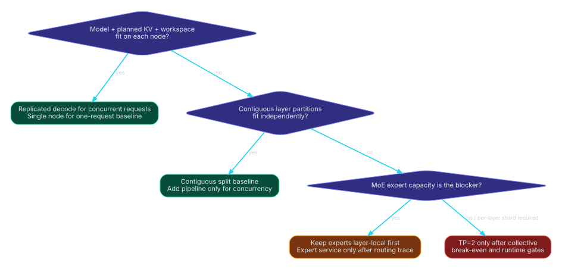

# Go/no-go decision framework



## Step 1 — classify the memory problem

Measure actual one-node residency at the planned context/concurrency.

### Full model fits each node

- **One request:** use one-node baseline; test remote speculation only as a separate measured latency optimization.
- **Multiple requests:** test replicated decode first.
- **Do not:** introduce model-path USB4 synchronization merely because a second node exists.

### Full model does not fit, contiguous layer partitions do

- test contiguous layer split;
- keep KV and MoE experts local to layer owners;
- add pipeline scheduling only for independent work and after stage-service gates.

### Contiguous layers do not fit because MoE experts dominate

- first search a different whole-layer cut;
- next evaluate layer-local expert grouping or a hybrid layer/expert placement;
- use remote expert service only with routing traces and capacity/speed gates.

### A single layer/operator requires both nodes

- TP=2 is the remaining standard option;
- fail closed until collective/runtime, sampler, KV, and break-even gates pass.

## Step 2 — classify the workload

| Workload | Implication |
|---|---|
| One latency-sensitive sequence | Pipeline cannot create independent token work. Prefer one node, capacity split, or measured remote speculation. |
| Many independent short prompts | Replication or pipeline can exploit concurrency. Prefill bulk transfers matter. |
| Few long-context sessions | KV capacity and session affinity dominate; migration is expensive. |
| High decode batch \(Q\) | TP payload grows with \(Q\), but fixed collective count is amortized; layer cut sends one larger tensor. Measure both. |
| MoE with stable routing locality | Expert placement may reduce \(\rho_l\), but verify across prompt classes and tails. |
| Stochastic sampling with complex logits processing | Sharded sampler and speculative exactness require a complete protocol. |

## Step 3 — pass hard gates

A candidate cannot advance unless all applicable boxes are checked:

- [ ] Both USB4 paths enumerate and are stable.
- [ ] Per-link \(B,\ell\) are measured by message-size region.
- [ ] Dual-link striping is either validated or disabled.
- [ ] Runtime primitive exists and is traced.
- [ ] Per-rank memory budget passes at peak planned load.
- [ ] Tokenizer, sampler, RNG, model, expert, KV, and session ownership are complete.
- [ ] Correctness equivalence tests pass.
- [ ] Mode-specific break-even denominator is positive.
- [ ] Measured full inequality passes for speed/throughput objective.
- [ ] Tail latency, queue memory, thermal stability, and failure policy pass.

## Step 4 — score soft factors

After hard gates, score each dimension 0–2:

| Dimension | 0 | 1 | 2 |
|---|---|---|---|
| Capacity margin | <5% or unstable | 5–15% | >15% measured usable margin |
| Communication margin | Fails / no margin | Passes by <20% | Passes by ≥20% under tails |
| Runtime maturity | Prototype | Reproducible lab | Automated, monitored, recoverable |
| Correctness evidence | Spot checks | Deterministic suite | Deterministic + stochastic/fault suite |
| Operational complexity | High, manual | Moderate | Simple/static or automated |
| SLO robustness | Tail fails | Borderline | p95/p99 pass with sustained load |

Set project-specific thresholds. A high soft score cannot override a failed hard gate.

## Mode-specific disposition table

| Mode | GO | CONDITIONAL | NO-GO |
|---|---|---|---|
| **Replicated decode** | Full model fits each; independent demand; SLO passes | Low demand or uneven long contexts | Claimed single-request speedup; model does not fit each |
| **Contiguous split** | Both partitions fit; correctness/transport stable; capacity objective | Speed objective awaiting measured inequality | Any partition fails memory; hidden second boundary; KV ownership unclear |
| **Pipeline** | Split passes; \(M\ge M_{min}\); service and tails pass | Burst/concurrency dependent | One sequence used as speed justification; \(s\ge c_A+c_B\) |
| **MoE layer-local** | Whole-layer expert partitions fit | Cut imbalance requires tuning | Experts scattered without need or ownership |
| **MoE expert service** | Capacity necessary and trace/critical-path gates pass | Lab experiment with uncertain routing tails | \(\rho_l\) invented; communication exceeds saved work for speed objective |
| **Remote speculation greedy** | Exact token equality and measured round break-even pass | Workload/acceptance dependent | Negative budget; incompatible tokens; unverified emission |
| **Remote speculation stochastic** | Exact probability/RNG protocol and break-even pass | Research prototype | Token-only protocol asserted exact without proof/data |
| **TP=2** | Per-layer capacity necessary or measured speed inequality passes | Backend/collective tuning in progress | Collective denominator ≤0; sampler/KV/runtime incomplete |
| **KV migration** | Export/import exact and future benefit amortizes transfer | Rare controlled handoff | Routine load balancing without amortization; incompatible layout |

## Recommended default decision

1. **Model fits each node:** GO replicated decode for concurrent sessions; otherwise stay one-node.
2. **Model needs pooled capacity:** GO contiguous layer split if memory and correctness pass.
3. **Concurrency is sustained:** conditionally add pipeline scheduling.
4. **MoE:** keep experts with layers; remote expert service only after traces.
5. **Single-request decode:** conditionally test remote speculation.
6. **TP:** use only when required by per-layer capacity or a measured collective break-even passes.

## Decision record template

For each candidate, record:

```text
Objective:
Model/checkpoint/quantization:
Context and concurrency:
Placement file:
Measured link profile:
Measured compute profile:
Memory budget by rank:
Correctness suite result:
Break-even equation and substituted values:
Nominal-floor triage result:
Sustained p50/p95/p99:
Failure/recovery policy:
Disposition: GO / CONDITIONAL / NO-GO
Owner and review date:
```

A decision expires when firmware, OS/kernel, runtime, model revision, quantization, cable/topology, or workload changes materially.
