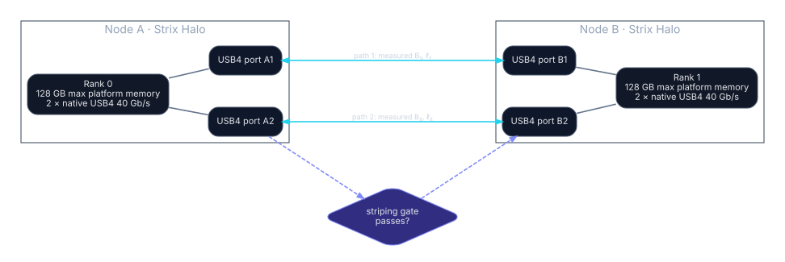

# Dual-Strix-Halo USB4 Distributed LLM Wiki

> **Scope.** Two AMD Ryzen AI Max+ 395 (“Strix Halo”) systems, each exposing two native 40 Gb/s USB4 ports, used as a two-rank inference system. The analysis covers tensor parallelism, pipeline parallelism, contiguous layer splitting, MoE placement, remote speculation, replicated decode, and hybrids.

## Principal conclusion

There is no single “dual-machine mode.” The correct placement depends first on the objective:

| Objective | First mode to test | Reason |
|---|---|---|
| A model already fits on one node; multiple independent requests | **Replicated decode** | Zero cross-node model-path traffic; model, sampler, and KV remain local per session. |
| A model does not fit one node, but contiguous layer partitions fit | **Contiguous layer split** | One hidden-state boundary per forward pass; each rank retains KV for its layers. |
| Same capacity constraint plus sustained concurrency | **Layer split + pipeline schedule** | Reuses the one-cut placement and overlaps independent microbatches/sequences. |
| MoE model whose experts fit when divided by layer | **Layer-local experts** | Avoids dispatch/return at every MoE layer. |
| MoE expert weights still exceed a layer partition | **Trace-gated expert service** | Capacity option only after measuring remote routing fraction and imbalance. |
| Single-request decode and a small compatible drafter exists | **Remote speculation** | Candidate-token traffic can be small; acceptance and verifier timing decide viability. |
| Per-layer weights themselves require two-node sharding | **TP=2, fail closed** | Two activation collectives per transformer layer create the strictest latency gate. |

These are architecture decisions, not performance claims. Every GO requires measurements from the target systems and runtime.

## What is known and what is not

**SOURCED FACT.** AMD lists two native 40 Gb/s USB4 ports, a 256-bit LPDDR5x interface, and up to 128 GB system memory for the Ryzen AI Max+ 395. Linux documents one `thunderbolt-net` virtual interface per port and a direct `thunderbolt-stream` path; Windows documents USB4 interdomain networking. [AMD product page](https://www.amd.com/en/products/processors/laptop/ryzen/ai-300-series/amd-ryzen-ai-max-plus-395.html), [Linux kernel USB4/Thunderbolt documentation](https://docs.kernel.org/admin-guide/thunderbolt.html), [Microsoft USB4 interdomain documentation](https://learn.microsoft.com/en-us/windows-hardware/design/component-guidelines/usb4-interdomain-connections).

**NOT KNOWN UNTIL MEASURED.** Effective payload bandwidth, one-way message latency, whether simultaneous paths scale, the actual p=2 collective algorithm, host-copy overhead, ROCm/runtime overlap, usable model memory, and mode-specific compute time.

The two nominal 40 Gb/s links provide an arithmetic line-rate ceiling of 80 Gb/s, or 10 GB/s in one direction before overhead. The wiki uses that number only for impossible-to-beat payload-time floors. It does **not** assume 10 GB/s application throughput or automatic bonding.

## Fast navigation

- Read the [executive summary](executive-summary.md) for mode rankings and non-negotiable gates.
- Use the [ownership matrix](placement/ownership-matrix.md) to see who owns the tokenizer, sampler, model, experts, KV, RNG, and sessions.
- Use [prefill](cost-models/prefill.md) and [decode](cost-models/decode.md) for formulas.
- Review [worked examples](examples/index.md) for exact byte arithmetic.
- Apply the [go/no-go framework](decision-framework.md) after collecting the [benchmark worksheet](benchmarking/measurement-worksheet.md).

## Repository contract

No mode is labeled faster from hardware specifications alone. A mode is viable only when:

1. its ownership and correctness protocol are complete;
2. both node-local memory budgets pass;
3. the required runtime primitives exist;
4. measured communication plus synchronization lies below the measured compute benefit, or the declared objective is capacity rather than speed;
5. failure and session-state handling are defined.
