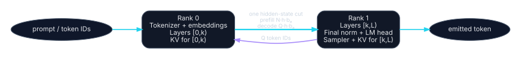

# Contiguous layer splitting

## Placement

Choose a layer boundary \(k\).

### Rank 0 / node A

- **Tokenizer:** canonical tokenizer/detokenizer.
- **Model:** token embeddings and layers \([0,k)\).
- **Experts:** all experts belonging to owned layers.
- **KV:** K/V for owned attention layers and all resident sessions.
- **Sampler:** none.
- **RNG:** request seed metadata only.
- **Session:** frontend, authoritative request state, batching, cancellation, output ordering.

### Rank 1 / node B

- **Tokenizer:** optional exact mirror for diagnostics/detokenization; rank 0 remains canonical.
- **Model:** layers \([k,L)\), final norm, LM head.
- **Experts:** all experts belonging to owned layers.
- **KV:** K/V for owned layers.
- **Sampler:** authoritative logits processing and next-token selection.
- **RNG:** final per-session RNG/counters.
- **Session:** stage-local KV and sequence handles keyed by rank-0 IDs.

Machine-readable definition: [`placements/contiguous-layer-split.yaml`](../../placements/contiguous-layer-split.yaml).

## Prefill

For \(N\) prompt tokens:

\[
V_{A\to B}=Nhb_a.
\]

A single prompt chunk has one boundary dependency. Splitting into \(M\) chunks keeps total payload \(Nhb_a\) but incurs \(M\) fixed message costs.

## Decode

For \(Q\) active sequences:

\[
V_{A\to B}=Qhb_a,
\qquad
V_{B\to A}=Qb_t+b_{control}.
\]

Rank 1 samples the tokens and returns IDs to rank 0. Rank 0 uses those IDs for the next embedding/first-stage pass. This feedback is the per-sequence autoregressive barrier.

## Why KV stays local

Attention for layer \(l\) always executes on its layer owner. Therefore that owner can append and read K/V without crossing the interconnect. For uniform layers, rank \(r\) with \(L_r\) layers stores:

\[
K_{r,token}=2L_rH_{kv}db_{kv}.
\]

No steady-state KV communication appears in the prefill/decode formulas.

## Choosing the cut

An equal layer count is only a starting point. Build a per-layer table including:

- quantized tensor residency and padding;
- embedding/LM-head residency;
- local KV for target contexts and sessions;
- prefill/decode compute time;
- runtime graph/workspace allocations;
- MoE expert weights and routing work.

First choose a feasible memory cut. For one-request latency, then evaluate all feasible cuts against:

\[
T(k)=C_A(k)+T_{boundary}(k)+C_B(k)+T_{feedback}.
\]

For pipeline throughput, choose among feasible cuts to minimize the measured service interval rather than simply equalize total compute.

## Break-even interpretation

A single request executes rank 0 and rank 1 serially. The speed gate is:

\[
C_A+C_B+T_{boundary}+T_{feedback}<C_1.
\]

Unlike TP, there is no ideal two-way division of one layer's matrix multiplications. Therefore:

- **capacity GO:** likely when each partition fits and the runtime is correct;
- **single-request speed GO:** only from measurement, usually requiring one-node memory pressure/paging or another concrete locality effect;
- **throughput GO:** add a pipeline schedule and independent work.

## Cut variants

### Rank 0 sampler

Placing the LM head/sampler back on rank 0 requires returning the final hidden state from rank 1, adding another \(Qhb_a\) decode transfer and a second large boundary. It is normally inferior unless rank 1 cannot hold/execute the head or sampler.

### Embedding on both ranks

Replicating embeddings does not remove the need for rank 0's first layers and usually adds memory. It can simplify failover but is not part of the base cost.

### Compressed boundary

Activation quantization/compression changes \(b_a\) and adds encode/decode cost and possible quality risk. It is a separate measured variant; do not silently substitute lower bytes.

## Feasibility gates

- Both independent memory budgets pass with safety margin.
- Rank 0 and rank 1 agree on model revision, tokenizer IDs, positions, dtype, quantization, and layer-boundary tensor layout.
- KV writes are ordered and idempotent under retries/cancellation.
- The transport handles prefill bulk tensors and decode small tensors without hidden copies that violate the measured model.
- Sampler and RNG authority are unambiguous.
- A node failure invalidates the split session unless a checkpoint/recovery protocol is implemented.

## Disposition

For a model that does not fit one Strix Halo but can be divided by whole layers, this is the **preferred baseline**. It minimizes cross-node boundaries and retains local KV. It is a capacity architecture until speed or pipeline evidence says otherwise.
