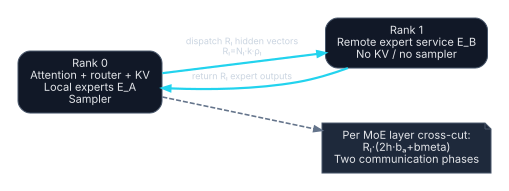

# MoE expert placement

Mixture-of-Experts models separate non-expert transformer work from routed feed-forward experts. Expert parallel systems dispatch token representations to expert owners and return the outputs, commonly using all-to-all-style communication. [DeepSpeed-MoE](https://proceedings.mlr.press/v162/rajbhandari22a.html), [Mixtral paper](https://arxiv.org/abs/2401.04088).

Two placements are viable in principle on two Strix Halo nodes. They have very different communication structure.

## Placement A: layer-local experts

Use a contiguous layer split. Every router and every expert attached to layer \(l\) resides with that layer's attention/non-expert block.

### Ownership

- **Rank 0:** tokenizer, embeddings, layers \([0,k)\), their routers/experts, their attention KV, request coordination.
- **Rank 1:** layers \([k,L)\), their routers/experts, their attention KV, final norm/head, sampler, final RNG.
- **Expert ownership:** determined entirely by layer ownership.
- **KV ownership:** determined entirely by attention-layer ownership.

Machine-readable definition: [`placements/moe-layer-local-split.yaml`](../../placements/moe-layer-local-split.yaml).

### Communication

Exactly the one-cut formulas:

\[
V_{pf}=Nhb_a,
\qquad
V_{dec}=Qhb_a+Qb_t+b_{control}.
\]

No expert assignment crosses USB4. The cut must be chosen using expert-weight residency; equal layer counts can be badly imbalanced.

### Disposition

This is the preferred first MoE placement because it converts a per-MoE-layer communication pattern into one model boundary.

## Placement B: remote expert service

Keep embeddings, attention, normalization, routers, final head, sampler, all attention KV, and a local expert subset on rank 0. Rank 1 stores a remote subset of experts and behaves as a stateless expert worker.

### Ownership

- **Rank 0:** canonical tokenizer; all non-expert model components; routers; local experts \(E_A\); all KV; sampler and final RNG; session authority.
- **Rank 1:** remote experts \(E_B\); transient routed-token buffers; no tokenizer, sampler, attention KV, or authoritative session state.

Machine-readable definition: [`placements/moe-expert-service.yaml`](../../placements/moe-expert-service.yaml).

This placement is useful when expert weights dominate capacity. A variant that also splits non-expert layers should be modeled as a hybrid, with both a layer boundary and expert traffic.

## Communication derivation

At layer \(l\), \(N_l\) token states each select \(k\) experts. Let \(\rho_l\) be the measured fraction of assignments whose expert is on the other node:

\[
R_l=N_lk\rho_l.
\]

A direct protocol sends each remote assignment's input hidden vector and receives an output vector:

\[
V_l=R_l\left(2hb_a+b_{meta}\right).
\]

Prefill:

\[
V_{pf}=\sum_{l\in MoE}N_lk\rho_l(2hb_a+b_{meta}).
\]

Decode:

\[
V_{dec}=\sum_{l\in MoE}Qk\rho_l(2hb_a+b_{meta}).
\]

The metadata covers at least session/token index, layer, expert ID, route weight, dtype/shape, and ordering. Padding to expert-capacity blocks can add bytes and must be measured.

## Synchronization

Each MoE layer with remote assignments has at least:

1. route and dispatch;
2. remote expert completion and return;
3. combine before the next dependent transformer operation.

The network has two one-way phases per active layer. An all-to-all API does not remove the logical dispatch/return dependencies. With two ranks, direct point-to-point batching may be preferable, but only runtime traces decide.

## Placement optimization from routing traces

A random half split gives no evidence about \(\rho_l\) or load balance. Collect per-layer traces:

- expert selection frequency \(f_{l,e}\);
- pair/co-selection matrix for top-\(k\) experts;
- tokens per expert by batch and prompt class;
- route-weight distribution;
- burst and tail load;
- expert execution time and weight-residency behavior.

Choose expert sets \(E_A,E_B\) to minimize a weighted objective such as:

\[
J=\sum_l \left[
\lambda_c R_l(2hb_a+b_{meta})+
\lambda_i I_l+
\lambda_m M_l
\right],
\]

subject to per-node memory. Here \(I_l\) captures critical-path imbalance and \(M_l\) capacity violation/slack. Co-selected experts placed on the same node can reduce split-token fan-out, but frequency and memory constraints matter.

## Speed and capacity gates

At layer \(l\), speed requires:

\[
2\ell+\frac{V_l}{B}+C_{remote,l}+C_{combine,l}+I_l<\Delta C_l,
\]

where \(\Delta C_l\) is the measured local critical-path expert work removed by remote placement.

For capacity, rank 0 must fit non-expert weights, local experts, all KV, and workspace; rank 1 must fit remote experts and routing buffers. Capacity can justify a slower mode, but the expected slowdown and SLO must be explicit.

## Model-specific implications

- **Mixtral 8x7B:** 8 experts, top-2 at each of 32 layers. The worked \(\rho=0.5\) sensitivity case creates one remote assignment per token per layer on average—not a measured property.
- **Qwen3-30B-A3B:** 128 experts, top-8 at each of 48 layers. Even a modest remote fraction can create multiple cross-node hidden vectors per token per layer. Layer-local placement is the stronger default.

## Feasibility gates

- Expert and router revisions match exactly.
- Routing traces are collected from the target workload and batch regime.
- The remote fraction and load imbalance pass the speed gate, or capacity is the declared objective.
- Dispatch buffers are bounded and backpressured.
- Retries do not duplicate expert contributions.
- Rank 1 never becomes an implicit KV or sampler owner.
- Expert placement updates are versioned and applied atomically between requests.

## Disposition

**Layer-local experts: GO candidate** when the layer partitions fit. **Independent remote expert service: experimental** and fail closed until routing, critical-path, memory, and correctness gates pass.
