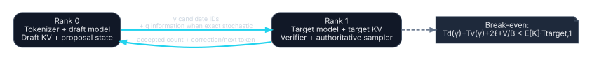

# Remote speculative decoding

Speculative decoding uses a faster draft model to propose several tokens and a target model to verify them in parallel. The original exact method preserves the target distribution. [Fast Inference from Transformers via Speculative Decoding](https://proceedings.mlr.press/v202/leviathan23a.html). Remote placement separates drafter and target across the USB4 link.

## Base ownership

### Rank 0 / node A — draft and frontend

- **Tokenizer:** canonical tokenizer/detokenizer. Draft and target token IDs must be exactly compatible.
- **Model:** complete draft model.
- **KV:** complete draft KV.
- **Sampler:** proposal generation only.
- **RNG:** proposal RNG stream in stochastic mode; no final-output authority.
- **Session:** prompt, external output, draft rollback/replay, round counters.

### Rank 1 / node B — target and authority

- **Tokenizer:** exact vocabulary/config mirror.
- **Model:** complete target model.
- **KV:** complete target KV with ability to commit accepted tokens and discard rejected speculative suffixes.
- **Sampler:** authoritative verification, correction/next-token selection, and final logits processing.
- **RNG:** final sampling and acceptance RNG streams/counters.
- **Session:** target verification epoch and authoritative committed prefix.

Placements: [`remote-speculation-greedy.yaml`](../../placements/remote-speculation-greedy.yaml) and [`remote-speculation-exact-stochastic.yaml`](../../placements/remote-speculation-exact-stochastic.yaml).

## Prefill

Draft and target normally prefill independently from the same canonical token IDs. Their KV layouts and hidden dimensions can differ, so no cross-model KV reuse is assumed.

Rank 0 sends at most:

\[
V_{prompt}=Nb_t+b_{request}
\]

to initialize rank 1 if the frontend is centralized. Both models then hold local KV.

## Greedy remote verification

Rank 0 drafts \(\gamma\) greedy candidates. Rank 1 evaluates the target over the candidate block, accepts the matching prefix, and returns the target correction or next token.

Request:

\[
V_{req}=\gamma b_t+b_{meta,req}.
\]

Response:

\[
V_{resp}=b_t+b_{meta,resp}.
\]

The response must identify accepted length, committed target token, round/session counters, and any stop condition. Rank 0 rolls back draft KV to the committed prefix and replays the target correction when necessary.

For deterministic target decoding, output equality can be tested token-for-token against baseline target greedy decoding.

## Exact stochastic remote verification

Standard exact speculative sampling accepts proposal tokens using both target probabilities \(p\) and draft probabilities \(q\), and may sample from a residual distribution after rejection. A remote system must make sufficient \(q\) information available to rank 1.

Protocol options include:

1. **Eager full proposal vectors:** send \(\gamma\) full \(q\) vectors.
   \[
   V_q=\gamma|\mathcal V|b_p.
   \]
2. **Draft replica/recomputation on target:** rank 1 also evaluates the draft, reducing network volume but duplicating draft compute/weights.
3. **Proven compressed or on-demand protocol:** state exact information, extra round trips, expected bytes, and correctness proof/test.

Sending only candidate IDs and their scalar proposal probabilities is not assumed sufficient for generic residual sampling. The placement is NO-GO until the chosen exact protocol is documented.

## Synchronous round model

\[
T_{round}=T_d(\gamma)+\ell+\frac{V_{req}}{B}+T_v(\gamma)+
\ell+\frac{V_{resp}}{B}.
\]

All timing terms are measured for the exact context, batch, quantization, and runtime. Target block verification is not assumed to equal one ordinary decode step.

## Expected committed tokens

The exact production value is empirical. For sensitivity analysis only, assume independent equal acceptance probability \(a\):

\[
E[K]=1+a+\dots+a^\gamma.
\]

The extra “1” represents the target token produced at the round boundary. This model does not capture position-dependent or correlated acceptance.

## Break-even

Against measured target baseline time \(T_{t,1}\) per token:

\[
T_{round}<E[K]T_{t,1}.
\]

Before any bandwidth calculation, the latency/compute budget must be positive:

\[
E[K]T_{t,1}-T_d(\gamma)-T_v(\gamma)-2\ell>0.
\]

Then:

\[
B_{req}=\frac{V_{req}+V_{resp}}
{E[K]T_{t,1}-T_d-T_v-2\ell}.
\]

Evaluate each \(\gamma\) over the empirical acceptance distribution. Longer drafts amortize a round trip but can reduce acceptance and increase wasted draft/verify work. Recent distributed-speculation research also treats draft length as a latency-dependent control variable; it does not provide a substitute for local measurement. [Delay-Adaptive Speculation Control](https://arxiv.org/abs/2606.20591).

## Asynchronous variants

An asynchronous drafter can continue proposing while target verification is in flight. This may hide round-trip latency but introduces stale speculative work, more complex rollback, and queue bounds. A coarse service model is:

\[
T_{service}\approx\max(T_{draft\_window},T_{network+verify})+T_{commit},
\]

plus expected wasted work after rejection. It is a separate experimental mode and must preserve exactness and bounded memory. [PicoSpec](https://arxiv.org/abs/2603.19133).

## Link use

Greedy candidate-ID traffic is small; a second USB4 link generally offers little bandwidth benefit and may add software overhead. Use the lowest-latency reliable control path. Dual-link bulk striping becomes relevant only when exact stochastic protocols send large probability data or when multiple speculative sessions are independently assigned to links.

## Feasibility gates

- Tokenizer/vocabulary compatibility is exact.
- Draft and target each fit with their KV and workspace.
- Measured acceptance and block timings make the break-even denominator positive.
- Greedy mode passes token-for-token equality.
- Exact stochastic mode passes algorithmic/probabilistic correctness and seeded-state tests.
- RNG streams and counters have one documented authority.
- Draft and target KV rollback/commit survive rejection at every candidate position.
- Stop tokens, grammar constraints, penalties, and tool-call schemas are applied consistently.
- Failure during a round cannot expose unverified tokens externally.

## Disposition

Remote speculation is **conditional** and can be network-light in greedy mode. It is not automatically advantageous: latency, drafter cost, target verification cost, and acceptance decide. Exact stochastic remote speculation is **experimental and fail closed** until its probability protocol is complete.
