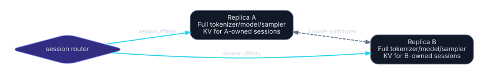

# Replicated decode

Replicated decode stores a complete independent inference replica on each node and assigns whole sessions to one replica. It is request/data parallelism, not model parallelism.

## Ownership

### Rank 0 / node A

- complete tokenizer and detokenizer;
- complete model, including all experts for MoE;
- complete sampler and per-session RNG for A-owned sessions;
- KV only for sessions assigned to A;
- authoritative lifecycle for A-owned sessions.

### Rank 1 / node B

The same ownership for B-owned sessions.

An external or rank-0 frontend selects the replica before prefill. Session affinity remains fixed unless an explicit KV migration succeeds.

Machine-readable definition: [`placements/replicated-decode.yaml`](../../placements/replicated-decode.yaml).

## Communication

Cross-node model-path communication:

\[
V_{pf}=0,
\qquad
V_{dec}=0.
\]

Request routing can send prompt text or token IDs once. Output can return directly from the replica or through a frontend. Heartbeats and load metrics are control-plane traffic, not per-layer synchronization.

## Performance interpretation

For one request, only one replica participates. There is no single-request speedup.

For independent requests with measured service rates \(\mu_A,\mu_B\), a scheduler may approach aggregate capacity \(\mu_A+\mu_B\) when bottlenecks are independent and offered load is sufficient. This is a measurement statement, not a guarantee; memory bandwidth, thermal/power limits, front-end bottlenecks, or identical workload bursts can alter behavior.

Report:

- throughput at fixed latency/SLO;
- admission-to-first-token and inter-token latency distributions;
- queue depth per replica;
- session/context mix;
- power/thermal mode;
- imbalance and scheduler decisions.

## Memory gate

The full model must fit twice, once per node:

\[
W_{full}+K_{planned,r}+R_r\le M_{usable,r}.
\]

A model that fits only by pooling memory cannot use replicated decode. “Fits” must include planned maximum concurrent KV, not just initial model load.

## Tokenizer and sampler rationale

Replicating the tokenizer and sampler removes per-token cross-node dependencies. Both copies must use identical model revision, tokenizer files, chat template, special token IDs, logits processing, and generation configuration.

Each session has one RNG authority on its replica. Replaying or failing over a stochastic session requires checkpointing RNG counters and KV or restarting from the committed token history.

## Session routing

Use a stable mapping such as consistent hashing or least-loaded admission with sticky ownership. Load signals should include:

- active KV bytes, not only request count;
- prompt and current context length;
- generation limit;
- prefill/decode phase;
- queue and thermal state.

A long-context session can dominate memory even when request counts are equal.

## Migration and failover

Migrating context \(c\) transfers at least:

\[
V_{KV}=2cLH_{kv}db_{kv}.
\]

The destination must also have identical model state, positions, runtime KV layout, and RNG/session metadata. Prefer routing new sessions rather than migrating active sessions. Migration is justified only when remaining work amortizes export, transfer, import, and pause.

A node failure without replicated KV loses in-flight session state. Reconstructing from committed token history requires re-prefill, not merely routing the next token.

## Feasibility gates

- Full model, maximum planned KV, workspace, and reserve fit on each node.
- At least two independent runnable sessions exist when aggregate throughput is the objective.
- Scheduler preserves session affinity.
- Both replicas pass deterministic and stochastic configuration equivalence tests.
- The frontend is not a throughput bottleneck.
- Failover behavior is documented: restart/re-prefill, periodic checkpoint, or no transparent failover.

## Disposition

When the model fits each Strix Halo, replicated decode is the **default GO candidate for multi-request throughput** because it removes USB4 from the model critical path. It is a **NO-GO as a claimed single-request latency optimization**.
