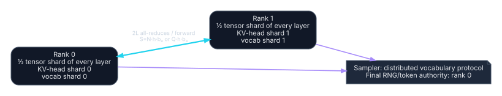

# Tensor parallelism over two USB4-connected ranks

## Placement

This page models Megatron-style tensor parallel degree two across the systems. Weight matrices inside every transformer layer are split so both ranks participate in every layer. The original Megatron construction uses two all-reduces in each transformer layer's forward path—one after the row-parallel attention output projection and one after the row-parallel MLP output. [Megatron-LM](https://arxiv.org/abs/1909.08053).

### Rank 0 / node A

- **Rank role:** request coordinator, tensor rank 0.
- **Tokenizer:** canonical full tokenizer and detokenizer.
- **Model:** tensor shard 0/2 of every layer; compatible embedding and vocabulary-head shard; final normalization may be replicated.
- **KV:** KV-head shard 0/2 when the architecture and runtime admit an exact split.
- **Sampler:** coordinator for an exact distributed vocabulary-sampling protocol.
- **RNG:** final sampler seed/counter authority.
- **Session:** authoritative prompt, token history, cancellation, and externally visible output.

### Rank 1 / node B

- **Rank role:** tensor rank 1.
- **Tokenizer:** none required for normal execution; exact vocabulary/config mirror is still required by the model.
- **Model:** complementary tensor, embedding, and vocabulary shards.
- **KV:** complementary KV-head shard.
- **Sampler:** local contribution to distributed sampling; no independent final decision.
- **RNG:** no independent final output RNG.
- **Session:** mirrored token IDs and tensor-rank state only.

Machine-readable definition: [`placements/tensor-parallel-2.yaml`](../../placements/tensor-parallel-2.yaml).

## Communication

For \(S=Nhb_a\) in prefill or \(S=Qhb_a\) in decode:

| Quantity | Formula |
|---|---:|
| Forward collectives | \(2L\) |
| Per-rank sent bytes | \(2LS\) |
| Per-rank received bytes | \(2LS\) |
| Aggregate bidirectional cut bytes | \(4LS\) |
| Communication time | \(2L(m_{AR}\ell+S/B)\) |
| Transport fixed-cost phases | \(2Lm_{AR}\) |

The collective cannot generally be moved outside the layer because the next operation consumes the fully reduced hidden state. Inference has no backward pass, so only the two forward collectives are counted.

## Sampler cost is part of the mode

A vocabulary-sharded LM head avoids storing all output weights on one rank, but creates a token-selection protocol.

### Exact greedy

Each rank produces its local maximum logit and corresponding global token ID. A small reduction over `(logit, token_id)` selects the global maximum. Tie-breaking must match the baseline.

### Exact stochastic

Temperature, penalties, masks, top-k/top-p, and RNG must be globally coherent. Viable implementations include a mathematically exact distributed normalization/selection protocol or a full-logit gather. The latter adds:

\[
V_{logits}=Q|\mathcal V|b_p
\]

per decode step and must appear in the cost model. “Sampler on rank 0” is not enough if rank 0 lacks the other vocabulary logits.

## KV ownership gate

With GQA and even \(H_{kv}\), head sharding can give each rank half of K/V. For the worked models, Llama 3.1 has 8 KV heads, Mixtral has 8, and Qwen3-30B-A3B has 4; each is arithmetically divisible by two. Runtime layouts still need validation.

Architectures with one KV head cannot be split evenly by head. Options—KV replication, sequence partitioning, or uneven ownership—change memory and communication and require a separate placement record.

## Speed break-even

With measured one-node compute \(C_1\) and measured compute efficiency \(\eta_{TP}\):

\[
\frac{C_1}{2\eta_{TP}}+2L\left(m_{AR}\ell+\frac{S}{B}\right)<C_1.
\]

Required effective payload bandwidth is:

\[
B_{req}=\frac{2LS}
{C_1(1-1/(2\eta_{TP}))-2Lm_{AR}\ell}.
\]

A non-positive denominator means that latency plus compute efficiency consumes the entire possible saving: no bandwidth can rescue the speed objective.

## Feasibility gates

**GO for capacity only when all pass:**

1. the backend supports TP=2 kernels, communication, and the target quantization on both APUs;
2. per-rank weights, KV shard, collective buffers, graph workspace, and OS reserve fit;
3. KV-head ownership is exact;
4. the sampler protocol is exact for the requested policy;
5. failure semantics do not leave half-owned KV/session state ambiguous.

**GO for speed only when, additionally:**

1. relevant small-message \(B,\ell\) and \(m_{AR}\) are measured through the actual collective path;
2. the displayed break-even passes for prefill and/or decode separately;
3. full runtime traces show no unmodeled host-copy or synchronization term large enough to reverse the result;
4. the comparison uses the same model, quantization, context, batch, sampling, and output.

## Disposition

TP is the last-resort two-node placement when a single whole-layer partition cannot satisfy capacity, or an empirical speed gate passes. Dual USB4's nominal aggregate line rate does not overcome the \(2L\) synchronization count by specification alone. Treat TP as **conditional and fail closed**.
