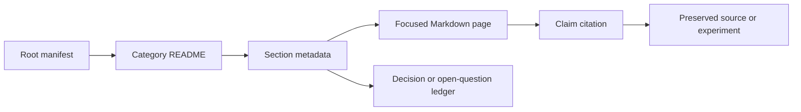

# Design implications

## Proposed root manifest record

```yaml
manifest_version: "1.0.0"
generated_at: "2026-07-16T00:00:00Z"
schema: "manifest.schema.json"
sections:
  - section_id: "01"
    category_id: "01"
    title: "Wiki Architecture, Navigation, and Root Manifest"
    canonical_path: "01_Wiki_Governance/01_Wiki_Architecture_Navigation_and_Root_Manifest"
    status: "needs-machine-validation"
    owner: "unassigned"
    last_verified: "2026-07-16"
    review_due: null
    applies_to:
      repositories: ["Custom_Inference_Project"]
      software_versions: ["YAML 1.2.2", "JSON Schema 2020-12"]
      hardware_revisions: []
    authoritative_for: ["wiki-navigation", "section-registry"]
    related_sections: ["02", "03", "04", "05"]
    supersedes: []
    superseded_by: null
```

**[RECOMMENDATION]** `section_id`, `canonical_path`, and `authoritative_for` must be unique. `related_sections`, `supersedes`, and `superseded_by` must resolve to registered IDs. Unknown keys should fail CI until the schema is intentionally revised.

## Duplicate and contradiction controls

| Control | Purpose |
|---|---|
| `authoritative_for` uniqueness | Prevent two sections claiming the same policy surface |
| claim IDs and source IDs from section [02](../02_Evidence_Citation_and_Source_Policy/README.md) | Make conflicts addressable |
| ledger links from section [04](../04_Assumption_Open_Question_and_Decision_Ledgers/README.md) | Prevent recommendations becoming decisions by repetition |
| applicability tuples | Keep version- or machine-specific truths scoped |
| archive records | Preserve history without presenting it as current |

**[INFERENCE]** A compact manifest lets Codex select high-value files before loading prose, which reduces retrieval noise and makes stale or superseded material less likely to be mistaken for authority. This follows from the Agent Harness progressive-disclosure contract [S01-06].

## Codex discovery order



**[RECOMMENDATION]** Codex must prefer an applicable `verified` section, then `needs-machine-validation`, then `draft`; it must not silently use `superseded` content. If two applicable pages claim authority, report a registry error rather than choose by modification date.
