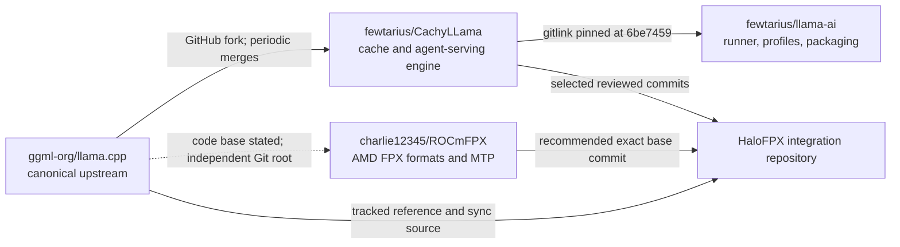

# Repository lineage and frozen baselines

## Decision-oriented summary

**[VERIFIED]** At the 2026-07-16 America/Los_Angeles observation point, the four remote default-branch tips are:

| Role | Repository | Default branch | Observed commit |
|---|---|---|---|
| End-to-end APU runner and packaging | `fewtarius/llama-ai` | `main` | `1017f3dfdce3ca2b06aa9007b23295db3bb35722` |
| Persistent-cache inference-engine fork | `fewtarius/CachyLLama` | `master` | `6be745998f568e379ea197fcf827baec73ff9940` |
| Intended HaloFPX source base | `charlie12345/ROCmFPX` | `main` | `a5605a72768c6562241b248e268e33dc92787394` |
| Canonical upstream | `ggml-org/llama.cpp` | `master` | `788e07dc91d266ad3162a1ce9037665656269689` |

These values were independently resolved with repository metadata and `git ls-remote --symref`; they are observations, not moving aliases to use in a reproducible build (SRC-11-001, SRC-11-003, SRC-11-006, SRC-11-010).

**[VERIFIED]** `llama-ai` is a separate GPL-3.0-or-later orchestration repository. Its only gitlink is `CachyLLama/` at `6be745998f568e379ea197fcf827baec73ff9940`; `.gitmodules` names `fewtarius/CachyLLama` and branch `master`. The gitlink SHA, not that branch hint, determines the checked-out source (SRC-11-002, SRC-11-014).

**[VERIFIED]** GitHub records `fewtarius/CachyLLama` as an MIT-licensed fork of `ggml-org/llama.cpp`. At the snapshot, its default branch is diverged from current upstream: 53 commits on the CachyLLama side and 125 commits on the upstream side after merge base `92366df30d4eaa4b85139b5fd694360237731b19` (SRC-11-003 through SRC-11-005).

**[VERIFIED]** GitHub does not record `charlie12345/ROCmFPX` as a fork. Its history has an independent root, while its README and notices state that it is based on `llama.cpp`. Therefore a normal graph-derived ahead/behind count against current upstream is undefined; content and imported-commit lineage must be tracked explicitly (SRC-11-006 through SRC-11-009).

**[RECOMMENDATION]** HaloFPX should be its own integration repository based on an exact ROCmFPX commit, with separate upstream remotes for ROCmFPX, CachyLLama, and llama.cpp. Import cache or serving work as reviewable commits/patches; do not make `llama-ai` or a moving branch the build root.

## Lineage map

The dashed edge is intentional: it expresses source-code lineage without claiming graph ancestry.

## Scope split

### Completed Internet and source-code research

- Remote default branches and exact tips.
- Fork metadata, branch tips, release/tag presence, root gitlinks, and recent development signals.
- CachyLLama/upstream merge base and divergence counts at the exact snapshot.
- ROCmFPX independent-root condition and its documented historical integration baseline conflict.
- A reproducible, preservation-first baseline-freeze procedure.

### Required on-machine inspection

- Identify the actual checkouts on both Strix Halo nodes and record their remotes, object IDs, submodule state, worktree dirtiness, patches, and build inputs.
- Prove that every pinned object can be checked out without a network connection from verified bundles.
- Build and run the section-16 smoke suite from the detached frozen worktrees; no performance result is claimed here.

### Contingent decisions

- The first HaloFPX base commit cannot be promoted until the current local ROCmFPX checkout and any uncommitted patches are inventoried.
- CachyLLama commits must be selected by capability and dependency review under sections 14 and 15, not by bulk merging its branch.
- The baseline is not releasable until its source bundles, dependency lock, licenses, build recipe, and test receipt are all attached to one manifest.

## Navigation

- [Facts and constraints](facts_and_constraints.md)
- [Design implications](design_implications.md)
- [Procedures and checks](procedures_and_checks.md)
- [Open questions](open_questions.md)
- [Sources](sources.md)

Related work: [12 - Codebase Architecture and Module Map](../12_Codebase_Architecture_and_Module_Map/README.md), [13 - ROCmFPX Feature, Kernel, Format, and Patch Inventory](../13_ROCmFPX_Feature_Kernel_Format_and_Patch_Inventory/README.md), [14 - llama-ai and CachyLLama Feature and Patch Inventory](../14_llama_ai_and_CachyLLama_Feature_and_Patch_Inventory/README.md), [15 - Integration Patch Stack and Upstream Synchronization Strategy](../15_Integration_Patch_Stack_and_Upstream_Synchronization_Strategy/README.md), and [16 - Build, Dependencies, Licensing, CI, and AI-Agent Workflow](../16_Build_Dependencies_Licensing_CI_and_AI_Agent_Workflow/README.md).
