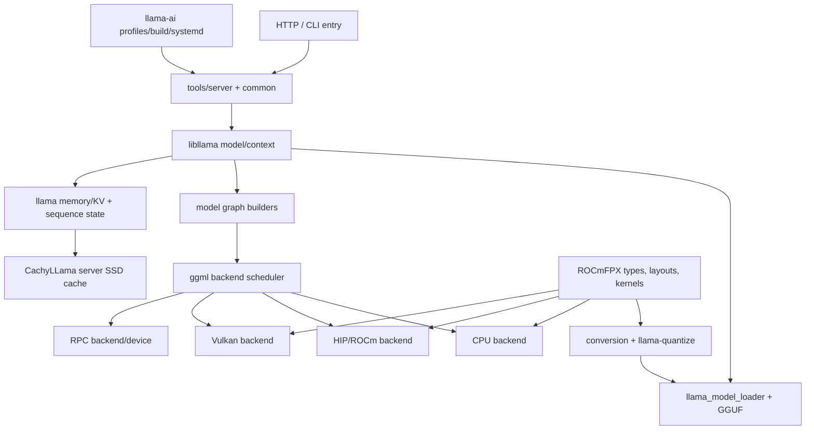

# 12 - Codebase Architecture and Module Map

This section is the source-level orientation map for HaloFPX. It identifies where model loading, GGUF, graph construction, backends, scheduling, server behavior, RPC, cache state, speculative decoding, quantization, tests, and packaging live in the four intended repositories.

## Executive map

**[VERIFIED]** At the pinned upstream commit, the main inference path is `llama-server` -> `server_context::load_model` -> common model/context initialization -> `llama_model_load_from_file` -> `llama_model_loader`/GGUF -> `llama_model::build_graph` -> `llama_context::graph_compute` -> `ggml_backend_sched_graph_compute_async` -> a registered CPU, HIP, Vulkan, or RPC backend. [S12-001][S12-002][S12-003][S12-004]

**[VERIFIED]** ROCmFPX adds actual GGML tensor types and format implementations plus CPU reference, HIP/ROCm, and Vulkan paths. Its changes therefore cross format ABI, model quantization, backend kernels, build logic, tests, and recipes; this is not a self-contained plugin. [S12-009]

**[VERIFIED]** CachyLLama adds SSD checkpoint/page-manager code under `common/` and integrates it directly into `tools/server/`, using upstream sequence-state serialization APIs to capture and restore target and optional draft contexts. [S12-010]

**[VERIFIED]** `llama-ai` is an outer operational repository: it pins CachyLLama as a submodule and owns detection, profiles, build/run scripts, benchmarking, and a systemd unit rather than an alternative inference core. [S12-011]

## Page guide

- [Facts and constraints](facts_and_constraints.md) - module map, call paths, extension points, and coupling.
- [Design implications](design_implications.md) - ownership boundaries and integration recommendations.
- [Procedures and checks](procedures_and_checks.md) - reproducible Internet and two-node validation work.
- [Open questions](open_questions.md) - unresolved architecture and compatibility decisions.
- [Sources](sources.md) - commit-pinned primary evidence.

## Research split

### Completed source-code research

**[VERIFIED]** Four repository default branches were queried live and shallow-cloned on 2026-07-16; key files and symbol call paths were inspected at the commits listed in the front matter. [S12-001][S12-009][S12-010][S12-011]

### Required two-machine inspection

**[OPEN]** No build, runtime trace, state-restore test, backend-op audit, or dual-link RPC measurement has been run on the actual Strix Halo pair. See [procedures and checks](procedures_and_checks.md#on-machine-validation).

### Contingent decisions

**[OPEN]** The extension strategy for dual-link transport, rank-local persistence, and distributed planning remains contingent on the pinned-baseline decision in section 11 and machine results in sections 18, 32, 39, 51, 56, and 57.

