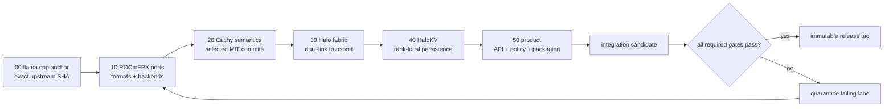

# 15 - Integration Patch Stack and Upstream Synchronization Strategy

## Decision-oriented summary

**[VERIFIED]** The research snapshot is pinned to four exact repository commits; mutable branch names are not baselines. ROCmFPX is published as an independent GitHub repository and its current commit graph has no merge base with pinned `ggml-org/llama.cpp`, even though its files and documentation identify llama.cpp as the source base. CachyLLama is a GitHub fork of llama.cpp and retains upstream ancestry. `llama-ai` pins CachyLLama as a submodule but is GPL-3.0-or-later, whereas the three C/C++ repositories are MIT-licensed. See [facts and constraints](facts_and_constraints.md#15-current-source-snapshot) and [sources](sources.md).

**[RECOMMENDATION]** Build HaloFPX on a real llama.cpp ancestry and maintain six ordered, reviewable patch lanes: upstream anchor, ROCmFPX, selected CachyLLama semantics, Halo fabric, HaloKV, and product code. Import ROCmFPX as a provenance-recorded port series until a common-ancestry source branch is identified; do not pretend that an unrelated-history merge is ordinary upstream synchronization.

**[RECOMMENDATION]** Rebase only unpublished topic lanes. Publish immutable integration candidates and releases as signed tags, merge the validated lanes in a fixed order, and never rewrite a released baseline. Review each rebase with `git range-diff`; use `rerere` only as a conflict-resolution aid, never as approval.

**[OPEN]** No patch inventory, CI matrix, cache ABI, rank protocol, or matched-machine result is yet approved for HaloFPX. This section defines the control structure, not a claim that the combined stack builds or runs.

## Stable section map

- [Facts and constraints](facts_and_constraints.md) - pinned topology, licensing, Git behavior, and non-negotiable constraints.
- [Design implications](design_implications.md) - branch model, patch ownership, cadence, conflict policy, and upstreaming.
- [Procedures and checks](procedures_and_checks.md) - reproducible synchronization, replay, review, integration, and bisect gates.
- [Open questions](open_questions.md) - decisions and evidence still required.
- [Sources](sources.md) - primary source ledger.

## Proposed integration flow

The arrows express dependency order, not repository ownership. Each lane remains separately reviewable and must state its upstream base, owner, provenance, validation gate, and rollback unit.

## Research split

### Internet and source-code research completed now

- **[VERIFIED]** Default branches, exact head commits, commit dates, licenses, GitHub fork relationships, CachyLLama merge ancestry, and the llama-ai submodule pin were inspected on 2026-07-16.
- **[VERIFIED]** Git 2.54.0 manuals document rebase replay, `range-diff`, `rerere`, cherry-pick provenance, and bisect; GitHub documents fork synchronization and protected-branch gates.
- **[INFERENCE]** The unrelated ROCmFPX history makes a wholesale upstream merge or blind rebase unsuitable as the initial integration mechanism.

### Required inspection and measurements on the two Strix Halo machines

- Reproduce clean builds at the upstream anchor and after every patch lane on both machines.
- Prove the ROCmFPX port inventory against the donor commit, including generated files and backend-specific tests.
- Exercise cache schema mismatch, truncation, checksum failure, and rank mismatch; every invalid artifact must miss or recompute.
- Exercise dual-link loss, rank loss, restart, and single-node fallback with raw logs and exact software/hardware metadata.
- Rehearse a seeded regression and show that `git bisect run` identifies the responsible patch without crossing unbuildable commits.

No results from these tasks are reported here.

### Decisions contingent on those results

- Whether ROCmFPX can be replayed as a compact patch series or needs a one-time ancestry reconstruction.
- Which CachyLLama cache commits are semantically portable and which require redesign around HaloKV.
- Whether fabric and cache code live in the core fork, libraries, or process-separated services.
- Synchronization cadence, supported upstream window, cache ABI compatibility policy, and first release baseline.

## Dependencies

The exact baseline ledger belongs in [section 11](../11_Repository_Lineage_Branches_Commits_and_Frozen_Baselines/README.md); donor patch inventories belong in [section 13](../13_ROCmFPX_Feature_Kernel_Format_and_Patch_Inventory/README.md) and [section 14](../14_llama_ai_and_CachyLLama_Feature_and_Patch_Inventory/README.md); build, license, CI, and agent workflow enforcement belongs in [section 16](../16_Build_Dependencies_Licensing_CI_and_AI_Agent_Workflow/README.md). Until those sections approve exact inventories, this strategy remains `needs-machine-validation`.
