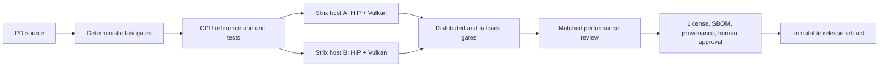

# Design implications

## Repository and license boundaries

**[RECOMMENDATION]** Make the ROCmFPX commit the source baseline and track llama.cpp as an explicit upstream remote. Record CachyLLama-derived work as individual source commits and transformations, not as a vague feature import. See Sections 11, 14, and 15 for lineage and patch-stack authority.

**[RECOMMENDATION]** Keep these distribution units distinct until reviewed:

- `halofpx-core`: MIT C/C++ source plus compatible notices;
- optional orchestration: newly authored under the chosen project license, or clearly separate GPL-covered `llama-ai` material;
- models/datasets: external artifacts with their own manifests and licenses;
- ROCm/Vulkan/system components: external runtime prerequisites, never implied to be covered by the source license.

**[OPEN]** The project's intended distribution model and license have not been approved. No page may label a combined MIT/GPL package safe to distribute without competent review.

## Hermetic-enough build contract

**[INFERENCE]** A Git SHA alone cannot reproduce HaloFPX because results depend on ROCm/LLVM, GPU target, Vulkan tools/driver, CMake-resolved projects, Python wheels, compiler flags, and generated shaders. This follows from the pinned build definitions and dependency ranges. [S16-02][S16-03][S16-06]

**[RECOMMENDATION]** Each build produces an immutable manifest containing:

| Class | Required fields |
|---|---|
| source | repository URL, full commit, tree hash, dirty flag, patch-series IDs/hashes |
| toolchain | OS image/distro snapshot, kernel, CMake/Ninja, C/C++/HIP compiler path and version, ROCm package/SDK revision |
| target | CPU architecture, `gfx1151`, backend list, all non-default CMake cache entries, environment allowlist |
| dependencies | submodule gitlinks, vendored-tree hashes, CMake fetch URL+commit+hash, Python/npm lock/hash, system package versions |
| outputs | artifact path, type, size, SHA-256, embedded build-info result, SBOM link, notices link |
| execution | UTC start/end, builder identity, CI run ID, source date epoch, network policy |

Use SPDX 3.0.1 for a machine-readable SBOM and a SLSA 1.2 provenance-shaped attestation; do not claim a SLSA level merely because fields are present. [S16-12][S16-13]

## CI topology

**[RECOMMENDATION]** Split gates by cost and authority:

Fast mandatory gates should include formatting, generated-file consistency, Python/Bash syntax, dependency/notice validation, CPU reference probes, unit tests, `test-backend-ops`, sanitizer jobs, and cache-corruption rejection. GPU gates must build and run on both actual machines. Distributed tests must identify rank ownership, failure behavior, and single-node fallback; a cache integrity failure must cause a miss/recompute, never acceptance.

**[RECOMMENDATION]** Performance is a reviewed gate, not a single hard-coded number. Compare matched compiler, flags, model hash, prompt/workload, cache state, thermal state, and backend. Store raw data and environment metadata under the experiment authority in Section 11.

## AI-assisted change lifecycle

**[RECOMMENDATION]** Apply the Agent Harness promotion rule to code work: evidence and issue -> candidate change -> review -> validation -> published commit -> use observation -> improvement proposal. Memory or a previous agent run may motivate a test but cannot establish compatibility or performance. [S16-11]

Every AI-assisted material change must have:

1. a human owner and linked requirement/issue/decision;
2. source paths and exact evidence consulted;
3. declared assistance type (research, review, mechanical edit, draft, implementation);
4. changed files and resulting commit (added after commit exists);
5. validation commands, environment, results, and unresolved risks;
6. explicit human review/approval identity and time;
7. an append-only superseding record for corrections—never silent history edits.

**[RECOMMENDATION]** Agents may prepare local candidate diffs and evidence but must not invent results, conceal provenance, rewrite the log, or push/merge autonomously. Upstream submissions must also obey the target repository's stricter rule prohibiting AI-written commit messages, PR text, and review replies. A human must author those communications and understand every line. [S16-05][S16-07]

## Append-only means auditable, not secret

**[RECOMMENDATION]** Store newline-delimited JSON records in `engineering/ai-change-log/YYYY.ndjson` and protect the path with CODEOWNERS plus CI validation. Each record references files and evidence; it must not store prompts containing secrets, private chain-of-thought, access tokens, or unnecessary personal data. A correction appends a record with `supersedes` and the prior record digest.

**[INFERENCE]** Git history alone is insufficient append-only enforcement because history can be rewritten. Releases should additionally publish the log head digest in provenance; organizational controls should restrict force pushes on protected branches.

## Deliberately unresolved choices

- one combined HIP+Vulkan artifact versus independently qualified artifacts;
- container, Nix, distro snapshot, or lockfile as the toolchain authority;
- self-hosted runner isolation and secrets model;
- release reproducibility threshold;
- legal treatment of any GPL orchestration reuse.

These remain decisions, not facts, until machine and governance work is complete.

