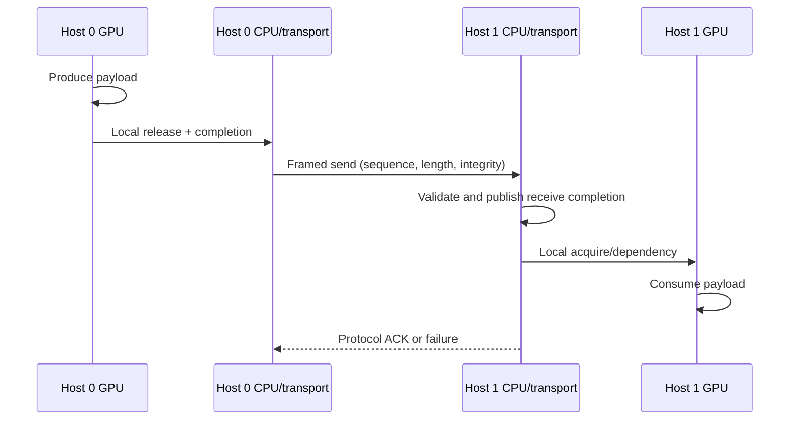

# Design implications

## Required ordering model

**[RECOMMENDATION]** Give every transfer an explicit state machine: `FREE -> GPU_WRITING -> LOCAL_READY -> IN_FLIGHT -> REMOTE_READY -> CONSUMED`, with generation counters so stale readiness cannot be mistaken for a new message.

**[INFERENCE]** The two local GPU/CPU edges can use HIP/HSA fences and completion. The middle edge must use the transport's ordering, integrity, and acknowledgment semantics. System-scope atomics are not a cross-host primitive [S24-005, S24-007].

## Candidate buffer paths

| Path | Local publication | Advantages | Risks/status |
|---|---|---|---|
| A. Device output -> explicit async copy -> pinned host send buffer | event with explicit system release after copy, then host synchronize/query | **[RECOMMENDATION]** conservative reference path; clear ownership | Extra copy; overlap, event flags, and copy-engine behavior must be measured. |
| B. GPU writes mapped fine-grained host buffer | system-release fence/atomic, host acquire/poll | Removes explicit local copy in principle | **[OPEN]** bandwidth, cache effects, atomics, and CPU polling cost on gfx1151. |
| C. GPU buffer registered directly by RCCL/network plugin | plugin completion contract | Potential copy reduction | **[OPEN]** USB4 plugin, DMA-BUF/export, registration, and gfx1151 support unproven. |
| D. Coarse-grained shared allocation with ownership handoff | command/event boundary | May provide better GPU caching | Ownership and visibility are easier to misuse; requires exact HSA/HIP validation. |

**[RECOMMENDATION]** Implement A first as the correctness oracle. Promote B or C only when they match A byte-for-byte under stress and improve end-to-end latency or throughput at relevant message sizes.

## Synchronization rules

1. **[RECOMMENDATION]** Use a dedicated non-default stream per transfer lane and explicit event dependencies. Avoid implicit null-stream coupling.
2. **[RECOMMENDATION]** Use timing-disabled events for dependencies and explicitly request `hipEventReleaseToSystem` when host visibility is required. Never use `hipEventDisableSystemFence` on a publication boundary; verify accepted flag combinations because the HIP event documentation is internally inconsistent [S24-003, S24-008].
3. **[RECOMMENDATION]** If GPU and CPU share a ready word, use a monotonic sequence number and system-scope release/acquire atomics in explicitly fine-grained memory. Gate this path on EX24-02/03/04.
4. **[RECOMMENDATION]** Keep payload ownership single-writer. Atomics protect metadata; they do not repair races on payload bytes.
5. **[RECOMMENDATION]** A timeout or process restart invalidates in-flight generations. Never accept an old completion after slot reuse.

## Graph-capture boundary

**[VERIFIED]** HIP graph capture records HIP stream operations, while arbitrary non-HIP socket work is not captured [S24-010].

**[RECOMMENDATION]** Capture stable compute and local-copy subgraphs only. Terminate the graph at a local completion event, let the host transport run outside capture, then launch or signal the receive-side graph. Do not embed blocking network waits in graph host nodes.

**[OPEN]** Graph update/capture compatibility of the eventual llama.cpp/ROCmFPX command sequence must be enumerated API-by-API and traced on ROCm 7.2.3.

## RCCL placement

**[RECOMMENDATION]** Treat RCCL as one candidate collective engine behind the transport abstraction, not as the architecture. Benchmark:

- RCCL socket transport pinned to each USB4 interface and any bonded/multipath interface;
- any viable `librccl-net` plugin;
- the project's framed point-to-point transport;
- host-staged and direct-buffer variants separately.

For every two-rank collective, record rank ownership, buffer lifetime, failure/timeout behavior, and single-node fallback. If RCCL initialization or a collective fails, HaloFPX must fail the distributed request or restart the communicator; it must not silently consume partially reduced data.

## Dependencies

- Section 19 owns GPUVM/GTT/IOMMU/allocation-limit details.
- Section 23 owns the exact kernel, firmware, ROCm, and Mesa compatibility matrix.
- Section 42 owns tensor-parallel collective placement.
- Sections 49/52/54 own transport, multipath, and GPU-visible buffer protocols.
- Section 75 owns end-to-end fabric and GPU-to-peer-GPU measurements.
