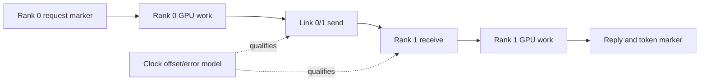

# Profiling design implications

## Correlation contract

**[RECOMMENDATION]** Every request, token step, rank transfer, cache lookup, device dispatch and storage operation should carry or map to:

```text
experiment_id, host_id, process/thread, rank, request_id,
token_step, link_id, monotonic timestamp, clock_id, build_id
```

Instrument user-space phases with ROCTx and an equivalent CPU trace marker. **[INFERENCE]** Stable IDs are more reliable than kernel/function-name matching and allow rank-local traces to remain useful when full clock alignment is unavailable.

## Capture ladder

1. **[RECOMMENDATION]** Start with low-overhead application timestamps, system telemetry and request outcomes.
2. Add `perf stat`, scheduler/block/network counters and rocprof runtime traces around a bounded reproduction.
3. Add sampling, KFD/page traces or eBPF to answer one hypothesis.
4. Use GPU hardware counters in validated groups and repeatable passes.
5. Use function tracing, crash dumps or full packet capture only when justified by a narrower fault.

**[RECOMMENDATION]** Run the same workload without profiling before and after each capture and report overhead. Never publish profiled latency as baseline latency.

## Distributed attribution



**[RECOMMENDATION]** Record both links independently. Aggregate bandwidth hides imbalance, retransmission, IRQ placement and head-of-line blocking. State rank ownership and preserve single-node traces as the fallback comparator.

## Evidence retention

- Preserve raw profiler configuration, tool output, environment/build manifest and dropped-event counters.
- Convert to Perfetto or summary tables as derived artifacts, linking back to raw inputs.
- Restrict cores and packet captures because prompts, tokens, credentials or model data can appear in them.
- Version metric formulas; do not silently reinterpret old counter names after a ROCm upgrade.

