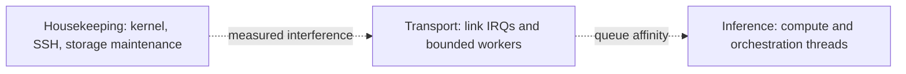

# Host tuning design implications

## Proposed resource partition

**[RECOMMENDATION]** Begin with no isolation. Use measured scheduler/IRQ traces to propose three logical pools only if needed:

**[INFERENCE]** Separating link IRQ/transport work from compute can reduce contention, but may increase cross-core cache traffic and IPIs. Exact CPU masks must follow core/LLC/NUMA/queue topology, not ordinal symmetry between hosts.

## Tuning promotion ladder

1. Capture topology, firmware, kernel, all current knobs and baseline workload.
2. Change one causal group: CPU policy, placement, network queues, memory/writeback, or storage.
3. Run correctness, failure recovery, tail latency, throughput and power/thermal checks.
4. Restore baseline and reproduce the baseline.
5. Reapply and reproduce the improvement on both hosts.
6. Encode the accepted setting declaratively with rollback and scope.

**[RECOMMENDATION]** Reject a setting if its improvement is within run-to-run variance, shifts cost to another phase, loses data, harms single-node fallback, or requires unbounded RT/locked memory.

## Specific design positions

- Governors/boost: **[RECOMMENDATION]** retain boost initially and compare `amd-pstate` modes/policies under thermal steady state; optimize tail latency per watt, not peak frequency alone.
- IRQ/RPS/XPS: **[RECOMMENDATION]** map hardware queue -> IRQ -> CPU -> transport worker first. Add software steering only for an observed imbalance.
- Scheduler: **[RECOMMENDATION]** start with normal scheduling plus affinity/nice. Test RT only with runtime limits and an external recovery path.
- Memory: **[RECOMMENDATION]** avoid swapoff as a default; instead size service memory, monitor PSI/faults, and test `mlock`/huge pages for named buffers.
- Filesystem: **[RECOMMENDATION]** keep durability defaults until rank-local cache semantics explicitly allow recomputation after loss. Model and verified cache files should be immutable or checksum-gated.
- NVMe: **[RECOMMENDATION]** separate model/cache workload characterization from blanket scheduler or queue-depth changes.

