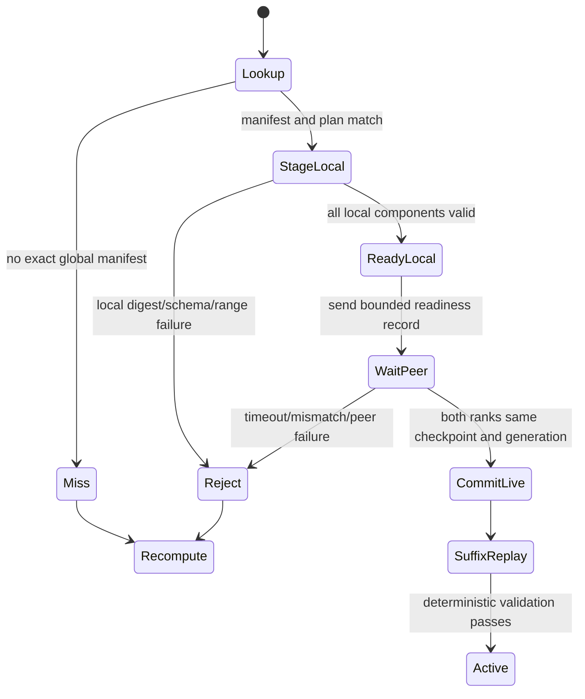

# Distributed restore protocol and design implications

## Two-rank restore state machine

**[RECOMMENDATION]** The request coordinator chooses `(checkpoint_id, generation, plan_digest, suffix_start)`. Each rank independently resolves a local manifest and reads local NVMe. `READY` contains rank ID, manifest digest, verified byte count and status—not payload. A commit nonce prevents stale readiness from a previous attempt.

## Suffix replay

- Restore only a prefix ending at a token boundary recorded by every rank.
- Verify exact rendered tokens and state component coverage before replay.
- Replay from the common committed prefix to current request tokens using the same model/template/position/topology semantics.
- **[OPEN]** Recurrent/hybrid state may make an attention-only prefix reusable differently from a full state; section 61 must specify model-specific boundaries.

## Topology mismatch and failover

| Condition | Required behavior |
|---|---|
| Same plan/fingerprint, one local object missing | Entire distributed restore misses; recompute that prefix under current plan and commit a new generation. |
| Rank count/order/shard range differs | Diagnostic `TOPOLOGY_MISMATCH`; no reshape or cross-load by default. |
| Peer timeout/failure before live commit | Discard staged state; choose recompute/retry or single-node fallback. |
| Failure after live commit/before output commit | Abort token step and invalidate partial generation; recovery policy belongs to execution protocol. |
| Single-node fallback | Load a separately created compatible single-node checkpoint or recompute. Never concatenate two rank blobs. |

## Preventing USB4 cache transfer

**[RECOMMENDATION]** Enforce a control-plane payload ceiling and reject messages containing page/component bytes. Optional repair/migration is an offline, rate-limited administrative workflow with explicit authorization; it must not block token-path restore. Both nodes should materialize rank-local objects at checkpoint commit time or recompute later.

**[INFERENCE]** This design trades duplicate prefix evaluation after a missing local shard for predictable restore latency and avoids turning multi-gigabyte state movement into a shared-link bottleneck. Measure that tradeoff before adding replication.

