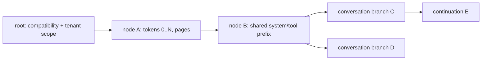

# HaloKV format schemas and design implications

## Segment layout proposal

```text
segment-header
  magic, format_major/minor, segment_uuid, created_at, writer_build_id
page-record[]
  record_len, header_len, flags, component_type/schema
  compatibility_digest, topology_digest, logical_rank
  token_start, token_end, payload_len, stored_len
  codec, payload_digest, header_crc, payload/padding
sealed-footer
  page_count, segment_bytes, ordered-record-root, footer_digest
```

**[RECOMMENDATION]** Write records sequentially. A segment is readable before sealing only through committed metadata locators to individually complete pages; compaction writes a new segment and atomically changes references before retiring old segments.

## Prefix DAG schema



```text
dag_node = {
  schema, node_id, parent_id|null,
  compatibility_digest, topology_digest, tenant_scope,
  token_start, token_end, token_suffix_digest,
  component_page_refs[], created_generation
}
```

**[RECOMMENDATION]** A child contains only immutable suffix pages and parent reference. Copy-on-write creates a child; it never mutates parent pages. Multiple parents are prohibited in v0 unless canonical token/state equivalence is formally defined—use a DAG name for shared ancestry but a single-parent node schema initially.

## Lookup index

Index keys should include compatibility/topology/tenant scope and a collision-resistant digest of exact rendered tokens at page/node boundaries. Store token count and an exact token-stream digest; on lookup, walk candidate ancestors and verify the request token slice. Longest prefix is the deepest fully verified node, not the largest approximate hash match.

## Publication sequence

1. Serialize page payloads deterministically and append records.
2. Flush required segment bytes under selected durability mode.
3. Write immutable rank manifest and verify referenced page digests.
4. Transactionally publish DAG/checkpoint/index references with a commit generation.
5. Sync metadata and directory according to section 63 policy.
6. Only then advertise readiness to section 58.

Crash before step 4 leaves unreachable garbage for GC. After step 4, the visible namespace may name a generation, but its survival depends on the selected Section 63 durability mode and tested failure model. Performance mode may lose or reorder a recent generation. In every mode, recovery must validate every referenced object and treat a missing, torn, or mismatched reference as an invalid generation: quarantine or ignore it and recompute, never deserialize partial state. Only turn-durable or strict mode may promise that no acknowledged committed reference dangles, and only after the exact filesystem, mount, kernel, controller/firmware, write-cache, flush, rename, and directory-sync sequence passes its declared crash/power-loss matrix. **[RECOMMENDATION]** Recovery truncates/ignores torn segment tails and rebuilds indexes from complete validated manifests.

## mmap versus explicit I/O

**[RECOMMENDATION]** Benchmark read-only sealed segments via buffered `pread`, mmap and aligned direct/async reads. Do not mmap mutable metadata or rely on page-fault timing in the token path without prefetch/error handling. Writes remain explicit append + durability operations.
