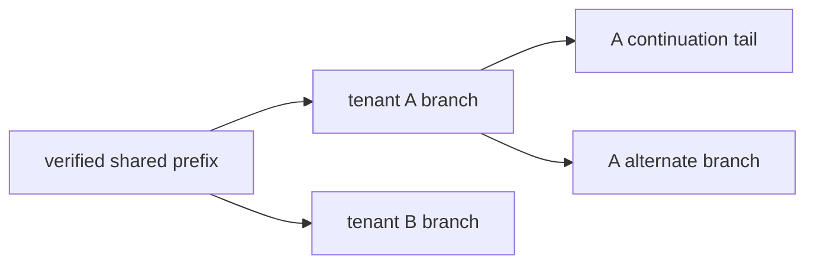

# Prefix, branch, and continuation design

## Content and policy identity

```text
content_key = SHA-256(object_frame_v1(object_type="prefix-content", payload=DCBOR(content_record)))
policy_key  = SHA-256(object_frame_v1(object_type="prefix-policy", payload=DCBOR(policy_record)))
object_key  = SHA-256(object_frame_v1(object_type="prefix-object", payload=DCBOR(object_record)))
```

**[RECOMMENDATION]** Use Section 57's exact `object_frame_v1` and deterministic-CBOR profile. Each record is a typed map with a schema ID and bounded fields: `content_record` contains compatibility root, token count, exact canonical token-byte sequence and ordered component-schema set; `policy_record` contains sharing class, trust domain, producer identity, policy version and expiry epoch; `object_record` contains the two prior 32-byte digests, topology root and logical rank. Raw concatenation is forbidden. Publish cross-implementation golden vectors. Store exact tokens or immutable token pages so a candidate is fully compared. Policy identity stays separate so content equality never collapses trust domains accidentally.

## Longest-prefix lookup

1. Resolve authenticated principal, trust domain and allowed sharing classes.
2. Render prompt/tool state once and receive explicit candidate boundaries.
3. Select the exact compatibility/topology root.
4. Walk indexed prefix nodes from longest candidate boundary downward.
5. Verify authorization, freshness/revocation, exact tokens, component coverage, object digests and rank ownership.
6. Return the longest fully valid candidate; otherwise miss/recompute.

No fuzzy overlap or cross-directory scan participates in authorization.

## Copy-on-write branches



**[RECOMMENDATION]** Parent pages remain immutable. A conversation node references a parent and stores only new token range/component pages. On divergence inside a partly filled page, write a new tail page; never modify the shared page. Section 59 defines page/DAG schema and reference-aware GC.

## Continuation authorization

A continuation handle should bind opaque random session ID/capability, tenant/principal, root node ID, compatibility/topology, creation/expiry and authorization version, protected by server-side lookup or authenticated MAC/signature. **[RECOMMENDATION]** Prompt content, FNV hash, guessed checkpoint ID or longest-prefix similarity is never sufficient to resume another session.

Cross-session continuation is allowed only by an explicit application action that verifies access to the parent. Cross-user sharing of a public prefix does not grant access to either user's tail.

## Expiry and revocation

- Expiry makes the node ineligible immediately; physical reclamation may follow later.
- Revocation epoch/policy version is checked on every lookup.
- Deletion tracks every reference and tenant obligation; shared pages remain only if another authorized live reference permits retention.
- Operator-public prefixes are rebuilt/signed through a privileged path; requests cannot refresh their expiry.
