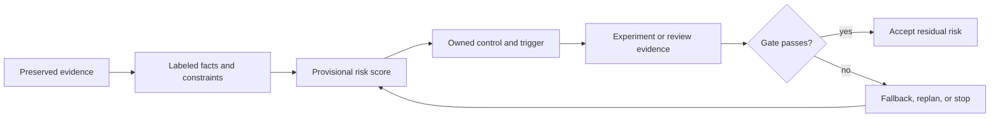

# Risk register, failure modes, mitigations, and contingencies

## Decision summary

This is the living decision surface for technical and project uncertainty. The scored register is in [facts and constraints](facts_and_constraints.md); control design is in [design implications](design_implications.md); update and validation workflows are in [procedures and checks](procedures_and_checks.md).

It covers USB4 assumptions, port independence, driver maturity, backend performance, fork drift, model correctness, memory pressure, storage endurance, thermal limits, kernel patches, staffing, schedule, security, and upstream changes. Every entry carries likelihood, impact, detectability, mitigation, trigger, fallback, owner, and evidence fields.

**[VERIFIED]** Live remote resolution on 2026-07-17 found the same four pinned default-branch tips shown in the applicability block [S83-01, S83-02]. This is a volatile observation, not permission to build from a moving branch.

**[MEASURED]** Preserved July 2026 project evidence observed two USB4 domains per node and traffic on both rails, but did not prove independent controllers, PCIe roots, or additive simultaneous capacity [S83-03].

**[VERIFIED]** The pinned ROCmFPX history has no merge base with the pinned llama.cpp history; CachyLLama is 53 commits ahead and 125 behind the pinned upstream snapshot at the recorded merge base [S83-01, S83-02].

**[VERIFIED]** The inspected CachyLLama checkpoint record has structural fields but no payload digest and no identified temp-file-plus-directory-fsync commit protocol [S83-10]. Uncertain state must therefore be rejected as a cache miss, never accepted.

**[VERIFIED]** Upstream llama.cpp tells operators not to use its RPC/server facilities on untrusted networks, and its RPC README calls the implementation fragile and insecure [S83-18, S83-19]. A 2026 critical advisory demonstrates why network reachability is a material control, but does not by itself prove the pinned commit vulnerable [S83-20].

**[MEASURED]** On 2026-08-12, a nimo-2 production worker held about 114 GiB of `gpu_active` HMM pages while ordinary memory accounting still showed about 14 GiB available. Four global OOM invocations killed the worker; stale RPC state then caused the coordinator to abort and restart on the first real request [S83-23]. This raises R83-007 to critical/partly-evidenced and makes [issue #41](https://github.com/JCFrags/HaloFPX/issues/41) a P0 target-ownership gate. The incident is not a benchmark.

**[RECOMMENDATION]** Do not select a distributed execution mode, custom USB4 transport, persistent-cache durability promise, or release date until its named exit evidence exists. The provisional top risks are model correctness, insecure transport, cache corruption, staffing concentration, driver maturity, port independence, fork drift, schedule uncertainty, upstream churn, and dual-rank recovery.

## Identifier and ROCm lane boundaries

`OQ83-*` and `M83-*` are immutable section-local aliases, not portable canonical IDs. Before either form is used outside Section 83, resolve it through the explicit crosswalks in [open questions](open_questions.md#identifier-crosswalk) and [procedures and checks](procedures_and_checks.md#experiment-alias-crosswalk), using the Section 03 `HLX-OQ-*` and `HLX-EXP-*` namespaces. The candidate `HLX-OQ-*` allocations remain **[OPEN]** pending naming-authority approval; the `M83-*` rows point to already allocated Section 84 experiment cards. `R83-*` remains the local risk-register key because Section 03 defines no canonical risk namespace; no `HLX-RISK-*` identifier may be asserted or exported until that governance decision is made.

ROCm version labels also identify separate lanes, not a numeric upgrade sequence: `7.2.1` is the Ryzen-specific vendor-supported control, `7.2.3` is the frozen research baseline used by the upstream-watch work, Core SDK/TheRock `7.14.0` is a broader unqualified candidate, and the exact installed two-node tuple is **[OPEN]**. See the [lane-aware vocabulary](facts_and_constraints.md#lane-aware-rocm-vocabulary) and [Section 85](../85_Internet_Research_Backlog_Upstream_Watch_and_Knowledge_Freshness/).

## Score boundary

All likelihood, impact, detectability, gross-priority, and residual-target values are **[RECOMMENDATION]** planning judgments as of 2026-07-17. They are not measurements and are not source-verified facts. A high score may coexist with strong evidence about the mechanism; it does not mean the failure has occurred.

## Operating rule

Risk acceptance must name an owner, evidence, expiry/review trigger, and fallback. Silence is not acceptance. An unowned critical/high risk blocks the affected milestone.

## Research split

### Internet and source-code research completed now

- Re-resolved the four repository default heads on 2026-07-17.
- Rechecked current primary AMD, Linux, USB-IF, NVM Express, upstream security, and pinned-source evidence.
- Mined completed wiki facts and open questions without promoting their assumptions or historical measurements to universal truth.

### Required paired-machine validation

- Prove port/controller/root/IRQ independence and paired simultaneous capacity.
- Freeze the exact OS, kernel, firmware, ROCm/HIP, Mesa/RADV, build, and model tuple on both nodes.
- Establish matched HIP/Vulkan correctness and performance, memory headroom, storage write amplification/endurance, and sustained thermal behavior.
- Exercise cable loss, rank death, OOM, disk-full, corrupted cache, rollback, and single-node degraded mode.
- Verify listeners, authentication, permissions, secrets, peer replay behavior, and artifact hashes.

### Decisions contingent on evidence

- Distributed mode and transport; USB4NET versus USB4STREAM or a project patch.
- Supported models, quantizations, contexts, concurrency, and backend.
- Persistent-cache default, durability level, quotas, and retention.
- Release baseline, upstream-sync cadence, staffing commitment, and milestone dates.

## Navigation

- [Facts, scoring method, and living register](facts_and_constraints.md)
- [Control architecture and contingencies](design_implications.md)
- [Review workflow and validation checks](procedures_and_checks.md)
- [Open questions and cross-project gaps](open_questions.md)
- [Sources](sources.md)
