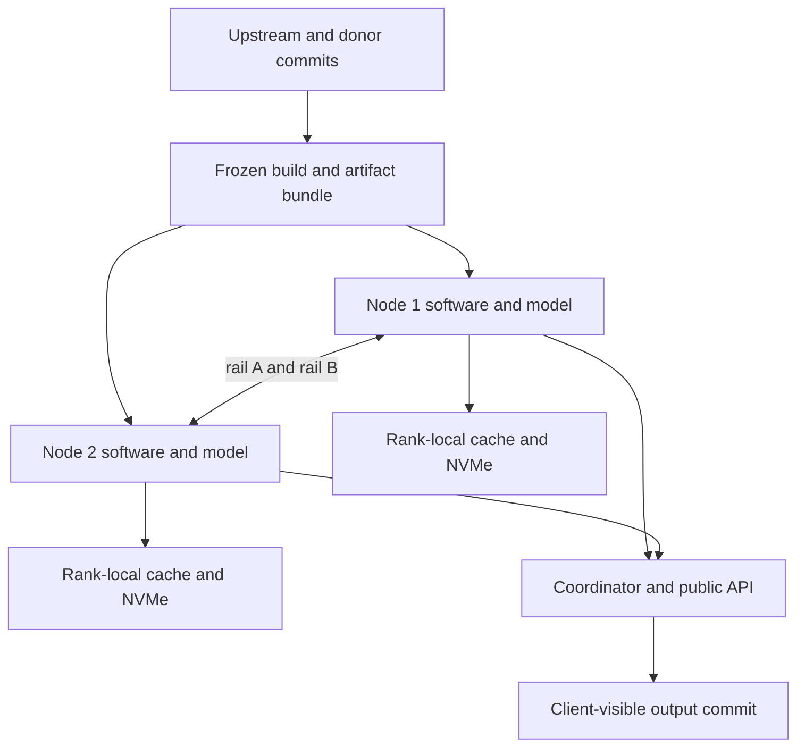

# Control design implications and contingencies

## Architecture implications

**[RECOMMENDATION]** The first usable architecture must be a ladder, not a single all-or-nothing dual-node design:

1. A frozen, correct single-node baseline.
2. Two independent replicas with request/session affinity.
3. One-rail distributed operation only after fault and break-even gates.
4. Dual-link striping only after controller independence and additive capacity are proven.
5. Custom USB4STREAM/kernel work only if it clears a preregistered benefit and maintenance gate.

This ordering contains R83-001/002/003/010/016. A failed distributed experiment must not destroy the usable single-node path.

**[RECOMMENDATION]** Select HIP or Vulkan per versioned plan manifest, not globally. Every plan fingerprints model bytes, tokenizer, quantization, runtime commit, backend, kernel/driver/firmware, graph options, cache schema, topology, and distributed mode. Unknown or mismatched identity rejects cache/checkpoint reuse and distributed join.

**[RECOMMENDATION]** Admission control reserves measured memory headroom for runtime workspaces, transport buffers, driver allocations, cache restore, and failure recovery. Disk and memory pressure must produce explicit rejection or eviction, not host-wide OOM.

**[RECOMMENDATION]** HaloKV is optional acceleration. Its fail-safe behavior is `validate -> use` or `miss -> recompute`; never “warn and continue.” Namespace isolation, digest verification, atomic generation manifests, quotas, and a cache-off operating mode are release requirements.

## Failure-domain map

A common build, model, protocol, or coordinator defect can defeat both matched nodes. Two nodes reduce some hardware failures but do not create software diversity. Rails are one failure domain until independence is measured.

## Stop, degrade, and recover policy

| Condition | Required immediate action | Allowed degraded service | Recovery evidence |
|---|---|---|---|
| Wrong token/logit/quality result | Stop affected plan; preserve fixture and trace | Prior verified model/quant/backend only | Matched correctness suite passes |
| Cache digest/schema/topology failure | Quarantine object; record miss | Recompute with cache off or last valid generation | Mutation/crash matrix passes |
| One USB4 rail lost | Fence failed path; stop new coupled work | Qualified one-rail or single-node plan | Link identity plus fault/rejoin test |
| Rank/coordinator lost | Abort uncommitted output; fence old incarnation | Restart from durable boundary or single node | No duplicate output; replay contract passes |
| GPU reset/OOM/thermal violation | Reject load; capture driver/sensor/memory state | Smaller context/concurrency or known-good lane | Sustained soak within gates |
| Disk full/SMART critical/endurance threshold | Stop cache writes; preserve model volume | Read-only cache or cache disabled | Capacity/health restored and scan clean |
| Security control/advisory trigger | Isolate listeners, disable affected service, rotate secrets as applicable | Loopback/single-host service only | Applicability review and negative tests |
| Build/provenance mismatch | Quarantine binary/artifact; block release | Previous signed offline-restorable baseline | Hash/SBOM/license/offline rebuild receipt |
| Critical owner unavailable | Freeze affected change and acceptance | Previously supported scope | Replacement owner and independent review |

## Release and schedule implications

**[RECOMMENDATION]** Dates follow evidence; evidence does not follow dates. Section 82 milestones should consume section 83 risk gates. A milestone cannot exit while it has an unowned critical/high risk, an expired acceptance, or a fallback that has never been exercised.

**[RECOMMENDATION]** Budget explicit research spikes for USB4 independence, the supported software tuple, correctness, and storage/thermal characterization. Report forecast ranges and confidence. Do not hide research behind implementation percentage.

**[RECOMMENDATION]** Require an independent reviewer for score reduction, risk acceptance, security exceptions, or deletion of a fallback. This follows the Agent Harness rule that an artifact cannot approve its own unsupported promotion [S83-22].

## Upstream-change policy

**[RECOMMENDATION]** Separate four update lanes:

- emergency security/correctness backport;
- scheduled upstream llama.cpp batch;
- donor-capability import from ROCmFPX/CachyLLama;
- experimental kernel/driver/transport lane.

Each lane gets a candidate branch, provenance map, full affected gate set, and rollback bundle. Never merge a moving donor branch directly into a releasable baseline. If a change cannot preserve cache compatibility, declare a new schema generation and retain a verified rollback/migration decision.

## Acceptance authority

Role names in this section are provisional; one person may hold multiple roles, but authorship and independent acceptance must still be distinguishable.

| Risk class | Proposes evidence | Accepts residual risk | Maximum acceptance lifetime |
|---|---|---|---|
| Correctness, cache integrity, security | Domain owner | Project owner plus independent reviewer | One release or 30 days |
| Hardware, fabric, driver, thermal, storage | Domain owner | Technical lead | One pinned hardware/software tuple |
| Staffing and schedule | Program owner | Project owner | One milestone |
| Upstream/provenance/release | Integration/release owner | Technical lead plus reviewer | One baseline |

**[RECOMMENDATION]** An acceptance records scope, score, evidence, compensating control, expiry, and rollback. “Local network,” “experimental,” and “temporary” are not controls by themselves.
