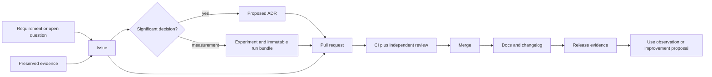

# Issues, labels, milestones, ADRs, code review, and contribution process

## Decision-oriented summary

**[VERIFIED]** GitHub can structure issue intake, relate issues and pull requests, group issues and pull requests in milestones, request code-owner review, and enforce pull requests, reviews, status checks, and conversation resolution through repository rules. These are platform capabilities, not an adopted HaloFPX process [S86-14, S86-15, S86-16, S86-17, S86-18].

**[VERIFIED]** On 2026-07-17 this research checkout had no commit (`HEAD` did not resolve), no remote, and none of `.github/`, `CONTRIBUTING.md`, `SECURITY.md`, `CODE_OF_CONDUCT.md`, `CHANGELOG.md`, `docs/decisions/`, or `engineering/ai-change-log/` [S86-01]. Therefore no GitHub workflow, owner identity, release authority, or contribution policy is currently enforceable here.

**[RECOMMENDATION]** Adopt one traceability chain in the future integration repository:

No link promotes a claim by itself: evidence labels and applicability remain governed by sections [02](../../01_Wiki_Governance/02_Evidence_Citation_and_Source_Policy/README.md), [04](../../01_Wiki_Governance/04_Assumption_Open_Question_and_Decision_Ledgers/README.md), and [05](../../01_Wiki_Governance/05_Research_Data_and_Benchmark_Artifact_Conventions/README.md).

## Integrated execution inputs

**[VERIFIED]** Sections [82](../82_Implementation_Roadmap_Epics_Dependencies_and_Exit_Criteria/README.md)-[85](../85_Internet_Research_Backlog_Upstream_Watch_and_Knowledge_Freshness/README.md) are now completed wiki sections. Within their declared `needs-machine-validation` applicability, they are the authoritative draft inputs for roadmap phases and gates, the living risk register, the canonical physical experiment sequence/card contract, and freshness/watch handling [S86-25, S86-26, S86-27, S86-28]. Section 86 consumes those records; it does not duplicate or silently override them.

**[OPEN]** Their recommendations are not accepted implementation or governance policy merely because the sections are complete. Human owners, acceptance authorities, forge configuration, exception policy, release thresholds, and adoption decisions remain unresolved. A later issue or ADR must link the exact Section 82 gate, Section 83 risk, Section 84 card, and Section 85 freshness trigger that it operationalizes.

## Non-negotiable gates

1. Every material change has a human-owned issue with acceptance criteria and links to requirements, evidence, affected wiki sections, and tests.
2. Architecture, security, compatibility, license, public-API, cache-format, distributed-ownership, or release-policy choices require an ADR; merge approval is not a substitute for decision rationale.
3. Performance claims link to an `HLX-EXP-*` definition and immutable `HLX-RUN-*` bundle. Repository-authored numbers are not HaloFPX measurements.
4. Distributed changes state rank ownership, failure behavior, and single-node fallback. Cache changes prove corrupt or incompatible state causes a miss/recomputation.
5. The author, coding agent, or originating artifact cannot provide the independent approval that accepts its own material change [S86-13].
6. Security reports use a private route, never a public issue containing exploit details.
7. Release tags point to a reviewed baseline manifest and are never silently moved.

## Research split

- **Internet/source research completed:** current GitHub issue, review, security, contribution, Actions, and release mechanics; MADR 4.0.0; SemVer 2.0.0; current upstream pins.
- **Repository and machine work required:** create the actual integration repository; name human owners; install templates/rules; validate untrusted-PR isolation; run a complete two-node traceability and release rehearsal.
- **Contingent decisions:** hosting/visibility, owner roster, branch/ruleset model, release/version policy, performance thresholds, self-hosted-runner trust boundary, disclosure policy, requirement-ID namespace, and human adoption of the Sections 82-85 draft contracts.

## Retrieval map

- [Facts and constraints](facts_and_constraints.md)
- [Design implications](design_implications.md)
- [Procedures and checks](procedures_and_checks.md)
- [Open questions](open_questions.md)
- [Sources](sources.md)
