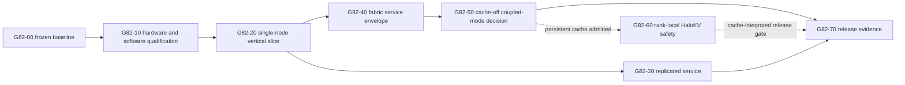

# 82 - Implementation Roadmap, Epics, Dependencies, and Exit Criteria

## Decision-oriented summary

**[VERIFIED]** The current wiki contains all 86 registered sections and supplies source-backed designs for repository control, the target platform, model/runtime choices, transport, HaloKV, server operations, and verification. The newly completed dependency sections remain `needs-machine-validation`: they define candidate contracts and experiment plans but report no HaloFPX measurements. This roadmap therefore sequences evidence acquisition and decision gates; it is not a schedule or proof of implementation readiness [S82-01, S82-02, S82-03, S82-04, S82-05, S82-06].

**[RECOMMENDATION]** Deliver useful, reversible increments in this order: freeze evidence; prove the platform; ship a correct single-node product slice; operate two independent replicas; characterize the dual-link fabric; select at most one coupled mode from matched evidence; add fail-closed rank-local HaloKV; then harden an integrated release. Replication is the first dual-node operating mode because Section 38 recommends it as the provisional baseline and it avoids a per-token fabric dependency.

**[ASSUMPTION]** One admitted target model and context will fit safely on one node. If the Section 29/74 capacity gate disproves this, the minimum useful product (MUP) changes from single-node serving to a capacity-only two-rank prototype; record that change in an ADR rather than silently reordering the program.

**[OPEN]** Numeric performance targets in Section 09 remain candidate targets. Exit gates below require ratified targets or explicit evidence-backed waivers; they do not promote those candidates to commitments.

## Roadmap at a glance

| Phase | Epic IDs | Deliverable and minimum useful product | Entry dependency | Exit gate |
|---|---|---|---|---|
| P0 Evidence freeze | E82-00, E82-01 | Reproducible source/build/evidence baseline | none | G82-00 |
| P1 Platform qualification | E82-10, E82-11 | Repeatable matched-node lab | P0 | G82-10 |
| P2 Single-node vertical slice | E82-20, E82-21 | **MUP-1:** one model, one backend, local authenticated API, diagnostics, restart | P0+P1 | G82-20 |
| P3 Replicated service | E82-30 | **MUP-2:** two independent servers, explicit routing/session affinity, peer-loss containment | P2 | G82-30 |
| P4 Fabric foundation | E82-40, E82-41 | Measured dual-link service envelope and carrier-neutral transport prototype | P1+P2 | G82-40 |
| P5 Cache-off coupled-mode selection | E82-50..E82-54 | **MUP-3:** one evidence-selected cache-disabled coupled plan, or a recorded no-go retaining replication | P4 | G82-50 |
| P6 HaloKV | E82-60, E82-61 | **MUP-4:** compatible prefix restore with corruption-as-miss and bounded rollback | P2; P5 for rank-local restore | G82-60 |
| P7 Product hardening | E82-70..E82-72 | Release candidate, clean deployment/upgrade/rollback, security/fault/soak evidence | applicable prior gates; G82-60 only if persistent cache is admitted | G82-70 |

MUP means the smallest increment that delivers user value and can be operated without depending on unfinished later phases. It does not mean production-ready.

## Critical path

**[INFERENCE]** Hardware identity, a reproducible single-node oracle, and real-message fabric curves are the critical path to a defensible coupled-mode choice. UI polish, optional backend optimization, cache inspection tooling, and multiple coupled prototypes can proceed in parallel but cannot bypass those gates.

## Non-negotiable promotion rules

1. **[RECOMMENDATION]** A gate passes only from linked raw evidence, exact manifests, and reviewer sign-off; “workflow green” without target-machine artifacts is insufficient.
2. **[RECOMMENDATION]** Correctness, incompatible/corrupt cache acceptance, unauthorized cross-tenant access, and silent partial distributed output are zero-tolerance blockers.
3. **[RECOMMENDATION]** Each candidate retains the previous immutable build, config/plan schemas, cache migration disposition, and a rehearsed rollback procedure.
4. **[RECOMMENDATION]** A failed coupled-mode value gate is a valid result. The product remains on replication; the roadmap must not force a specialized mode merely to satisfy architecture intent.
5. **[RECOMMENDATION]** Rank ownership and failure behavior are part of every distributed epic. Single-node fallback is accepted only where the model/context fits and the state boundary has been validated.

## Parallel tracks and expertise

| Track | Work that can run in parallel | Required expertise | Integration boundary |
|---|---|---|---|
| Source/toolchain | pinning, patch lanes, CI, SBOM/provenance | Git, CMake, licenses, supply chain | build and compatibility fingerprint |
| Platform | BOM, firmware, kernel/ROCm/Mesa, memory, NVMe, thermals | Linux, amdgpu/ROCm, hardware lab | hardware profile |
| Model/backend | format parity, quality, HIP/Vulkan profiling | llama.cpp/ggml, numerical methods, GPU kernels | model manifest and oracle |
| Fabric/runtime | carrier audit, framing, multipath, rank protocol, mode prototypes | Linux networking/USB4, distributed systems | versioned fabric API and plan manifest |
| HaloKV | identity, state inventory, atomic commit, isolation, endurance | storage, filesystems, security, inference state | compatibility key and cache API |
| Product/verification | API, lifecycle, observability, packaging, faults, benchmarks | server/SRE, security, test/statistics | release evidence bundle |

## Research split

### Internet and source-code research completed now

The roadmap uses the pinned repository commits, official Git mechanics, SLSA provenance, SPDX, NIST SSDF, and the completed 86-section wiki snapshot. See [sources](sources.md).

### Target-machine work still required

Run the M82-01 through M82-12 local roadmap aggregates through their canonical Section 84 owner cards and unresolved crosswalks in [procedures and checks](procedures_and_checks.md). No result is claimed here, and an M82 alias is not an externally valid experiment ID.

### Decisions contingent on measurements

Backend admission, model/context envelope, dual-port independence, carrier, coupled mode, multipath policy, cache durability tier, fallback limits, performance thresholds, and release readiness remain contingent. See [open questions](open_questions.md).

## Page map

- [Facts and constraints](facts_and_constraints.md)
- [Design implications](design_implications.md)
- [Procedures and checks](procedures_and_checks.md)
- [Open questions](open_questions.md)
- [Sources](sources.md)
